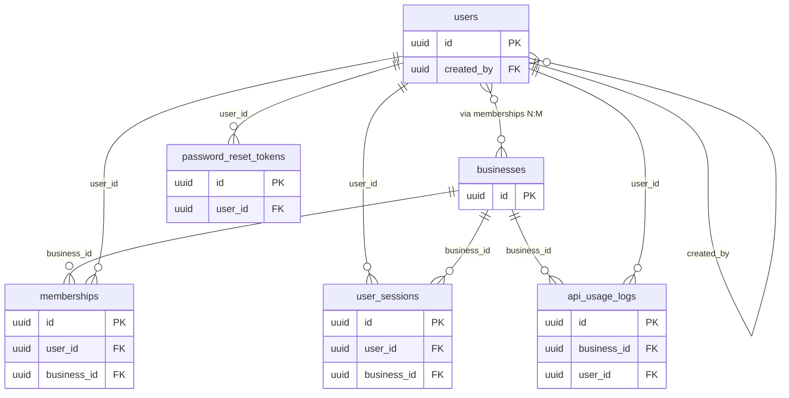
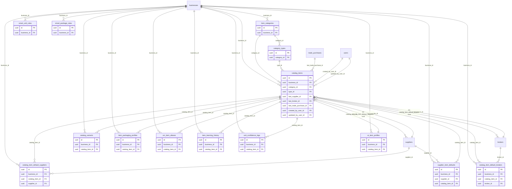
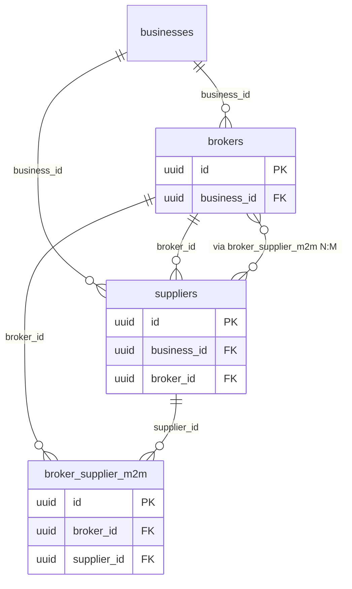
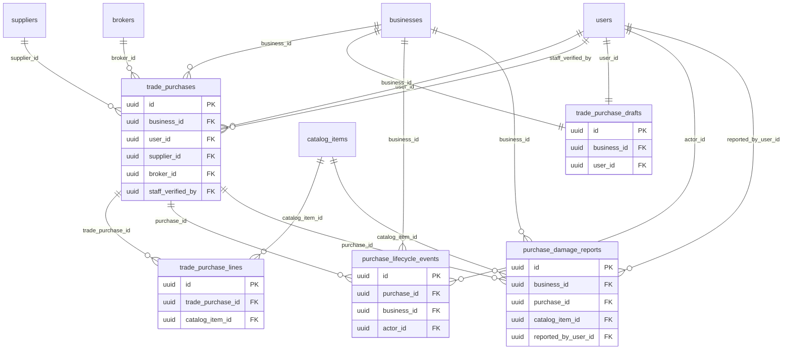
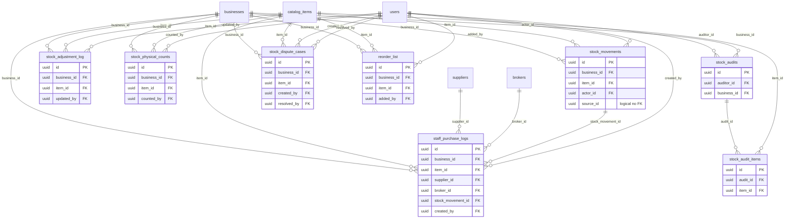
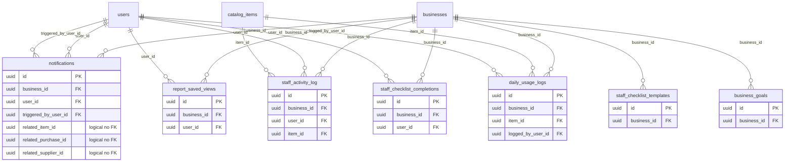
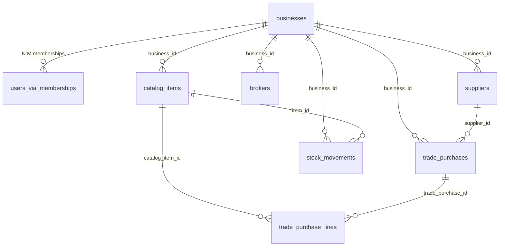

# 24 — ER Diagram (Mermaid)

> **Phase:** 1.9 Relationships / ER diagram  
> **Status:** Review PASS (2026-07-18)  
> **Source:** ORM `ForeignKey` names from `source-app/backend/app/models/*.py` and `docs/20_Database_Analysis.md` `FK->` lines  
> **Companion:** `docs/23_Relationships.md` (row-level inventory)  
> **Rule:** Only declared ORM FKs appear as relationships. Soft UUID links are noted in text, not as hard edges.

Mermaid `erDiagram` relationship labels use the **FK column name** from the child table. Cardinality markers:

| Marker | Meaning |
|--------|---------|
| `\|\|--o{` | 1 : N (one parent, many children) |
| `\|\|--\|\|` | 1 : 1 (UniqueConstraint implies at most one child) |
| `}o--o{` | N : M via association table |

---

## Core

`businesses`, `users`, `memberships`, `user_sessions`, `password_reset_tokens`, `api_usage_logs`.

**Notes (Core):**

- `memberships`: `UniqueConstraint(user_id, business_id)` → N:M association (`uq_membership_user_business`).
- `user_sessions.business_id` / `api_usage_logs.*`: nullable FKs where model declares `nullable=True`.
- `users.created_by` → `users.id`, `ondelete=SET NULL`.
- Session/token FKs use `ondelete=CASCADE` on `user_id` (and session `business_id`).
- No ORM FKs: `admin_audit_logs`, `webhook_event_logs` (omit from diagram).

---

## Catalog

Categories, types, items, variants, default supplier/broker links, supplier item defaults, unit-intelligence satellites.

**Notes (Catalog):**

- `category_types.category_id` → `ondelete=CASCADE`; `catalog_items.type_id` → `SET NULL`.
- Snapshot FKs on `catalog_items` (`last_supplier_id`, `last_broker_id`, `last_trade_purchase_id`) → `SET NULL`.
- `ai_item_profiles`: `uq_ai_item_profile_item` → **1:1** with `catalog_items` within a business.
- `master_units`: no FKs — reference data only (not drawn).
- Cross-domain edges to `suppliers` / `brokers` / `trade_purchases` / `users` are real ORM FKs (shown); those entities are owned in Contacts / Trade / Core diagrams.

---

## Contacts

`brokers`, `suppliers`, M2M junction `broker_supplier_m2m`.

**Notes (Contacts):**

- Legacy optional `suppliers.broker_id` (1:N) **and** explicit M2M `broker_supplier_m2m` with `uq_broker_supplier_m2m_pair` coexist — both are declared in ORM (`contacts.py`, `trade_purchase.py`).
- No `ondelete` declared on these Contact FKs in the ORM.

---

## Trade

Purchases, lines, drafts, lifecycle events, damage reports.

**Notes (Trade):**

- `trade_purchase_lines.trade_purchase_id` → `ondelete=CASCADE` (+ ORM `delete-orphan`).
- `trade_purchase_drafts`: `uq_trade_purchase_drafts_biz_user` → **1:1** per (business, user).
- Lifecycle / damage report purchase FKs → `CASCADE`; optional user/item FKs → `SET NULL` where declared.
- Inverse snapshot: `catalog_items.last_trade_purchase_id` → `trade_purchases` (drawn under Catalog).

---

## Stock

Movements, adjustment log, physical counts, audits, disputes, reorder, staff purchase logs.

**Notes (Stock):**

- Business/item FKs on stock tables typically `ondelete=CASCADE`; actor-style user FKs `SET NULL`.
- `stock_audit_items.audit_id` → `CASCADE` with ORM `delete-orphan` / `passive_deletes`.
- **Logical (not drawn as FK edge):** `stock_movements.source_id` + `source_type` (polymorphic; no ORM `ForeignKey`).

---

## Ops / Aux

Notifications, saved report views, staff activity, daily usage, checklists, business goals.

**Notes (Ops / Aux):**

- Notification recipient FKs → `CASCADE`; `triggered_by_user_id` → `SET NULL`.
- **Logical (attribute only, not FK edges):** `notifications.related_item_id`, `related_purchase_id`, `related_supplier_id`.
- `daily_usage_logs`: unique per `(business_id, item_id, usage_date)`.
- `business_goals`: unique per `(business_id, period)`.

---

## Cross-domain hub (summary)

High-level tenant + product spine (not a substitute for the domain diagrams above):

---

## Soft UUID / logical links (not ORM FK edges)

| From | Column | Logical to | Why not an edge |
|------|--------|------------|-----------------|
| `notifications` | `related_item_id` | `catalog_items.id` | No `ForeignKey` in `notification.py`; `docs/20` has no `FK->` |
| `notifications` | `related_purchase_id` | `trade_purchases.id` | Same |
| `notifications` | `related_supplier_id` | `suppliers.id` | Same |
| `stock_movements` | `source_id` | Polymorphic (`source_type`) | No `ForeignKey` in `stock_movement.py`; `docs/20` has no `FK->` |

---

## Coverage checklist vs `23_Relationships.md`

| Domain | FK rows in 23 | Diagram section |
|--------|--------------:|-----------------|
| Core | 8 | Core |
| Catalog | 33 | Catalog |
| Contacts | 5 | Contacts |
| Trade | 16 | Trade |
| Stock | 26 | Stock |
| Ops / Aux | 15 | Ops / Aux |
| **Total** | **103** | All domains |

---

## Unknowns — needs verification

1. Raw SQL under `source-app/backend/sql/` may add FKs / `ON DELETE` not present on ORM columns — parse in later Phase 1/2 index/constraint docs (`25` / `30`).
2. Whether polymorphic `stock_movements.source_id` should become a formal FK in SQL Server (legacy does not).
3. Whether notification `related_*` columns should gain FKs in the target schema (legacy ORM does not).

---

## Review PASS/FAIL

| Check | Result |
|-------|--------|
| Mermaid blocks for Core, Catalog, Contacts, Trade, Stock, Ops/Aux | PASS |
| FK column names match ORM / `docs/20` `FK->` | PASS |
| Soft UUID links not drawn as hard FKs | PASS |
| N:M junctions called out | PASS (`memberships`, `broker_supplier_m2m`, default supplier/broker tables) |
| 1:1 UniqueConstraint called out | PASS (`trade_purchase_drafts`, `ai_item_profiles`) |
| Companion inventory | `docs/23_Relationships.md` |
| No invented FKs | PASS |

**Verdict:** Review **PASS** (analysis / documentation only — no DDL or application code changes).
)
