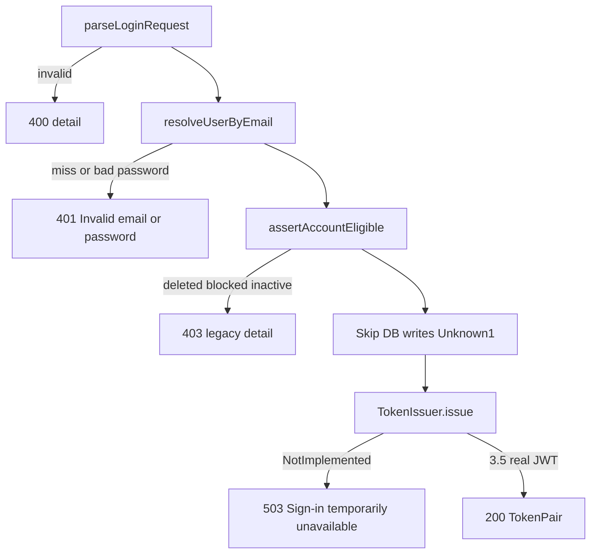

# 36 — Controllers / routes (Phase 3.4)

**Status:** Review PASS (2026-07-18)  
**Checklist:** Phase 3 task **3.4**  
**Location:** `new-app/backend/src/routes/auth.routes.ts`, `controllers/auth.controller.ts`, `auth/`  
**Branch:** `phase3/controllers-routes`  
**Inventory:** [`docs/18_API_Inventory.md`](18_API_Inventory.md) — `auth.py` prefix `/v1/auth`  

---

## 1. Purpose

Expose Login HTTP surface matching FastAPI paths. Wire `POST /login` through Phase 3.3 services for credential and account gates. Defer JWT to **3.5** (TokenIssuer port). Defer login DB writes until Unknown #1 is decided.

---

## 2. Path map

| Method | Path | 3.4 behavior |
|---|---|---|
| POST | `/v1/auth/login` | Wired — 400 / 401 / 403 / 503 (pending JWT) |
| POST | `/v1/auth/register` | 501 stub |
| POST | `/v1/auth/forgot-password` | 501 stub |
| POST | `/v1/auth/reset-password` | 501 stub |
| POST | `/v1/auth/google` | 501 stub (→ 3.5) |
| POST | `/v1/auth/refresh` | 501 stub (→ 3.5) |

Health remains at **`GET /api/health`** (Phase 3.1). Auth is **not** under `/api/v1`.

Mount: [`src/app.ts`](../new-app/backend/src/app.ts) → `app.use("/v1/auth", ...)`.

---

## 3. Login flow (3.4)



Sources:

- Router logic: `source-app/backend/app/routers/auth.py` (`POST /login`)
- Body: `source-app/backend/app/schemas/auth.py` `LoginRequest`
- Services: `docs/35_Service_Layer.md`

`device_token` is accepted but **not persisted** in 3.4.

---

## 4. TokenIssuer handoff → 3.5

| Piece | File | Role |
|---|---|---|
| `TokenIssuer` | `src/auth/tokenIssuer.ts` | `issue(user) → TokenPair` |
| `NotImplementedTokenIssuer` | same | Throws → controller maps to **503** with legacy token-failure detail |
| Phase 3.5 | replace implementation | HS256 access/refresh from `jwt_tokens.py` |

Do **not** invent placeholder JWTs in 3.4.

---

## 5. Error JSON

Auth endpoints return FastAPI-style `{ "detail": "..." }`. Global `{ error }` handler remains for unhandled errors until Phase 3.8.

---

## 6. Unknown #1 (still open)

Login side effects (`last_login_at`, `user_sessions`, staff LOGIN audit) are **not** written. Decide commit vs flush-parity before enabling writes.

---

## 7. Tests

`tests/auth/login.test.ts` — mocked `UsersRepository` + `NotImplementedTokenIssuer`:

- 400 invalid email
- 401 missing user / null hash / bad password
- 403 deleted / blocked / inactive
- 503 valid credentials (issuer not implemented)
- 501 register stub

```bash
cd new-app/backend && npm test && npm run build
```

---

## 8. Review PASS/FAIL

| Check | Result |
|---|---|
| Paths match `/v1/auth/*` inventory | PASS |
| 401/403 detail strings match legacy | PASS |
| No real JWT; success → 503 | PASS |
| No login DB writes | PASS |
| No invented register/forgot/google logic | PASS |
| Tests + build green | PASS |

**Verdict: PASS**

---

## 9. Rollback

1. Revert `phase3/controllers-routes` commits.
2. Checklist: **3.4 → ⬜**, **3.5 → 🔒**.
3. No schema changes.

---

## 10. Checklist impact

- **3.4** → ✅  
- **3.5** Authentication (JWT) → unlocked ⬜  
