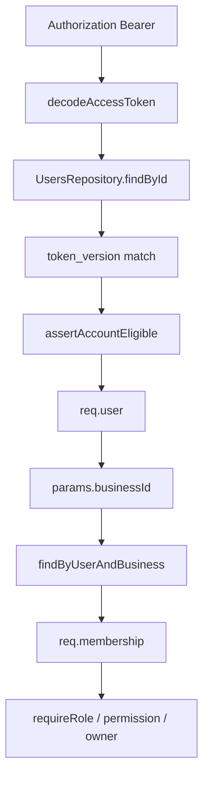

# 38 — Authorization (Phase 3.6)

**Status:** Review PASS (2026-07-18)  
**Checklist:** Phase 3 task **3.6**  
**Location:** `new-app/backend/src/middleware/auth.ts`, `membership.ts`, `authz.ts`  
**Branch:** `phase3/authorization`  
**Source:** `source-app/backend/app/deps.py` (+ `require_permission_key` from `permissions.py`)  

---

## 1. Purpose

Port FastAPI authorization dependencies into Express middleware: Bearer `getCurrentUser`, business membership scoping, role/permission/owner/super-admin gates. No domain routers, Google, Zod, or login DB writes.

---

## 2. Legacy → new map

| FastAPI (`deps.py`) | New |
|---|---|
| `get_current_user` | `createRequireAuth(users)` |
| `require_membership` | `createRequireMembership(memberships)` |
| `require_owner_membership` | `requireOwnerMembership` |
| `require_role(*roles)` | `createRequireRole(...roles)` |
| `require_permission(key)` | `createRequirePermission(key)` |
| `require_super_admin` | `requireSuperAdmin` |
| `require_permission_key` | `requirePermissionKey` in `permissions.service.ts` |

Detail strings match legacy exactly (including Python-style `Access denied. Required roles: ['owner', 'admin']`).

---

## 3. Flow



`super_admin` bypasses **role** and **permission** checks only (same as deps.py); still needs JWT + membership for membership-scoped routes.

---

## 4. Tenancy (docs/29)

Future `/v1/businesses/:businessId/...` routes mount:

```ts
app.authz.requireAuth,
app.authz.requireMembership,
// optional: app.authz.requireRole("owner","admin")
// optional: app.authz.requirePermission("reports_access")
```

`createApp` exposes `app.authz` from injected (or fail-closed) repos. **No silent cross-tenant access.**

---

## 5. Explicitly deferred

| Item | When |
|---|---|
| `require_admin_caller` / ADMIN_API_TOKEN | Later admin panel |
| AI / realtime env gates | Per feature |
| `GET /v1/me/businesses` | After 3.7 or dedicated Login post-auth slice |
| Google OAuth | Still 501 |
| Zod | **3.7** |

---

## 6. Tests

`tests/middleware/authz.test.ts` — mocked repos / mock req-res:

- Not authenticated / invalid token / user not found / token revoked / blocked  
- Membership miss / success  
- Owner / role deny+allow / permission deny+allow / super_admin bypass  

```bash
cd new-app/backend && npm test && npm run build
```

---

## 7. Review PASS/FAIL

| Check | Result |
|---|---|
| Detail strings match deps.py | PASS |
| token_version revoke | PASS |
| Membership business scoping | PASS |
| Role / permission / owner / super_admin | PASS |
| No invented domain routes | PASS |
| Tests + build | PASS |

**Verdict: PASS**

---

## 8. Rollback

1. Revert `phase3/authorization`.
2. Checklist: **3.6 → ⬜**, **3.7 → 🔒**.

---

## 9. Checklist impact

- **3.6** → ✅  
- **3.7** Validation (Zod) → unlocked ⬜  
