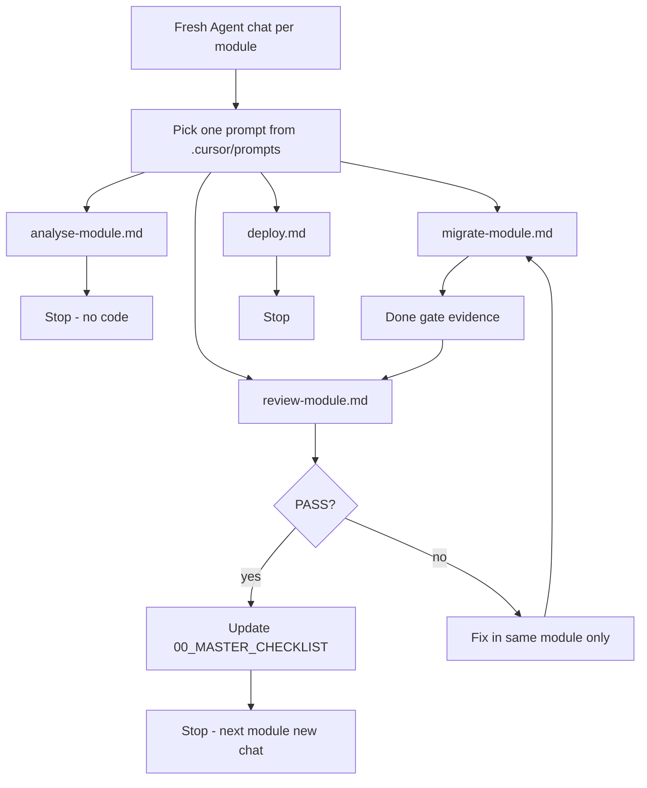

# Cursor Pro — Setup & Run Flow

This file is the operator guide for the warehouse ERP migration workspace.

## Workspace layout

```
warehouse-migration/          ← open THIS folder as the Cursor workspace root
├── .cursor/
│   ├── rules/                ← always-on + scoped rules
│   ├── skills/               ← one-responsibility Agent skills
│   ├── prompts/              ← paste into a fresh Agent chat
│   ├── hooks.json            ← light prompt guard
│   ├── mcp.json.example      ← copy → mcp.json and add your GitHub PAT
│   └── mcp.json              ← local only (gitignored)
├── docs/                     ← migration truth docs
├── source-app/               ← READ ONLY legacy
└── new-app/                  ← React + Node + SQL Server target
```

## One-time Cursor settings (you click these)

1. **Agent mode** for implementation (not plain Ask-only chat).
2. **Indexing**: Settings → Indexing & Docs → index the whole `warehouse-migration/` workspace (include `source-app/` + `docs/`).
3. **Rules**: Settings → Rules, Skills, Subagents → confirm project rules from `.cursor/rules/` appear.
4. **Skills**: same page → confirm project skills under `.cursor/skills/` are visible.
5. **Plugins**: Settings → Plugins / Customize → optional. Recommended later:
   - None required to start analysis.
   - Add database/SQL or Figma plugins only if you actually use those tools daily.
6. **Auto-run**: keep cautious for shell; do not auto-approve destructive commands.

## MCP setup

### GitHub (required for repo/PR agent tools)

1. Create a fine-grained PAT: https://github.com/settings/personal-access-tokens  
   Scopes: access to `ANANDU-2000/warehouse_application_erp` (contents, PRs, issues as needed).
2. Copy `.cursor/mcp.json.example` → `.cursor/mcp.json`.
3. Replace `YOUR_GITHUB_PAT` with the token.
4. Cursor → Settings → Tools & MCP → confirm `github` shows connected (restart Cursor if needed).
5. Never commit `.cursor/mcp.json` (gitignored).

Remote server used: `https://api.githubcopilot.com/mcp/`

Alternative (Docker): see GitHub’s install guide for `ghcr.io/github/github-mcp-server` if the remote MCP is unavailable on your plan.

### Already available in this environment

- **cursor-ide-browser** — UI checks later (Phase 4+)
- **user-render** — only if you deploy on Render (optional; not required for Windows Server target)

Do **not** copy Supabase/Render tokens from `source-app/.cursor/mcp.json` into git.

### CLI companion

Install/login GitHub CLI for push/PR from terminal:

```powershell
gh auth login
gh repo view ANANDU-2000/warehouse_application_erp
```

## GitHub repo

Remote: https://github.com/ANANDU-2000/warehouse_application_erp.git

Local git should point at this remote. Prefer making the GitHub repo **private** while `source-app/` is included.

## Session flow (strict loop)



### Rules of the loop

- Fresh chat per module (avoids context bleed).
- Paste the small prompt from `.cursor/prompts/` — do not paste a giant mega-prompt.
- Mention the skill name in the prompt (e.g. `module-migration`).
- Phase 1 gaps (business logic, wireframes, ER, reports, roles) must be finished before coding modules in `new-app/`.
- Done gate (not confidence %):
  - documented fields implemented or Unknown
  - documented endpoints implemented or Unknown
  - tests pass
  - Legacy vs New has no known mismatches
  - Unknowns listed

## Which skill when

| Need | Skill folder |
|------|----------------|
| Overview | `01-project-analysis` |
| Rules/calculations | `02-business-logic` |
| Schema | `03-database-analysis` |
| HTTP API | `04-api-analysis` |
| Screens | `05-uiux-analysis` |
| Full module loop | `06-module-migration` |
| Node API code | `07-backend-implementation` |
| React UI code | `08-frontend-implementation` |
| SQL Server DDL | `09-database-migration` |
| Tests | `10-testing` |
| Review | `11-code-review` |
| Windows deploy | `12-deployment` |
| After shared changes | `13-regression-check` |

## Current project status

See `docs/00_MASTER_CHECKLIST.md`. Phase 1 is in progress (~55%). Do not start `new-app/` feature coding until the relevant module plan doc exists and Phase 1 blockers for that work are cleared.
