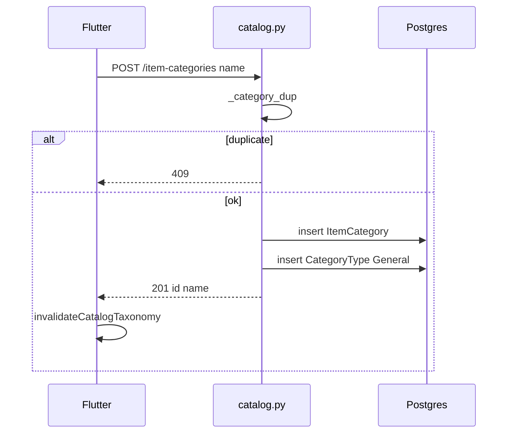
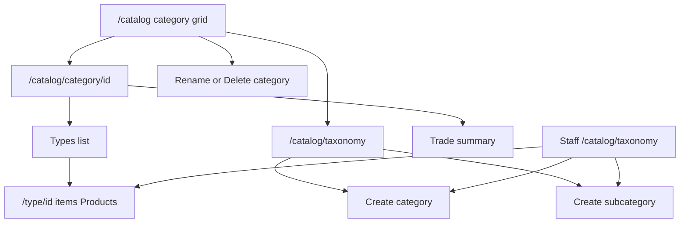

# Module: Categories (Catalog Taxonomy)

**Queue:** 5 of 15  
**Status:** Review PASS (2026-07-18)  
**Scope:** Analysis only — `item_categories` + `category_types` (subcategories), not catalog items, not unit masters  
**Source of truth:** `source-app/`  

## Boundary (Products / Units deferred)

| In Categories (this doc) | Deferred to Products (#4 — done) | Deferred to Units (#6) |
|---|---|---|
| `/catalog/taxonomy`, new-category, new-subcategory, category detail CRUD | Item list under type; item create/edit/detail | `master_units`, unit-engine |
| Category rename/delete on `/catalog` hub | All `/catalog-items*` APIs | Packaging profile masters |
| Full `/item-categories*` + `/category-types*` APIs | Item FKs on create (document as exit only) | Unit-setup sheets on item create |
| Category trade-summary / insights APIs | — | — |

**Exclude:** `/contacts/category` (`CategoryItemsPage`) — contact/trade string category reports, not `item_categories`.

---

## 1. Screen inventory (taxonomy-scoped)

| Route | Page | Notes |
|---|---|---|
| `/catalog` | `CatalogPage` | Category grid; rename/delete; FAB add category; nav to taxonomy. Staff **blocked**. |
| `/catalog/taxonomy` | `CatalogTaxonomyHubPage` | Staff+owner hub: browse/create categories & types |
| `/catalog/new-category` | `CatalogAddCategoryPage` | Full-screen create category |
| `/catalog/category/:categoryId` | `CatalogCategoryDetailPage` | Types list + trade pulse. Staff **blocked** (no `/type/` in path). |
| `/catalog/category/:categoryId/new-subcategory` | `CatalogAddSubcategoryPage` | Full-screen create type |
| `/catalog/category/:id/type/:typeId` | `CatalogTypeItemsPage` | **Boundary** — Products owns item list |

**Staff route gate** (`app_router.dart` `_isStaffAllowedRoute`): staff **allowed** `/catalog/taxonomy`, `/catalog/new-category`, and `/catalog/category/…` when path ends with `/new-subcategory` or contains `/type/`. Staff **blocked** from `/catalog` and pure `/catalog/category/:id`.

**Sheets (not routes):** `quick_catalog_taxonomy_sheet.dart` — quick create category (± optional sub) or subcategory-only.

---

## 2. Layouts

### Catalog hub (`catalog_page.dart`) — taxonomy actions

- AppBar “Catalog”; action **Quick categories** → `/catalog/taxonomy`; FAB **Add category** → quick taxonomy sheet.
- Category **grid** (desktop 2 cols / mobile 1); card: initial avatar, name, `$subCount subcategories · $itemCount items`.
- Popup menu: **Rename** (dialog), **Delete** (confirm; must have no items).
- Tap card → `/catalog/category/$id`.

### Taxonomy hub (`catalog_taxonomy_hub_page.dart`)

- Explains category vs subcategory; chips **Category** / **Subcategory** open quick sheet modes.
- List of categories with subtitle (sub count or “General created automatically”); trailing add-sub.
- **Staff** tap → subcategory sheet; **Owner** tap → category detail. Owner AppBar link **Full catalog** → `/catalog`.
- Back: staff → `/staff/home`; owner → `/home`.

### Add category / subcategory pages

- Single name field; Cancel / Create; similar-name confirm dialog; saving spinner + PopScope.

### Category detail (`catalog_category_detail_page.dart`)

- Header: category name, total items.
- **Trade pulse** from `categoryTradeSummaryProvider` (hidden if `item_count==0`): INR total, KG/BAGS volume; item tiles → Products item detail.
- Types list with fuzzy filter; FAB **Add subcategory**.
- **No** rename/delete on this page; **no** insights UI (API/provider exist unused).

### Quick taxonomy sheet

- Modes: `categoryAndOptionalSub` | `subcategoryOnly` (dropdown category + required sub name).

---

## 3. Form fields

| Surface | Fields |
|---|---|
| Create category (page/sheet) | `name*` (max 255 server) |
| Create subcategory (page/sheet) | `name*`; sheet may require category select |
| Optional first sub on category create | `Subcategory (optional)` after category create |
| Rename category | `name*` |
| Type rename/delete | **No Flutter UI** (API only) |

**Not exposed in taxonomy UI/API Out:** `is_perishable` on `item_categories` (DB/model default `false`; Create/Update/Out schemas are `name` only). Flutter stock UI may show a perishable flag from **stock** payloads — not category CRUD.

---

## 4. Validation

**Client**

- Empty name → `Enter a name`; subcategory-only empty category → `Select a category`.
- Similar-name fuzzy confirm (category minScore ~86; subcategory within types) — dialog Go back / Create.

**Server** (`catalog.py`)

- Create/update: `name` `min_length=1`, `max_length=255`; strip; normalize dup via `_norm_name` (lower, collapse spaces).
- Category dup → **409** `"A category with this name already exists"`.
- Type dup within category → **409** `"A type with this name already exists in this category"`.
- Delete category with items → **400** move/delete items first; **owner** only (`require_owner_membership`).
- Delete type with items on `type_id` → **400**; **owner** only.
- Missing category/type → **404**.

---

## 5. Buttons / menus / sheets

| Action | Where | API |
|---|---|---|
| Add category | FAB hub / taxonomy / sheet / `/new-category` | `POST /item-categories` |
| Add subcategory | Detail FAB / taxonomy / sheet / `/new-subcategory` | `POST …/category-types` |
| Rename category | Catalog hub menu | `PATCH /item-categories/{id}` |
| Delete category | Catalog hub menu | `DELETE /item-categories/{id}` |
| Navigate type → items | Category detail type card | Products route |
| Cross-feature create | `contacts_page.dart` may `createItemCategory` | Same POST |

**No UI:** `updateCategoryType`, `deleteCategoryType` (client methods exist in `hexa_api.dart` only).

---

## 6. Search / filter / sort

| Surface | Behaviour |
|---|---|
| Catalog hub | Fuzzy on **category names**; 150ms debounce; suggestion chips |
| Taxonomy hub | Case-insensitive `contains` on category name (not fuzzy) |
| Category detail types | Fuzzy filter types; 150ms debounce; minScore 38 |
| List APIs | Categories / types ordered by `lower(name)`; types-index by category then type |

No pagination on taxonomy list endpoints (full list for business).

---

## 7. Calculations (category-scoped)

### Trade summary (`GET …/trade-summary`)

- Confirmed trade lines (`TradePurchase.status` coalesce lower == `confirmed`).
- Per item + category totals: `period_line_total`, `period_qty_bags` (unit bag/sack/box), `period_weight_kg`; last purchase/selling/supplier/broker/human_id.
- UI: “Trade pulse (confirmed bills)” on category detail.

### Insights (`GET …/insights?from&to`)

- Returns `CategoryInsightsOut`: item_count, linked_line_count, total_profit, top/worst item by profit.
- Flutter: `categoryInsightsProvider` defined; **not wired** to category detail UI.

Do not deep-dive item stock here (Products).

---

## 8. Role / permission gates

| Capability | Gate |
|---|---|
| View `/catalog` grid, rename/delete | Route blocks staff; delete API = **owner** |
| Taxonomy hub + quick create | Membership; staff allowed |
| Category detail + trade pulse | Owner path only (staff blocked by router) |
| Create category/type | `require_membership` |
| Delete category/type | `require_owner_membership` |
| PATCH category/type | Membership (type PATCH unused in UI) |

---

## 9. Taxonomy APIs (`catalog.py`)

Prefix: `/v1/businesses/{business_id}`

| Method | Path | Auth | Body / notes | Response |
|---|---|---|---|---|
| GET | `/item-categories` | membership | — | `[{id,name}]` |
| POST | `/item-categories` | membership | `{name}` | 201; seeds type `"General"` |
| GET | `/item-categories/{id}` | membership | — | `{id,name}` |
| PATCH | `/item-categories/{id}` | membership | `{name?}` | Out |
| DELETE | `/item-categories/{id}` | **owner** | blocked if items | 204 |
| GET | `/category-types-index` | membership | flat types + `category_name` | index list |
| GET | `/item-categories/{id}/category-types` | membership | — | type list |
| POST | `/item-categories/{id}/category-types` | membership | `{name}` | 201 |
| PATCH | `/item-categories/{id}/category-types/{type_id}` | membership | `{name?}` | Out |
| DELETE | `/item-categories/{id}/category-types/{type_id}` | **owner** | blocked if items on type | 204 |
| GET | `/item-categories/{id}/trade-summary` | membership | — | `CategoryTradeSummaryOut` |
| GET | `/item-categories/{id}/insights` | membership | `from`, `to` query | `CategoryInsightsOut` |

**Shared with Products (FK only):** item create validates `category_id`/`type_id`; list filters; `_get_or_create_general_type_id` for item flows.

---

## 10. Database

From `models/catalog.py` + `docs/20_Database_Analysis.md`:

### `item_categories` (`ItemCategory`)

| Column | Notes |
|---|---|
| `id` | UUID PK |
| `business_id` | FK → `businesses.id` |
| `name` | String(255) |
| `is_perishable` | bool NOT NULL default false — **API/UI taxonomy unused** |
| `created_at` | timestamptz |

Relationships: `items`, `category_types` with `cascade="all, delete-orphan"`.

### `category_types` (`CategoryType`)

| Column | Notes |
|---|---|
| `id` | UUID PK |
| `category_id` | FK → `item_categories.id` **ON DELETE CASCADE** |
| `name` | Unique per category (`uq_category_types_name`) |
| `created_at` | timestamptz |

### Boundary FK (`catalog_items`)

- `category_id` NOT NULL → `item_categories`
- `type_id` NULL → `category_types` **ON DELETE SET NULL**

---

## 11. Business rules

1. **`GENERAL_TYPE_NAME = "General"`** — every `POST /item-categories` also inserts a type named `"General"`.
2. Category name unique per business (app-level normalized compare; not a DB unique on `item_categories.name` in model).
3. Type name unique per category (DB unique + app dup check).
4. Soft-delete of categories: **none** — hard DELETE when empty.
5. Delete category cascades types (ORM/FK); API refuses delete while catalog items reference category.
6. Delete type refuses while items have `type_id`; item FK SET NULL if type removed another way.
7. Staff cannot reach owner rename/delete UI; API still enforces owner on DELETE.

---

## 12. Loading / error / empty / refresh

- Loading: `ListSkeleton` on hub lists.
- Error: `FriendlyLoadError` + invalidate retry; sheet load fail `Could not load categories`.
- Empty: hub `No categories yet` / `No matches`; detail `No subcategories yet — tap Add subcategory.`
- After writes: `invalidateCatalogTaxonomy` (`catalog_taxonomy_utils.dart`) invalidates categories list, types index, catalog items list, contacts categories, optional per-category types provider.
- Snacks: `Category created`, `Subcategory created`, `Saved`, `Category deleted`; Dio errors via `showRetryableErrorSnackBar`.

---

## 13. Responsive / a11y

- Catalog hub: 2-col desktop / 1-col mobile grid (source).
- No dedicated a11y taxonomy docs found beyond standard Flutter widgets — Unknown if further semantics exist.

---

## 14. Boundary reminder

| Keep in Categories | Products | Units |
|---|---|---|
| Taxonomy CRUD + trade-summary UI | Type → item list & item APIs | Master units / packaging |
| Auto-General type | Item selectors for category/type | Unit sheets on item forms |

Do not expand this doc into Products item flows or Units masters.

---

## 15. Unknowns / Risks

1. **`is_perishable`** — stored on `item_categories`, never in taxonomy Create/Update/Out; who writes it? Unknown — needs verification at implement (likely always default).
2. **Type rename/delete** — API present; **zero** Flutter callers — product may rely on API/admin only; migrating UI must not invent rename unless approved.
3. **`categoryInsightsProvider`** unused on category detail — dead client path or reserved; implement must not invent UI.
4. **Category name uniqueness** — app-level only; concurrent create race risk.
5. **Contacts** can create categories outside catalog UX — shared invalidation via `contactsCategoriesProvider`.
6. ORM `ItemCategory.items` cascade delete-orphan vs API block — API is safety; do not rely on cascade to wipe items.

---

## 16. Sequence (create category)

## 17. User flow

---

## Capability flags

| Capability | UI | API | Notes |
|---|---|---|---|
| List categories | Yes | Yes | |
| Create category + General type | Yes | Yes | |
| Rename category | Yes (owner hub) | Yes | |
| Delete category | Yes (owner hub) | Yes owner | |
| List / create types | Yes | Yes | |
| Rename / delete type | No | Yes | API-only |
| Trade summary on detail | Yes | Yes | |
| Category insights | No | Yes | Provider unused |
| is_perishable edit | No | No | DB column only |

---

## Review PASS/FAIL

| # | Section | Status | Evidence |
|---|---|---|---|
| 1 | Screen inventory | PASS | `app_router.dart` routes + staff allowlist |
| 2 | Layouts | PASS | taxonomy hub, add pages, detail, sheet, catalog hub actions |
| 3 | Form fields | PASS | name-only; is_perishable noted unused |
| 4 | Validation | PASS | client + `_category_dup` / `_type_name_dup` |
| 5 | Buttons/menus | PASS | §5 |
| 6 | Search | PASS | fuzzy hub / contains taxonomy / type filter |
| 7 | Calculations | PASS | trade-summary + insights API |
| 8 | Role gates | PASS | router + `require_owner_membership` |
| 9 | APIs | PASS | `catalog.py` item-categories / category-types |
| 10 | DB | PASS | models + `20_Database_Analysis.md` |
| 11 | Business rules | PASS | GENERAL + delete guards |
| 12 | Loading/errors | PASS | invalidate helpers |
| 13 | Responsive/a11y | PASS | grid cols; a11y sparse |
| 14 | Boundary Products/Units | PASS | §Boundary + §14 |
| 15 | Unknowns | PASS | §15 |
| 16–17 | Diagrams | PASS | §16–17 |

**Verdict:** Review **PASS**. **Stop.** Next: Units analysis only.
