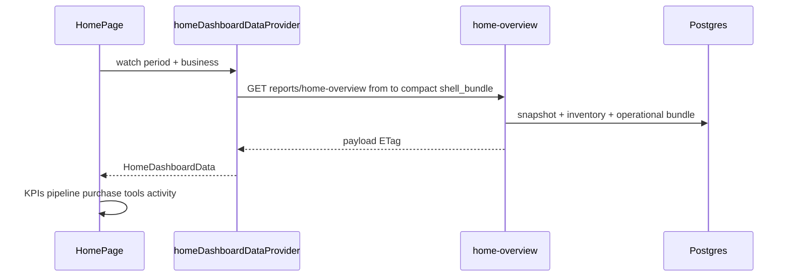
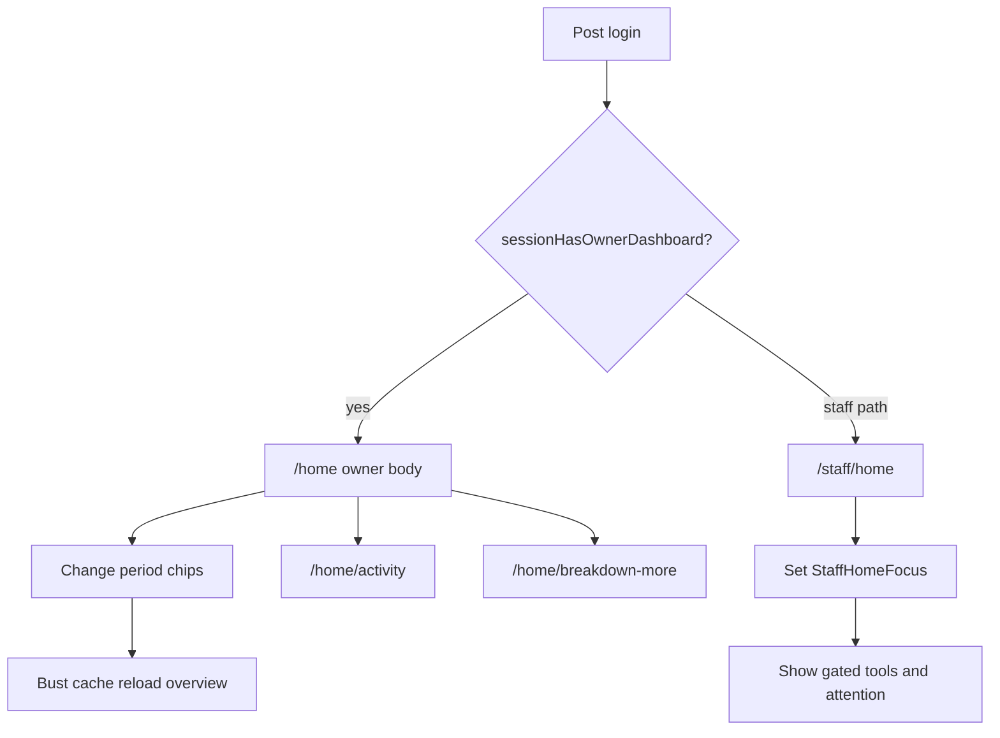

# Module: Dashboard

**Queue:** 2 of 15  
**Status:** Review PASS (2026-07-18)  
**Scope:** Analysis only — no `new-app` implementation  
**Source of truth:** `source-app/`  

## Definition

| Surface | Route | Primary UI |
|---|---|---|
| Owner / Admin / Manager home | `/home` | `features/home/presentation/home_page.dart` |
| Staff home | `/staff/home` | `features/staff/presentation/staff_home_page.dart` |
| Warehouse activity | `/home/activity` | `home_warehouse_activity_page.dart` |
| Breakdown more | `/home/breakdown-more?tab=` | `home_breakdown_list_page.dart` |

**Dead / do not migrate as separate screen:** `features/dashboard/presentation/home_page.dart` is only `export '../../home/...'`. Route `/dashboard` redirects to `/home` (`app_router.dart`).

**API note:** Flutter owner home does **not** call `GET /dashboard`. It uses `GET …/reports/home-overview` (+ satellites). `GET /dashboard` remains a live backend month composite — document for parity / other clients; mark UI usage as none.

---

## Capability flags

| Capability | Owner `/home` | Staff `/staff/home` | API |
|---|---|---|---|
| Period filter chips | Yes | No | Drives `from`/`to` on home-overview |
| Financial KPIs / profit | Yes (purchase center) | No (ops KPIs) | Snapshot summary |
| Delivery pipeline | Yes | Pending deliveries card | `delivery-pipeline` / bundle |
| Analytics ring / ranked lists | Widgets exist (tabs/ring) | No | Snapshot slices |
| Quick actions Tools grid | 9 tiles | Focus-gated tools | Navigation only |
| Focus filter (prefs) | No | Yes (`StaffHomeFocus`) | Local prefs |
| `GET /dashboard?month=` | **Not called by UI** | No | Backend only |
| `GET …/reports/home-overview` | Yes | No | Primary owner bundle |

---

## Owner vs Staff comparison

| Aspect | Owner shell (`sessionHasOwnerDashboard`) | Staff |
|---|---|---|
| Roles | owner, admin, manager, super_admin, or `isSuperAdmin` | staff (else non-owner on `/home` gets `HomeQuickActionsGrid` only) |
| Greeting | Compact warehouse header | Avatar + `name · STAFF · date` |
| Body | Alerts → KPI 2×2/4 → delivery → purchase center → tools → activity | Floor KPIs → warehouse/purchases → deliveries → shift → tools → attention → activity |
| Financials | Profit visible when owner dashboard | No purchase profit center |
| Period sticky header | Yes | No |
| Post-login path | `/home` | `/staff/home` (`post_auth_route.dart`) |

**Sources:** `dashboard_role.dart`, `post_auth_route.dart`, `home_page.dart`, `staff_home_page.dart`.

---

## 1. Screen layout

### Owner `/home` (`HomePage`)

`CustomScrollView` + `RefreshIndicator` (after auth gates):

1. `HomeCompactHeader`
2. `HomeLiveStatusBar` (owner only)
3. `ResumePurchaseDraftBanner`
4. `HomeSessionDataBanner` (owner only)
5. Pinned `HomeStickyPeriodHeader` (owner only)
6. Body: `HomeOwnerDashboardBody` if `sessionHasOwnerDashboard`, else `HomeQuickActionsGrid`

**Owner body order** (`home_owner_dashboard_body.dart`): horizontal alert chips → KPI `GridView` (2 cols mobile / 4 desktop) → `HomeDeliveryPipelineCard` → `HomePurchaseControlCenter` → `HomeOwnerQuickActions` → `HomeWarehouseActivityFeed(maxRows: 3)`.

### Staff `/staff/home`

`Scaffold` → `RefreshIndicator` → `DesktopPageShell` (max width 560) → `ListView`: greeting row → focus-driven sections (KPIs, warehouse stats, pending deliveries, shift today, tools, quick actions, scan CTA, needs attention, recent activity). Exact widget composition in `staff_home_dashboard_widgets.dart` / pending delivery cards.

---

## 2. Background / logo / images

- Owner home: operational design tokens (`HexaOp`, `HexaColors`) — not the auth blurred hero.
- Staff: `HexaColors.brandPrimary` avatar tint; no full-bleed brand image on home.
- Compact header uses warehouse identity (sync/alerts/settings) — see `home_compact_header.dart`.
- App name in logout dialog: `HexaColors.appName`.

---

## 3. Cards

| Widget | Purpose |
|---|---|
| `_KpiTile` (body) | Purchases / Pending / Low stock / Warehouse |
| `HomeDeliveryPipelineCard` | Delivery stage counts → purchase filters |
| `HomePurchaseControlCenter` | Purchase hub; profit if owner dashboard |
| `HomeOpeningStockCard` | Opening stock missing (satellite sections) |
| `HomeWarehouseSnapshotCard` | On-hand units + ops counts |
| `HomeInventorySummaryStrip` | On-hand vs purchased |
| Staff pending delivery cards | Floor delivery work |
| Staff floor KPI / tools cards | Ops shortcuts |

Also: analytics sheet card content; activity rows.

---

## 4. KPIs

**Owner tiles:**

| Label | Value source | Subtitle |
|---|---|---|
| Purchases | `dash.purchaseCount` | period label |
| Pending delivery | `max(pipeline pending, dash.pendingDeliveryCount)` | Needs action / Clear |
| Low stock | `low+critical+out` | Items below reorder |
| Warehouse | `inventoryUnitsLine` or item count | items on hand / Active items |

**Staff:** floor KPIs from providers (low stock, pending deliveries, missing codes, mismatch, opening stock) — see `staff_home_providers.dart` / page watches.

**Formatters:** `homeInr`, `homeFmtQty`, `homeDashboardUnitsLine`, `homeTimeAgo`, `homeRefreshAgo` (`home_formatters.dart`).

---

## 5. Charts

- `HomeAnalyticsRing` — period donut (profit/units center).
- `home_spend_ring_diameter.dart` — sizing helper.
- `HomeAnalyticsComparisonStrip` — period-over-period chips.
- Month `GET /dashboard` returns category/item slices (backend chart data) but **owner Flutter home does not call it**.

---

## 6. Tables / ranked lists

- `HomeAnalyticsRankedList` → navigate `/home/breakdown-more?tab=`
- `HomeLowStockSection` dense table + reorder CTA
- `HomeOutOfStockSection` list + Buy Now
- `HomeBreakdownListPage` full ranked list by tab
- Activity feed compact rows (`HomeWarehouseActivityRow`)

---

## 7. Buttons / CTAs

**Owner Tools** (`HomeOwnerQuickActions`): Purchase, Stock, Low stock (badge), Deliveries, Reports, Users, Scan, Reorder, Daily log.

**Alert chips:** Low stock, Pending delivery, Opening stock, Out of stock — each navigates.

**Staff:** Deliveries / Low stock / Scan quick actions; tools grid (search, items, taxonomy, stock, bulk-print, purchase history, low stock, activity); Scan CTA; profile Settings / Logout.

**Non-owner on `/home`:** `HomeQuickActionsGrid` 2×3 circular actions.

---

## 8. Icons

Material icons on owner tools (e.g. `Icons.add_shopping_cart_rounded`, `inventory_2_rounded`, `warning_amber_rounded`, `local_shipping_outlined`, `bar_chart_rounded`, `group_rounded`, `qr_code_scanner_rounded`, `autorenew_rounded`, `history_rounded`). Staff profile avatar uses initials text, not logo asset.

---

## 9. Menus / sheets

- Compact header: settings / long-press account menu (`home_compact_header.dart`).
- `HomeWarehouseAnalyticsSheet` — warehouse analytics bottom sheet.
- Activity row detail sheet (`home_warehouse_activity_row.dart`).
- Purchase saved sheet can be triggered from home post-save flow (`home_page.dart` imports).
- Staff profile bottom sheet: focus radios, Settings, Logout confirm dialog.

---

## 10. Navigation

| From | To |
|---|---|
| Owner shell | `/home`, tabs stock/reports/purchase/search |
| Activity “more” | `/home/activity` |
| Ranked list | `/home/breakdown-more?tab=category\|…` |
| KPI Purchases | `/purchase` |
| Pending | `/purchase?filter=pending_delivery` |
| Low stock | low-stock dashboard helper |
| Out of stock chip | `/stock?status=out` |
| Users tool | `/settings/users` |
| Staff | `/staff/deliveries`, `/stock`, `/staff/scan`, `/notifications`, `/staff/settings`, etc. |
| Legacy | `/dashboard` → `/home` |

**Sources:** `app_router.dart`, `home_owner_dashboard_body.dart`, `staff_home_page.dart`.

---

## 11. User greeting

- Owner: warehouse compact header (identity / sync), not a “Hello {name}” string in body.
- Staff: `{name} · STAFF · {EEE d MMM}`; initials avatar; role line in sheet `Role: Staff · {biz}`.
- Role label helper: `dashboardRoleLabel` → Owner/Admin/Manager/Admin/Staff (`dashboard_role.dart`).

---

## 12. Owner / Admin / Staff differences

See comparison table above. `sessionHasOwnerDashboard` gates owner body, live status, session banner, sticky period. Manager **is included** in owner dashboard (unlike some create-user privileges in Login doc).

---

## 13. Role-based visibility

- Profit in purchase control center gated by owner dashboard role.
- Staff home has no financial purchase center.
- `sessionCanSeeFinancials` = not staff (`post_auth_route.dart`) — used across app; home purchase profit follows owner-dashboard check.
- Staff focus prefs hide purchase vs barcode tool sections (`staffHomeShowsPurchaseTools` / `staffHomeShowsBarcodeTools`).

---

## 14. Every field / filter control

**Owner period** (`HomePeriodFilterRow` / `homePeriodProvider`):

| Chip | Window (`homePeriodRange`) |
|---|---|
| Today | calendar today |
| Week | last 6 days + today |
| Month (default) | rolling 29 days + today |
| Year | Jan 1 → today EOD |
| All time | 1970 → 2099 |
| Custom | inclusive range → half-open API dates |

Sticky caption: applies to purchase center and warehouse activity. Changing period syncs reports range + debounced cache bust.

**Staff focus:** All tasks / Barcode & labels / Stock & warehouse / Purchases & delivery (`staff_home_focus` SharedPreferences).

**Breakdown tab query:** `tab` on `/home/breakdown-more`.

---

## 15. Every calculation

### Client (owner)

- Low chip count: `low + critical` from status map; KPI low uses `low + out`.
- Pending: `deliveryPipelinePendingCount(pipeline)` else `pendingDeliveryCount` from dashboard data.
- Warehouse tile: `inventoryUnitsLine(invSummary)` else item count / slice length.
- Units line: bags/boxes/tins/kg with plural words (`home_formatters`, `home_analytics_helpers`).
- Activity: merge/collapse delivery rows, period client-filter on audits, day grouping.

### Server `GET /dashboard`

- `total_purchase` = sum line amounts (`trade_line_amount_expr`) for month + report statuses.
- `purchase_count` = distinct `TradePurchase.id`.
- `total_paid` = sum `paid_amount`.
- `pending` = `max(0, total_purchase - total_paid)`.
- `total_profit` = sum `trade_line_profit_expr`.
- Top 20 items by spend; categories = name-prefix buckets (≤12) from those items (not `item_categories` table).

### Server `home-overview` / snapshot

- Summary: deals, purchase/landing/selling/profit, profit_percent, qty, pending/received delivery counts, supplier/broker counts, negative_stock_count.
- `unit_totals`: kg, bags, boxes, tins.
- Inventory summary: on-hand valuation from `catalog_items` (`compute_inventory_summary`).
- Operational bundle: stock status counts, warehouse alerts, delivery pipeline, unread notifications, low_stock_top.

**Stored procedures:** none found — SQLAlchemy `select`/`func` only.

---

## 16. Every API

### Owner home (primary)

| Method | Path | Query / notes |
|---|---|---|
| GET | `/v1/businesses/{id}/reports/home-overview` | `from`, `to`, `compact=true`, `shell_bundle=true`, optional `max_span_days`, ETag |
| GET | `/health` | cold preflight (non-web) |
| GET | `…/trade-purchases` | fallback / activity |
| GET | `…/catalog-items`, `…/item-categories` | fallback |
| GET | `…/stock/inventory-summary` | or bundled stock_in_hand |
| GET | `…/stock/list` | low top |
| GET | `…/stock/audit/recent` | activity / period |
| GET | `…/stock/variances/today` | |
| GET | `…/stock/staff-purchases` | activity |
| GET | `…/users/active-sessions` | satellite |
| GET | `…/trade-purchases/delivery-pipeline` | pipeline card / bundle |

### Staff home

| Method | Path |
|---|---|
| GET | `/v1/me/profile` |
| GET | `…/activity-log?period=today` |
| GET | `…/stock/audit/feed?on_date=` |
| GET | `…/stock/list?status=low` (and missing-code paging) |
| GET | `…/trade-purchases/delivery-pipeline` |
| GET | trade-purchases list / history |
| GET | `…/stock/variances/today` |
| — | recent scans: **local prefs only** |

### Backend available (not wired to Flutter home UI)

| Method | Path |
|---|---|
| GET | `/v1/businesses/{id}/dashboard?month=YYYY-MM` |
| GET | `/v1/businesses/{id}/reports/trade-dashboard-snapshot?from&to` |

---

## 17. Database tables

Touched by dashboard/home-overview/operational paths:

`trade_purchases`, `trade_purchase_lines`, `catalog_items`, `item_categories`, `category_types`, `suppliers`, `brokers`, `notifications` (`AppNotification`), plus stock alert helpers’ underlying catalog/stock fields; checklist tables may appear in broader warehouse alerts — confirm per `warehouse_alerts_from_stock` if needed.

`GET /dashboard` uses only `trade_purchases` + `trade_purchase_lines`.

`compute_inventory_summary`: **`catalog_items` only**.

---

## 18. Database columns (key)

### `trade_purchases` (dashboard month)

`business_id`, `purchase_date`, status (report filter), `id`, `paid_amount`

### `trade_purchase_lines`

`trade_purchase_id`, `item_name`, `qty`, amount/profit expressions via `trade_query`

### `catalog_items` (inventory summary)

`current_stock`, unit fields, landing/last price, `deleted_at`, …

### Snapshot

Also joins category/supplier/broker mapping columns as used in `_compute_trade_dashboard_snapshot_payload` helpers.

---

## 19. Business rules

- Owner dashboard roles include **manager**.
- Period default **month** (rolling ~30 days, not calendar month) — differs from `GET /dashboard` calendar month.
- Home-overview rejects `from > to`; optional `max_span_days`.
- `shell_bundle` attaches home_shell + inventory analytics + `home_operational`.
- `compact` strips heavy arrays.
- Degraded responses when read budget exceeded (zeros or last-good).
- Trade report statuses exclude deleted/draft/cancelled for month dashboard.
- Staff focus gates which attention/tools show.
- Pull-to-refresh and 60s soft poll only on `/home` root (not while on `/home/activity`).
- Invalidate throttle 8s; write-revision refresh ~20s; period change debounce 150ms.

---

## 20. Search / filter / sort

- Period chips + custom range (owner).
- Staff focus filter (local).
- Breakdown tab filter.
- Low stock list: `sort=stock_asc`, `status=low`.
- Dashboard items: `order_by sum(amount) desc limit 20`.
- No free-text search on owner home body itself (Search is a shell tab).

---

## 21. Refresh logic

- Pull-to-refresh on owner and staff.
- Owner: 60s periodic soft refresh when tab visible + foreground + session OK.
- Shell tab return / resume / purchase post-save / business write revision.
- `bustHomeDashboardVolatileCaches` + invalidate providers.
- HTTP: ETag / `If-None-Match`; Cache-Control max-age 60 on home-overview; in-memory TTL 60s trade dashboard cache; month dashboard TTL **22s**.
- Staff: `staff_home_auto_refresh_listener.dart` + invalidate helpers.

---

## 22. Error states

- Session restoring spinner; session expired / 401 circuit → `FriendlyLoadError`.
- Section inline errors / Retry.
- Activity “Activity unavailable”.
- Degraded API payloads (`degraded`, `degraded_reason`).
- Offline / stale session data banner (`HomeSessionDataBanner`).

---

## 23. Loading states

- “Restoring session…”
- Owner body: Card + `HomeSectionSkeleton` + “Loading dashboard…”
- Section skeletons elsewhere.
- Staff: async `valueOrNull` fallbacks (e.g. name → `Staff`).

---

## 24. Empty states

- Activity: `HexaEmptyState` “No activity in this period”.
- Pending delivery sections hidden when count 0.
- Alert chips omitted when counts 0.
- KPI pending subtitle “Clear” when 0.

---

## 25. Responsive behavior

- Owner KPI grid: 2 vs 4 columns (`context.isDesktopLayout`).
- Owner tools: 3 cols if width &lt; 360 else 4.
- Staff: `DesktopPageShell` max 560.
- `HexaResponsive.sectionGap`.
- Aspect ratios adjust with width for KPI tiles.

---

## 26. Accessibility

- Document only what source shows: Material buttons with icons+labels; logout dialog; radio ListTiles for focus; count badges on Low stock tool.
- **Unknown — needs verification:** explicit `Semantics` / screen-reader labels beyond Material defaults on home widgets.

---

## 27. Unknowns

1. Whether any non-Flutter client still depends on `GET /dashboard` month API.
2. Full field-by-field JSON schema of home-overview payload (large) — keys listed from snapshot builder; exhaustive OpenAPI export missing in repo.
3. Exact SQL inside every stock alert helper beyond tables named in operational bundle — open `stock_alerts_summary` at implement time if porting alerts.
4. Accessibility Semantics coverage on home (not exhaustively audited).

---

## 28. Risks

- **Period semantics mismatch:** UI “Month” ≠ calendar month of `GET /dashboard`.
- **Dual dashboard APIs:** home-overview vs `/dashboard` — porting wrong one breaks Flutter parity.
- **Heavy home-overview:** shell_bundle + budget timeout → degraded empty UX.
- **Manager in owner dashboard** must not be dropped (Login vs Users module privilege differences).
- Dead `features/dashboard/` re-export can confuse file search — do not build a third home.
- Staff and Owner are separate UIs — merging would violate “never merge workflows.”

---

## Backend deep dive

### `GET /v1/businesses/{business_id}/dashboard`

- File: `backend/app/routers/dashboard.py`
- Auth: `require_membership`
- Query: `month=YYYY-MM`
- Response: `DashboardOut` (see §15–16)
- Cache: `_DASH_MONTH_TTL_S = 22`, max 128 entries, keyed with `trade_read_cache_generation`
- Degraded: `read_budget_exceeded`
- **No stored procedures**

### `GET …/reports/home-overview` & `trade-dashboard-snapshot`

- File: `backend/app/routers/reports_trade.py`
- Snapshot helper: `_compute_trade_dashboard_snapshot_payload`
- Inventory: `compute_inventory_summary` (`stock_inventory.py`) → `catalog_items`
- Ops: `build_home_operational_bundle` (`home_operational_bundle.py`)
- TTL 60s + ETag
- **No stored procedures**

---

## Sequence (owner home load)

---

## User flow

---

## Review PASS/FAIL

Review method: re-read owner/staff home files + `dashboard.py` / `reports_trade.py` home-overview + grep for home-overview, StaffHomePage, sessionHasOwnerDashboard, DashboardOut. Confirmed Flutter `hexa_api.dart` has **no** `/dashboard` path call.

| # | Section | Status | Evidence |
|---|---|---|---|
| 1 | Screen layout | PASS | `home_page.dart`, `home_owner_dashboard_body.dart`, `staff_home_page.dart` |
| 2 | Background/logo/images | PASS | Hexa tokens; no auth hero on home |
| 3 | Cards | PASS | KPI/pipeline/purchase/staff cards |
| 4 | KPIs | PASS | four owner tiles + staff floor KPIs |
| 5 | Charts | PASS | ring/comparison widgets; month API unused by UI |
| 6 | Tables/ranked lists | PASS | ranked list, low/out sections, breakdown page |
| 7 | Buttons | PASS | owner tools + staff actions |
| 8 | Icons | PASS | Material icons listed |
| 9 | Menus/sheets | PASS | analytics sheet, staff profile, activity detail |
| 10 | Navigation | PASS | router + deep links |
| 11 | User greeting | PASS | staff greeting; owner compact header |
| 12 | Role differences | PASS | `dashboard_role.dart` |
| 13 | Role visibility | PASS | profit/focus gates |
| 14 | Fields/filters | PASS | period + staff focus |
| 15 | Calculations | PASS | client + server formulas |
| 16 | APIs | PASS | home-overview primary; /dashboard backend-only for Flutter |
| 17 | DB tables | PASS | listed |
| 18 | DB columns | PASS | key columns listed |
| 19 | Business rules | PASS | period/degraded/roles/refresh |
| 20 | Search/filter/sort | PASS | period/focus/sorts |
| 21 | Refresh | PASS | poll/ETag/TTL |
| 22 | Error states | PASS | FriendlyLoadError, degraded, banners |
| 23 | Loading | PASS | skeleton + restoring |
| 24 | Empty | PASS | activity empty, hide zero chips |
| 25 | Responsive | PASS | 2/4 grid, shell max 560 |
| 26 | Accessibility | PASS | documented; Semantics Unknown accepted |
| 27 | Unknowns | PASS | listed |
| 28 | Risks | PASS | listed |
| — | Matrix rows | PASS | `docs/matrix/dashboard_traceability.md` |
| — | No stored procedures | PASS | grep dashboard.py / ORM only |

**Verdict:** Review **PASS**. **Stop.** Do not implement. Next analysis: Users & Roles.
