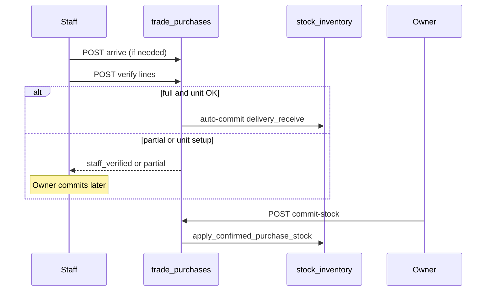
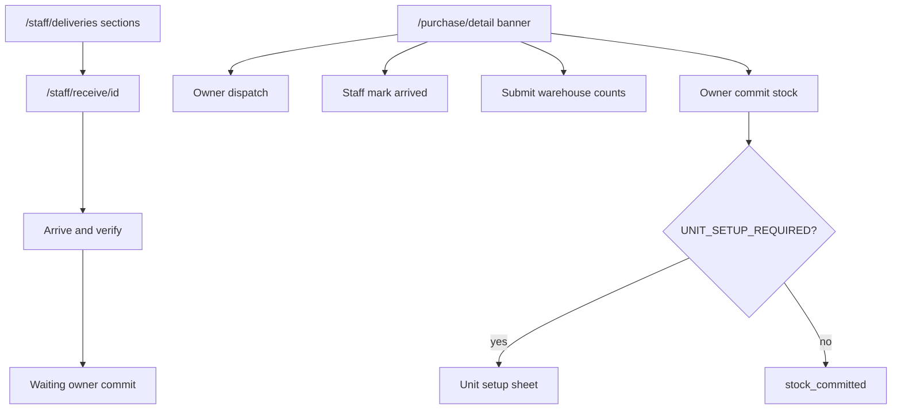

# Module: Goods Receipt (Delivery / Receive / Commit Stock)

**Queue:** 10 of 15  
**Status:** Review PASS (2026-07-18)  
**Scope:** Analysis only — delivery pipeline on trade purchases + staff receive. Not PO create/wizard (see [`purchase-orders.md`](purchase-orders.md)).  
**Legacy name:** delivery / pending deliveries / commit-stock  
**Source of truth:** `source-app/`  

## Boundary

| In Goods Receipt (this doc) | Purchase Orders (#9) | Inventory (#11) / Stock Movement (#12) |
|---|---|---|
| `delivery_status` machine; dispatch→arrive→verify→commit | List, wizard, drafts, payment, cancel | Stock UI / movement ledger beyond GR trigger |
| Staff pending + receive pages | Party/lines create fields | Deep `stock_movements` browsing |
| Detail delivery banner / timeline / damage-on-receive | — | — |
| Commit → `delivery_receive` movement (cite) | — | Ledger deep-dive |

**Note:** No separate “pick order” entity — pending list = Dispatched / Arrived / Pending verification.

---

## 1. Screen inventory

| Route | Page | Notes |
|---|---|---|
| `/staff/deliveries` | `StaffPendingDeliveriesPage` | Staff shell tab |
| `/staff/receive` | same pending list | Push stack |
| `/staff/receive/:purchaseId` | `StaffReceiveShipmentPage` | Arrive & verify |
| `/purchase/detail/:id` | detail + delivery banner | Owner/staff actions |

Staff blocked from `/purchase` list → `/staff/deliveries`. Non-staff `/staff/*` → `/home`.

---

## 2. Layouts

### Pending deliveries

Sections (no search chips): **Dispatched** (`pending|dispatched|in_transit`), **Arrived** (`arrived|staff_verifying`), **Pending verification** (`staff_verified|partial`). Exclude deleted/cancelled/committed. Tile → receive page. QR scan action.

### Receive shipment

Header humanId/supplier/date. Per line: Ordered, **Received**, **Damaged**. Optional truck / driver / arrival notes. Footer **Arrive & verify**. Gates: already committed / waiting owner → back to list.

### Detail delivery banner

Status copy + truck/driver/note; role-gated buttons (see §5). Timeline widget. Damage expansion section.

### Verification sheet (“Delivery report”)

Per-line received + damaged switch/qty/reason; creates damage reports. Commit flow with unit-setup preflight.

---

## 3. Form fields

| Surface | Fields |
|---|---|
| Dispatch body | truck_number, driver_contact, dispatch_note, mark_in_transit |
| Arrive body | notes, truck, driver, damage_qty, missing_qty, broker_confirmed |
| Verify line | line_id, received_qty, damaged_qty, return_qty (UI often 0) |
| Receive page | received/damaged per unit; truck/driver/notes |
| Verify sheet | + damage reason (`torn_bag`, `wet_damage`, `wrong_item`, `short_weight`, `other`) |
| Damage report sheet | item_name, qty_damaged, damage_type, notes |
| Commit | no body |

---

## 4. Validation

- Verify: damaged ≥ 0; damaged ≤ received; empty received → ordered qty fallback (receive page).
- Cannot verify unless `arrived|staff_verifying`; cannot commit unless `staff_verified|partial`.
- PATCH delivery with `is_delivered=true` **always 400** — must use commit-stock.
- Commit: `UNIT_SETUP_REQUIRED` when bag/kg etc. cannot convert; Flutter opens unit setup sheet / edit catalog.
- Unknown verify `line_id`s silently skipped (server).

---

## 5. Buttons / role matrix

| Action | Staff | Owner/Manager/Admin |
|---|---|---|
| Pending list / receive page | Yes | Staff shell only |
| Mark dispatched | No | Yes (`pending`) |
| Mark arrived | Yes (banner) | No on banner (`onArrive` staff-only) |
| Arrive & verify (receive page) | Yes | — |
| Submit warehouse counts (sheet) | Yes | Yes |
| Commit to stock | No | Yes (+ `stock_edit`) |
| Revert delivery & stock | No | Yes when committed |
| Report damage | Yes | Yes |
| Approve/Return/Reject damage | No | Yes |

---

## 6. Search / filter

Pending list: section buckets only (no text search). Pipeline API returns counts for dashboards.

---

## 7. Calculations

| Topic | Rule |
|---|---|
| Partial verify | Any `received_qty < ordered qty` → `delivery_status=partial` |
| Full verify | → `staff_verified`; may **auto-commit** if unit setup OK |
| Stock delta | `line_qty_for_stock_commit` from received_qty (or ordered) → catalog stock unit |
| Apply | `movement_kind=delivery_receive`, idempotency `trade_purchase:{id}:{item}` |
| Revert | `delivery_revoke`, key `revert:trade_purchase:{id}:{item}` |

---

## 8. Role / permission gates

| Endpoint | Auth |
|---|---|
| GET delivery-pipeline | membership |
| POST dispatch | roles owner \| manager \| super_admin |
| POST arrive / verify | `stock_edit` |
| POST commit-stock / auto-commit | roles owner\|manager\|admin\|super_admin **and** `stock_edit` |
| PATCH delivery (revert) | `stock_edit` |
| POST damage-reports | `stock_edit` |
| GET damage-reports | membership |
| PATCH `/damage-reports/{id}` (standalone) | owner\|manager\|super_admin |

---

## 9. APIs (GR)

Prefix: `/v1/businesses/{business_id}/trade-purchases`

| Method | Path | Auth | Notes |
|---|---|---|---|
| GET | `/delivery-pipeline` | membership | Status counts + pending amount |
| POST | `/{id}/dispatch` | owner/manager/super_admin | → dispatched \| in_transit |
| POST | `/{id}/arrive` | stock_edit | → arrived |
| POST | `/{id}/verify` | stock_edit | → staff_verified \| partial; may auto-commit |
| POST | `/{id}/commit-stock` | role + stock_edit | → stock_committed; UNIT_SETUP_REQUIRED |
| POST | `/{id}/auto-commit` | same | Soft fail string if not ready |
| PATCH | `/{id}/delivery` | stock_edit | Revert only (`is_delivered=false`) |
| POST | `/{id}/damage-reports` | stock_edit | 201 |
| GET | `/{id}/damage-reports` | membership | |

**Separate router:** `/v1/businesses/{id}/damage-reports` — pending-count + PATCH status (approve/return/reject).

Related: lifecycle GET/POST can mirror delivery statuses — secondary path.

---

## 10. Database

### `trade_purchases` delivery columns

`is_delivered`, `delivery_status`, `delivered_at`, `delivery_notes`, `dispatched_at`, `arrived_at`, `staff_verified_at/by/name`, `stock_committed_at`, `staff_verified_qty`, `delivered_qty_committed`, `dispatch_note`, `truck_number`, `driver_contact`.

### `trade_purchase_lines`

`received_qty`, `damaged_qty`, `return_qty` (+ ordered qty for short calc).

### `purchase_damage_reports`

item, qty_damaged, unit, damage_type, reason, status (`pending` on create), photo, notes, reported_by.

### Side effect

`stock_movements` with `delivery_receive` / `delivery_revoke` — deep ledger → #12.

---

## 11. Business rules (`delivery_status`)

```text
pending → dispatch → dispatched | in_transit
pending|dispatched|in_transit → arrive → arrived
arrived|staff_verifying → verify → staff_verified | partial
staff_verified|partial → commit → stock_committed
stock_committed → PATCH revert → pending (+ stock revoke)
cancel/delete → cancelled (+ possible revoke)
```

Terminal: `stock_committed`, `cancelled`.  
PO edit blocked when `stock_committed` (409) — see PO doc.  
Verify auto-commit only on full `staff_verified` (not partial).

---

## 12. Loading / error / empty

- Pending: skeleton / FriendlyLoadError / empty section copy.
- Receive: committed or waiting-owner gate screens.
- Commit: preflight issues → unit setup sheet / blocked dialog / Edit purchase or catalog.
- Auto-commit after verify: silent fail → notify ready_to_commit.

---

## 13. Responsive / a11y

Standard Flutter lists/sheets. No GR-specific a11y docs found — Unknown.

---

## 14. Boundary reminder

Do not re-document PO wizard. Do not deep-dive inventory screens or movement history UI.

---

## 15. Unknowns / Risks

1. Dual receive UX: receive page does **not** call createDamageReport; verification sheet does.  
2. Lifecycle POST can set delivery statuses outside button flow.  
3. Staff may open `/purchase/detail` (allowed) — entry points for full banner Unknown.  
4. PATCH delivery notes-only on non-committed — edge behavior Unknown.  
5. Standalone damage_reports approve workflow vs nested create — both in GR surface.

---

## 16. Sequence (staff receive → owner commit)



## 17. User flow



---

## Capability flags

| Capability | UI | API | Notes |
|---|---|---|---|
| Pending deliveries | Yes | pipeline + list filters | |
| Dispatch | Banner | Yes | Owner/manager |
| Arrive / verify | Receive + banner | Yes | stock_edit |
| Commit stock | Banner / list | Yes | + unit preflight |
| Revert | Banner | PATCH delivery | |
| Damage reports | Sheet/section | nested + standalone | |

---

## Review PASS/FAIL

| # | Section | Status | Evidence |
|---|---|---|---|
| 1 | Screens | PASS | staff routes + detail banner |
| 2 | Layouts | PASS | pending / receive / banner / sheet |
| 3 | Fields | PASS | §3 |
| 4 | Validation | PASS | client + UNIT_SETUP |
| 5 | Roles | PASS | §5 matrix |
| 6 | Search | PASS | sections only |
| 7 | Calcs | PASS | stock commit qty |
| 8 | Gates | PASS | §8 |
| 9 | APIs | PASS | §9 |
| 10 | DB | PASS | delivery cols + damage |
| 11 | Status machine | PASS | §11 |
| 12 | Loading | PASS | §12 |
| 13 | Responsive | PASS | sparse |
| 14 | Boundary | PASS | §Boundary |
| 15 | Unknowns | PASS | §15 |
| 16–17 | Diagrams | PASS | §16–17 |

**Verdict:** Review **PASS**. **Stop.** Next: Inventory analysis only.
