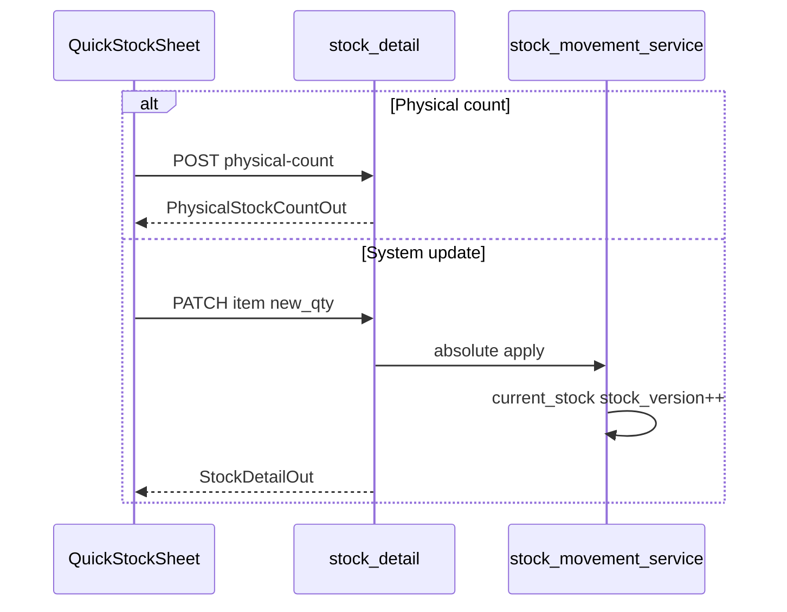
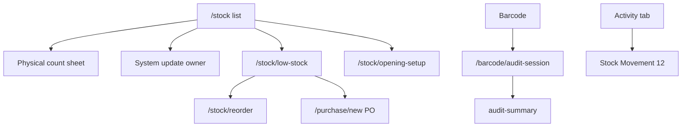

# Module: Inventory (Stock List / Adjust / Audit)

**Queue:** 11 of 15  
**Status:** Review PASS (2026-07-18)  
**Scope:** Analysis only — warehouse stock list, physical/system adjust, low-stock, reorder, opening, missing labels, barcode stock audits.  
**Source of truth:** `source-app/`  

## Boundary

| In Inventory (this doc) | Goods Receipt (#10) | Stock Movement (#12) | Reports (#14) |
|---|---|---|---|
| Stock list, physical-count, system PATCH, audits, low-stock, reorder, opening | `commit-stock` / delivery_receive | Activity/Changes tab deep-dive; `stock_movements` ledger | dead/fast/slow redirects |
| `stock_physical_counts`, `reorder_list`, `stock_audits` | — | `/stock/audit/feed` detail | — |

---

## 1. Screen inventory

| Route | Page | Notes |
|---|---|---|
| `/stock` | `StockPage(owner)` | Shell tab; `?tab=` `?status=` |
| `/staff/stock` | `StockPage(staff)` | Staff shell |
| `/stock/movement|changes|today-feed` | → `?tab=…` | Activity surface → #12 |
| `/stock/low-stock`, `/staff/low-stock` | `LowStockDashboardPage` | |
| `/stock/reorder` | `ReorderListPage` | |
| `/stock/opening-setup` | `OpeningStockSetupPage` | Staff → `/staff/stock` |
| `/stock/missing-barcodes` | `StockMissingLabelsPage` | Staff allowed |
| `/stock/staff-purchases` | `StaffPurchaseLogsPage` | Borderline |
| `/barcode/audit-session` | `StockAuditSessionPage` | |
| `/barcode/audit-summary` | `StockAuditSummaryPage` | |
| `/stock/dead|fast|slow` | → reports | #14 |

---

## 2. Layouts

### StockPage

Tabs: **Stock** (list) | **Activity** (`StockChangesTab` — cite only → #12).  
Search debounce 180ms; status chips All/Low/Out; delivery chips; period; advanced filters (reorder only, missing barcode/code, category/supplier/unit, sort). Infinite scroll `perPage=50`. Desktop split detail pane.

### Low stock dashboard

Segmented filters All/Out/Bought/Pending/Delivery; search scopes; PDF/CSV; row `+ Stock` / Order (owner) / Inform+Receive (staff).

### Reorder list

Tabs Pending/Ordered/Done; long-press mark status / remove.

### Opening setup

Summary + table + bulk set; Set Opening Stock sheet.

### Missing labels

Tabs missing barcode / item code; assign/print gated by permissions.

### Quick stock sheet

Mode toggle **Physical** vs **System**; qty + notes; system requires reason chip.

### Audit

Session: scan/list lines → End & review → Summary (matched/discrepant).

---

## 3. Form fields

| Surface | Fields |
|---|---|
| Physical count | counted_qty (≥0); optional period/notes |
| System update / PATCH | new_qty; adjustment_type (`verification\|sale\|damaged\|correction`); reason; `last_seen_stock_version?` |
| Opening stock | qty≥0; reason if changing locked; notes; idempotency? |
| Reorder | status pending\|ordered\|done |
| Audit line | system vs counted qty; reason when variance |
| List filters | q, category, status, sort, reorder_only, missing_*, unit |

---

## 4. Validation

- Physical-count: observation-only — **does not** bump `current_stock` / `stock_version`.
- Physical-update / PATCH: **409** `STALE_STOCK_VERSION` (tolerance ≤2 for verification); `?force=true`.
- Opening locked: PATCH **403** unless owner/super_admin/admin; set opening always locks.
- Audit: reason required when difference ≠ 0; approval if large variance (>2 and >2% or zero system).
- Undo-last: own adjustment within **15 min**.

---

## 5. Buttons / actions

| Action | Owner | Staff |
|---|---|---|
| Update physical | Yes | Yes (if stock_edit) |
| Update system (list row) | Yes | Hidden on list |
| Opening setup | Yes | Blocked by router |
| Low-stock Order | Yes | Inform / Receive |
| Export PDF/Excel | Yes | No |
| Start audit | Yes | Via scan overflow if allowed |
| Reorder add/mark | Yes | Membership APIs |

---

## 6. Search / filter / sort

List: `q`, status (`all|low|critical|out|shortage`), sort (`name|stock_asc|stock_desc|recent`), ETag cache. Compact + shell-bundle variants. Low-stock ops: filter/sort priority.

---

## 7. Calculations

| Rule | Source |
|---|---|
| stock_status | out ≤0; critical ≤ reorder×0.5; low ≤ reorder; else healthy |
| shortage | out ∪ critical ∪ low |
| Inventory summary | landing × qty valuation |
| Physical variance | counted − system |
| Low-stock priority | out / delay≥7d / mismatch / usage bands |

---

## 8. Role gates

| Capability | Auth |
|---|---|
| List / low-stock / reorder GET | membership |
| Physical-count / physical-update / PATCH / verify-count / undo | **`stock_edit`** |
| Opening-stock POST | **owner \| super_admin** |
| Stock-audits create/lines/complete/delete | **`stock_edit`** |
| Approve audit lines / pending-lines | owner\|manager\|admin |
| Staff opening-setup route | Redirect `/staff/stock` |

---

## 9. APIs (in-scope)

Prefix: `/v1/businesses/{business_id}/stock` unless noted.

### List / alerts (`stock_list.py`) — membership

`GET /list`, `/list/compact`, `/search`, `/shell-bundle`, `/delivery-indicator-counts`, `/low`, `/critical`, `/alerts/summary`, `/warehouse/alerts-summary`, `/low-stock/summary`, `/low-stock/operations`

### Detail / mutations (`stock_detail.py`)

| Method | Path | Auth |
|---|---|---|
| GET | `/{id}`, `/bundle`, `/intelligence`, `/activity`, `/summary`, purchase-intelligence | membership |
| POST | `/{id}/opening-stock` | owner\|super_admin |
| POST | `/{id}/physical-count` | stock_edit |
| POST | `/{id}/physical-update` | stock_edit |
| POST | `/{id}/verify-count` | stock_edit |
| PATCH | `/{id}` | stock_edit |
| POST | `/{id}/undo-last` | stock_edit |
| POST | `/{id}/notify-owner` | membership |

### Ops (`stock_ops.py`)

`GET /opening/setup`, `/opening/missing`, `/inventory-summary`, `/totals`, `/reorder`; `PATCH/DELETE /reorder/{id}`; `POST /{id}/reorder`; `POST /{id}/quick-purchase` (stock_edit)

### Stock audits (`stock_audits.py`) — `/stock-audits`

POST create; GET list/active/kpis/pending-lines/{id}; PUT; POST lines/complete/approve; DELETE draft only.

### Boundary → #12 (`stock_audit.py`)

`GET /audit/feed`, `/audit/recent`, `/audit/{item_id}`, `/variances/today` (+ staff-purchases).

---

## 10. Database

| Table | Inventory role |
|---|---|
| `catalog_items` | `current_stock`, `stock_version`, `reorder_level`, opening_*, rack, last_stock_* |
| `stock_physical_counts` | Observation rows (system vs counted) |
| `stock_adjustment_log` | Adjust history / undo window |
| `stock_audits` / `stock_audit_items` | Session audit |
| `reorder_list` | pending\|ordered\|done |
| `stock_movements` | Side effect of absolute/delta updates → #12 |

---

## 11. Business rules

1. **Physical-count ≠ ledger** — record only; use physical-update/PATCH/verify to change stock.  
2. Optimistic locking via `stock_version` on mutating paths.  
3. Opening set → `opening_stock_locked=True`.  
4. Reorder statuses: pending → ordered → done.  
5. Audit complete may leave `pending_review` if approvals remain.  
6. Mutations publish `stock.changed` realtime.

---

## 12. Loading / error / empty

List skeleton / FriendlyLoadError / empty + clear filters. 409 stale version → retry with fresh version. Undo 404 if none.

---

## 13. Responsive / a11y

Desktop split detail at `kDesktopMin`. A11y: Unknown beyond standard widgets.

---

## 14. Boundary reminder

Do not deep-dive Activity tab movement kinds or GR commit-stock.

---

## 15. Unknowns / Risks

1. Two audit systems: `/stock-audits` CRUD vs `/stock/audit/*` feed.  
2. Who sets audit line `rejected` (no reject route).  
3. Legacy `/v1/stock-audits` router defined but not mounted — Unknown clients.  
4. `OpeningStockIn.override` unused in handler.  
5. Staff low-stock detail still exposes Update system while list hides it.  
6. Live audit line upsert during scan — offline sync path; session page mostly complete.

---

## 16. Sequence (physical vs system)

## 17. User flow

---

## Capability flags

| Capability | UI | API | Notes |
|---|---|---|---|
| Stock list / filters | Yes | Yes | |
| Physical count | Yes | Yes | No ledger change |
| System adjust | Yes | Yes | stock_edit |
| Opening stock | Yes | Yes | owner |
| Low stock / reorder | Yes | Yes | |
| Stock audits | Yes | Yes | |
| Movement ledger | Activity tab | feed | → #12 |

---

## Review PASS/FAIL

| # | Section | Status | Evidence |
|---|---|---|---|
| 1 | Screens | PASS | app_router /stock* |
| 2 | Layouts | PASS | StockPage + satellites |
| 3 | Fields | PASS | §3 |
| 4 | Validation | PASS | version / locked |
| 5 | Actions | PASS | §5 |
| 6 | Search | PASS | list filters |
| 7 | Calcs | PASS | stock_status |
| 8 | Roles | PASS | stock_edit / opening |
| 9 | APIs | PASS | §9 + boundary |
| 10 | DB | PASS | §10 |
| 11 | Rules | PASS | physical vs ledger |
| 12 | Loading | PASS | §12 |
| 13 | Responsive | PASS | desktop split |
| 14 | Boundary | PASS | §Boundary |
| 15 | Unknowns | PASS | §15 |
| 16–17 | Diagrams | PASS | §16–17 |

**Verdict:** Review **PASS**. **Stop.** Next: Stock Movement analysis only.
