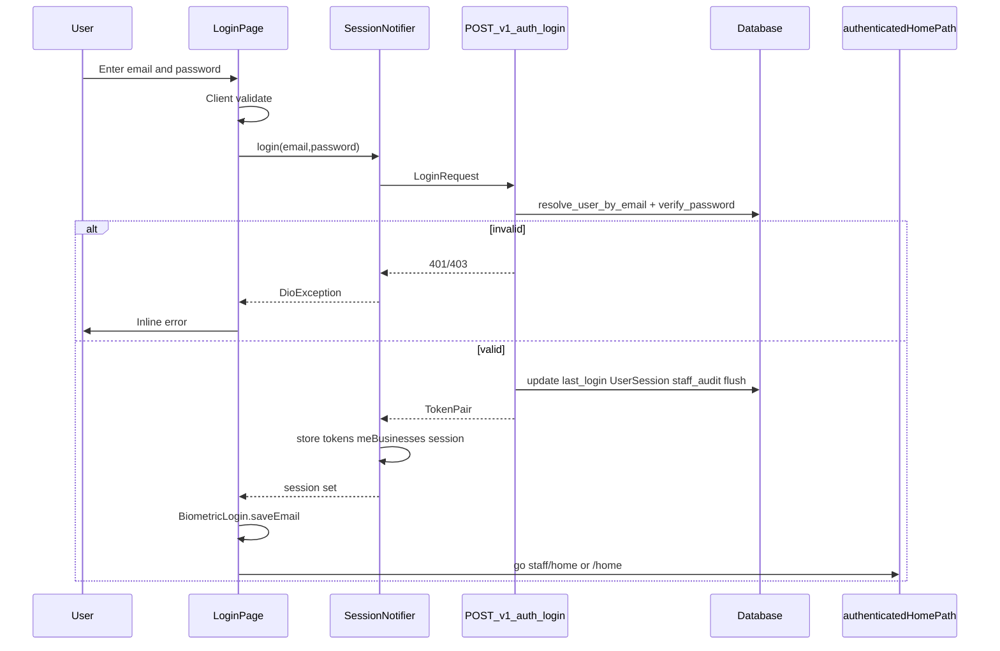

# Module: Login

**Queue:** 1 of 15  
**Status:** Review PASS (2026-07-18) — accepted Unknowns listed below  
**Scope:** Analysis only — no `new-app` implementation  
**Source of truth:** `source-app/` (trust over `docs/` on conflict)

---

## Capability flags

| Capability | UI present? | API present? | Notes |
|---|---|---|---|
| Email/password login | Yes — `LoginPage` | Yes — `POST /v1/auth/login` | Primary path |
| Forgot password | Yes — `ForgotPasswordPage` | Yes — `POST /v1/auth/forgot-password` | Linked from login |
| Reset password | Yes — `ResetPasswordPage` | Yes — `POST /v1/auth/reset-password` | `?token=` query |
| Biometric re-entry | Yes — fingerprint/Face ID button when ready | No dedicated biometric API | Uses stored refresh + `restore()` |
| Google OAuth | **No** button on `LoginPage` | Yes — `POST /v1/auth/google` | Client method exists in `hexa_api.dart`; not wired on login UI |
| Self-register | **No** on `LoginPage` | Yes — `POST /v1/auth/register` (often 403) | `/get-started` redirects to `/login`; snackbar `msg=exists` implies register elsewhere historically |
| Token refresh | Transparent (session restore / dio interceptor) | Yes — `POST /v1/auth/refresh` | |

---

## 1. Screen purpose

Sign staff/owner users into Harisree Agency warehouse management with email + password (or biometric resume of an existing token pair). Resume an already-valid session without re-typing credentials when tokens exist.

**Sources:** [`login_page.dart`](../../source-app/flutter_app/lib/features/auth/presentation/login_page.dart) class doc + `_signIn` / `_tryResumeSession`.

## 2. UI Layout

- `Scaffold` background `#E8F5F2`.
- Body: tap-to-unfocus → `AuthPageShell` → single `AuthFormCard` (max width **420** via shell).
- Card content (top → bottom): warehouse icon + title block → “Sign In” heading → optional network banner → email field → password field → optional inline auth error → optional biometric button → Sign In button → Forgot password link → helper text → optional build SHA → `© 2026`.
- Keyboard-safe: `resizeToAvoidBottomInset: true`; shell scrolls with `viewInsets` padding.
- Comment on `LoginPage`: “Keyboard-safe, centered card login (**no hero image**) — iOS + web friendly.” Shell still paints a **blurred background asset** (see §3); the form itself has no separate hero panel.
- **Dead / unused on live login route (do not port unless a screen still references them):** `AuthBrandPanel`, `AuthGlassFormPanel`, `AuthHeroArtwork` — no imports from other Dart files found (only self definitions). Live login uses `AuthPageShell` + `AuthFormCard` only.

**Sources:** `login_page.dart` `build`; `auth_page_shell.dart`.

## 3. Background image

- Asset: `assets/brand/getstarted_bg.png` via `AuthBrandAssets.background`.
- Rendered full-bleed in `AuthPageShell` with `BoxFit.cover`, blur (`sigma` 12), then white→brandBackground gradient scrim.
- Fallback if asset missing: `HexaColors.atmosphereGradient`.

**Sources:** `auth_brand_assets.dart`, `auth_page_shell.dart`.

## 4. Logo

- `LoginPage` does **not** use `AuthSmallLogo` / `assets/brand/logo.png`.
- Uses Material icon `Icons.warehouse_outlined` size 36, color `HexaColors.brandPrimary`.
- `AuthSmallLogo` (circular `logo.png`, fallback letter “H”) exists for other auth shells; unused on current login card.

**Sources:** `login_page.dart` ~345–349; `auth_page_shell.dart` `AuthSmallLogo`; `auth_brand_assets.dart`.

## 5. Company branding

- Title: **Harisree Agency** (`HexaDsType.heading` 24).
- Subtitle: **Warehouse Management** (muted body 14).
- Primary brand color: `HexaColors.brandPrimary` = `#0E4F46`.
- Brand background: `#F7F9F6` (used in shell scrim).
- Scaffold mint: `#E8F5F2`.
- Typography: design-system headings/body (`HexaDsType` / HEXA tokens).

**Sources:** `login_page.dart`; `hexa_colors.dart`.

## 6. Every field

| Control | Type | Notes |
|---|---|---|
| Email | `TextField` | Controller `_loginEmail`, focus `_emailFocus` |
| Password | `TextField` obscure | Controller `_loginPass`, focus `_passFocus`, visibility toggle |
| (Biometric) | `FilledButton.tonalIcon` | Shown only if `_bioReady` |
| Sign In | `FilledButton` | Primary CTA |
| Forgot password? | `TextButton` | Navigates `/forgot-password` |

No username-only field; login identity is email (server also accepts deprecated `identifier` alias).

## 7. Placeholder

- Fields use `authFilledDecoration('Email' / 'Password', …)` — label text **Email** / **Password** (filled decoration; not separate hint strings beyond the decoration helper).

**Sources:** `login_page.dart`; `auth_input_styles.dart`.

## 8. Validation

### Client (`LoginPage`)

- Form valid when: email trimmed contains `@`, length ≥ 5, password length ≥ 6.
- Shown only after `_showValidation` (failed submit or disabled-button tap).
- Email error: `Enter a valid email address` if empty or no `@`.
- Password error: `Password must be at least 6 characters` if empty or length &lt; 6.
- **Note:** Client min password length is **6**; server register/reset hashing requires **8** + digit (`passwords.py`). Login request schema allows password `min_length=1`.

### Server (`LoginRequest` / `login`)

- Email required (or `identifier`), stripped/lowercased, must contain `@` (else 422-style validation error via Pydantic).
- Password required 1–128 chars.
- Auth failures: 401 invalid credentials; 403 blocked/inactive/deleted; 503 DB/token errors.

**Sources:** `login_page.dart` `_isFormValid`, `_emailError`, `_passError`; `schemas/auth.py` `LoginRequest`; `routers/auth.py` `login`; `passwords.py`.

## 9. Keyboard behaviour

- Tap outside unfocuses.
- Email: `TextInputType.emailAddress`, `TextInputAction.next`, autofill email → on submit focuses password.
- Password: `TextInputAction.done`, autofill password → on submit calls `_signIn` if form valid.
- Obscure toggle via suffix `IconButton` tooltips Show/Hide password.
- Shell: `ScrollViewKeyboardDismissBehavior.onDrag`.

**Sources:** `login_page.dart`; `auth_page_shell.dart`.

## 10. Button behaviour

| Control | Behaviour |
|---|---|
| Sign In | If loading: disabled. If form invalid: set `_showValidation`. Else `_signIn`. |
| Biometric | If `_bioReady` and not loading: authenticate locally → `session.restore()` → post-auth or error. |
| Forgot password? | Disabled while loading; `context.go('/forgot-password')`. |
| Network banner Retry | Clears banner; signs in if form valid else shows validation. |

**No Google Sign-In button on this page.**

## 11. Loading behaviour

- `_loading` true during `_signIn`, `_signInWithBiometric`, `_tryResumeSession`.
- Sign In shows white `CircularProgressIndicator` (22px) instead of label; button `onPressed` null.
- Biometric button disabled while loading.

## 12. Error messages

| Situation | Message / UI |
|---|---|
| Client email | `Enter a valid email address` |
| Client password | `Password must be at least 6 characters` |
| HTTP 401 | `Invalid email or password. Try again.` |
| HTTP 403 blocked | `This account is blocked. Contact your owner.` |
| HTTP 403 inactive | `This account is inactive.` |
| HTTP 403 other | `Sign-in not allowed for this account.` |
| HTTP 422 | Staff email format hint with `@staff.harisree.local` example |
| Other Dio | `friendlyAuthError(..., AuthErrorContext.login)` |
| Generic | `Something went wrong. Please try again.` |
| Network | `AuthNetworkErrorBanner` + retry |
| Biometric fail | `Biometric sign-in failed. Use password.` / `Session expired — sign in with password once.` |
| Query `msg=exists` | Snackbar: email already registered |
| Query `notice=session_expired` | Snackbar: session expired |
| Query `notice=owner_only` | Snackbar: accounts created by owner |

**Sources:** `login_page.dart`; `auth_error_messages.dart`; `auth_network_error_banner.dart`.

## 13. Success flow

1. `sessionProvider.notifier.login(email, password)` → API login → store tokens → load businesses / super-admin → set session → staff local notification / activity log if staff.
2. `BiometricLogin.saveEmail(email)`.
3. `context.go(authenticatedHomePath(session))`.

## 14. Navigation after login

- Staff role → `/staff/home`.
- Otherwise (owner/admin/manager/etc.) → `/home`.
- Helper: `authenticatedHomePath` in `post_auth_route.dart` (`sessionIsStaff` = primary business role `staff`).

**Sources:** `post_auth_route.dart`; `login_page.dart` `_goPostAuth`.

Routes (auth): `/login`, `/forgot-password`, `/reset-password`; `/get-started` → redirect `/login` (`app_router.dart`).

## 15. Forgot password

### Forgot (`ForgotPasswordPage`)

- Email field; regex validation stricter than login (`^[\w.+-]+@[\w.-]+\.\w{2,}$`).
- Calls `hexaApi.requestPasswordReset`.
- Success: uniform message; may show `dev_reset_token` in development.
- Copy on login: “Contact your manager to reset password”.

### Reset (`ResetPasswordPage`)

- Token from `?token=` query.
- New password + confirm; client min length 8; must match.
- Calls `resetPasswordWithToken`.
- Empty token → “Invalid link” UI with links to forgot / login.

**API:** see §20–22.

## 16. Session handling

- Tokens: `SecureTokenStore` — native FlutterSecureStorage; **web uses SharedPreferences only** (localStorage keys `hexa_access_token_bk` / `hexa_refresh_token_bk`).
- `SessionNotifier.login` / `restore` / silent refresh on 401 via shared refresh lock.
- Login page `_tryResumeSession`: if tokens exist and session not expired/circuit-open → `restore()` with timeout (8s web / 25s native) → navigate home.
- Skips resume if `authSessionExpiredProvider` or `auth401CircuitOpenProvider`.

**Sources:** `session_notifier.dart`; `secure_token_store.dart`; `login_page.dart`.

## 17. JWT

- Access: HS256, secret `jwt_secret`, claims `sub` (user id), `typ=access`, `exp`, `tv` (token_version).
- Refresh: HS256, secret `jwt_refresh_secret`, claims `sub`, `typ=refresh`, `exp`.
- TTL: `settings.jwt_access_ttl_minutes` / `jwt_refresh_ttl_days` → `expires_in` seconds = access TTL × 60.
- Response model `TokenPair`: `access_token`, `refresh_token`, `expires_in`.

**Sources:** `jwt_tokens.py`; `schemas/auth.py`; `auth.py` login return.

## 18. Authentication flow

1. **Password:** UI → `POST /v1/auth/login` → tokens → me businesses → session → home.
2. **Resume / biometric:** local biometric gate (optional) → `restore()` → refresh if needed → me businesses → home.
3. **Google:** API + `hexa_api` path exist; **not exposed on LoginPage**.
4. **Register:** API exists; gated by `settings.allow_public_registration` (403 when disabled). UI not on LoginPage; get-started redirects to login.

## 19. Authorization

- Login itself only checks user exists, password, not deleted/blocked/inactive.
- Post-login authorization is membership **role** + later `permissions_json` / route shells (Owner vs Staff) — not decided inside `POST /login` response (token has no role claim; role comes from businesses after login).
- `post_auth_route.dart` helpers: financials, manage users, create users — used after session exists.

## 20. API endpoints

Prefix `/v1/auth` ([`auth.py`](../../source-app/backend/app/routers/auth.py)):

| Method | Path | Used by Login UI? |
|---|---|---|
| POST | `/login` | Yes |
| POST | `/forgot-password` | Yes (forgot page) |
| POST | `/reset-password` | Yes (reset page) |
| POST | `/refresh` | Yes (session restore / interceptor) |
| POST | `/register` | No (API only on this screen) |
| POST | `/google` | No (API only on this screen) |

Post-login (required for session): `GET /v1/me/businesses` via `HexaApi.meBusinesses()` ([`hexa_api.dart`](../../source-app/flutter_app/lib/core/api/hexa_api.dart) ~424).

## 21. Request body

### `POST /login` — `LoginRequest`

```json
{
  "email": "string (preferred)",
  "identifier": "string (deprecated alias)",
  "password": "string",
  "device_token": "string | null (optional FCM/web push)"
}
```

Email resolved from `email` or `identifier`, lowercased; must contain `@`.

### `POST /forgot-password` — `ForgotPasswordRequest`

```json
{ "email": "string" }
```

### `POST /reset-password` — `ResetPasswordRequest`

```json
{ "token": "string", "new_password": "string (min 8)" }
```

### `POST /refresh` — `RefreshRequest`

```json
{ "refresh_token": "string" }
```

### `POST /register` / `POST /google`

See `schemas/auth.py` (`RegisterRequest`, `GoogleAuthRequest`) — not used by LoginPage UI.

## 22. Response body

### Success `TokenPair`

```json
{
  "access_token": "string",
  "refresh_token": "string",
  "expires_in": 0
}
```

### Forgot-password (always shape)

```json
{
  "ok": true,
  "message": "If an account exists for that email, you will receive reset instructions.",
  "dev_reset_token": "optional in development/dev/test"
}
```

### Reset-password success

```json
{
  "ok": true,
  "message": "Password updated. You can sign in now."
}
```

## 23. Database tables

Touched by login/forgot/reset/register/google paths:

| Table | Role |
|---|---|
| `users` | Credential lookup; last_login/active; device_info push token; google_sub |
| `user_sessions` | Row inserted on password login |
| `password_reset_tokens` | Forgot/reset |
| `memberships` | Business context for session + staff audit |
| `businesses` | Created on register/google new user |
| `staff_activity_log` | `LOGIN` via `log_staff_login_if_applicable` for roles staff/manager/admin |

## 24. Database columns (login-relevant)

### `users` (model `User`)

`id`, `email`, `username`, `password_hash` (nullable for Google-only), `google_sub`, `phone`, `name`, `is_super_admin`, `is_active`, `is_blocked`, `token_version`, `last_login_at`, `last_active_at`, `device_info`, `created_by`, `created_at`, `deleted_at`, `notes`, …

### `user_sessions`

`id`, `user_id`, `business_id`, `login_at`, `logout_at`, `device_info`, `is_active`

### `password_reset_tokens`

`id`, `user_id`, `token_hash` (SHA-256 of raw), `expires_at` (1 hour), `used_at`, `created_at`

**Sources:** `models/user.py`, `user_session.py`, `password_reset.py`.

## 25. Password hashing

- Library: **bcrypt** (`hash_password` / `verify_password`).
- Strength on **hash** (register/reset): min 8 chars, at least one digit, not in common-password set.
- Login verifies with `bcrypt.checkpw`; does not re-validate strength on login.

**Sources:** `passwords.py`.

## 26. Security

- Passwords never returned; reset stores **hash** of token only (`hash_reset_token` SHA-256).
- Forgot-password response uniform (no email enumeration).
- Public registration can be disabled (`allow_public_registration`).
- Access token includes `token_version` for invalidation.
- Separate JWT secrets for access vs refresh.
- Secure storage on mobile; web localStorage caveat documented in `SecureTokenStore`.
- Auth failure / 401 circuit in Flutter (`auth_failure_policy` / session flags) to avoid storms.
- Google: verifies ID token audiences; requires verified email.

**Rate limiting:** `SlidingWindowLimiter` is used for OTP and `/public/items` only — **not** wired to `/v1/auth/*` (confirmed by grep of `routers/auth.py` and rate_limit usages).

## 27. Audit logging

- Backend password login: `UserSession` insert; `log_staff_login_if_applicable` → `staff_activity_log` action `LOGIN` for membership roles `staff`, `manager`, `admin` (not owner).
- Flutter after login: if staff, `StaffActivityLogger.logStaffLogin` + optional local notification.

**Observation:** `login` handler calls `await db.flush()` but **does not call `await db.commit()`**, unlike `register` / `forgot-password` / `reset-password`. `get_db` yields a session with no commit-on-exit. **Unknown — needs verification** whether `user_sessions` / `last_login_at` / staff LOGIN rows actually persist in production (possible legacy gap).

## 28. Edge cases

- Duplicate email redirect `?msg=exists`.
- `?notice=session_expired` / `owner_only`.
- Offline / connection refused → network banner.
- Blocked / inactive / soft-deleted users → 403.
- Google-only users (`password_hash is None`) cannot password-login or self-reset password.
- Biometric on web: unavailable (`kIsWeb` → false).
- Biometric without valid stored tokens: button not ready.
- Resume timeout differences web vs native.
- Staff synthetic emails `@staff.harisree.local` hinted on 422.
- Dev-only `dev_reset_token` on forgot-password.
- `/get-started` always redirects to `/login`.

## 29. Sequence diagram



## 30. User Flow

```mermaid
flowchart TD
  start[Open /login] --> resume{Tokens present?}
  resume -->|yes| restore[SessionNotifier.restore]
  restore -->|session ok| home[Owner /home or Staff /staff/home]
  restore -->|fail| form[Show login form]
  resume -->|no| form
  form --> bio{Biometric ready?}
  bio -->|yes| bioAuth[Local biometric then restore]
  bioAuth -->|ok| home
  bioAuth -->|fail| form
  bio -->|no| fill[Fill email password]
  fill --> submit[Sign In]
  submit -->|invalid client| showVal[Show field errors]
  submit -->|ok| apiLogin[POST /v1/auth/login]
  apiLogin -->|error| err[Inline or network banner]
  apiLogin -->|ok| home
  form --> forgot[Forgot password?]
  forgot --> fp[/forgot-password]
  fp --> rp[/reset-password?token=]
  rp --> form
```

---

## Unknowns (explicit — accepted for Review PASS)

1. Whether `POST /login` DB side effects (`user_sessions`, `last_login_at`, staff `LOGIN` audit) persist without `db.commit()` — **must verify before implementing** Node port (replicate intentional behavior or fix with documented change).
2. Production email delivery for forgot-password (backend docstring: “email delivery TBD”).
3. Full JSON shape of `GET /v1/me/businesses` items — path confirmed; field-level contract deferred to Users & Roles / Dashboard module docs.

---

## Review PASS/FAIL

Review method: re-read mandatory sources + repo-wide grep for login/auth tokens; compare each section.

| # | Section | Status | Evidence |
|---|---|---|---|
| 1 | Screen purpose | PASS | `login_page.dart` |
| 2 | UI Layout | PASS | `login_page.dart`, `auth_page_shell.dart`; unused panels noted |
| 3 | Background image | PASS | `AuthBrandAssets.background` |
| 4 | Logo | PASS | warehouse icon; `AuthSmallLogo` unused on login |
| 5 | Company branding | PASS | Harisree strings + `HexaColors.brandPrimary` |
| 6 | Every field | PASS | email, password, bio, CTA, forgot |
| 7 | Placeholder | PASS | `authFilledDecoration` labels |
| 8 | Validation | PASS | client 6-char vs server hash 8-char documented |
| 9 | Keyboard behaviour | PASS | focus/next/done/autofill |
| 10 | Button behaviour | PASS | no Google on UI |
| 11 | Loading behaviour | PASS | `_loading` + spinner |
| 12 | Error messages | PASS | 401/403/422/network/snacks |
| 13 | Success flow | PASS | `session_notifier._loginImpl` |
| 14 | Navigation after login | PASS | `post_auth_route.dart` |
| 15 | Forgot password | PASS | forgot + reset pages + APIs |
| 16 | Session handling | PASS | `SecureTokenStore`, restore |
| 17 | JWT | PASS | `jwt_tokens.py` |
| 18 | Authentication flow | PASS | password/bio/API-only google+register |
| 19 | Authorization | PASS | role after me businesses |
| 20 | API endpoints | PASS | `auth.py` + `/v1/me/businesses` |
| 21 | Request body | PASS | `schemas/auth.py` |
| 22 | Response body | PASS | `TokenPair` + forgot/reset |
| 23 | Database tables | PASS | models listed |
| 24 | Database columns | PASS | models listed |
| 25 | Password hashing | PASS | `passwords.py` bcrypt |
| 26 | Security | PASS | no auth rate limit; token_version; secure store |
| 27 | Audit logging | PASS | documented + commit Unknown |
| 28 | Edge cases | PASS | query notices, bio web, etc. |
| 29 | Sequence diagram | PASS | matches call order |
| 30 | User Flow | PASS | matches UI branches |

**Verdict:** Review **PASS**. Do not implement until Unknown #1 is decided at implement time. **Stop.**
