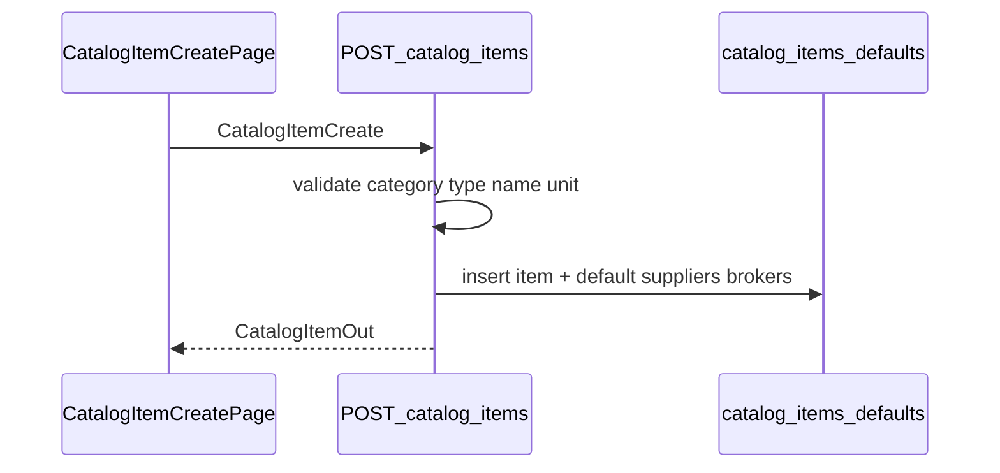
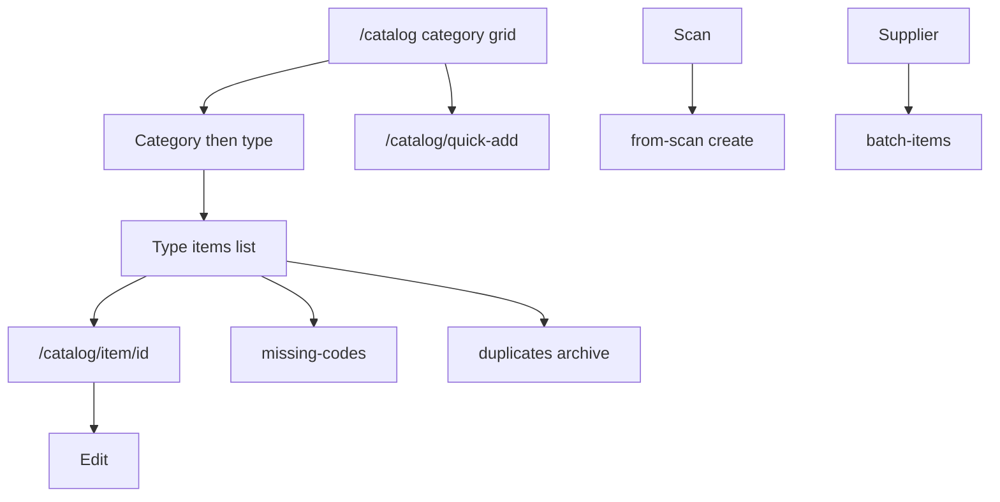

# Module: Products (Catalog Items)

**Queue:** 4 of 15  
**Status:** Review PASS (2026-07-18)  
**Scope:** Analysis only — catalog **items**, not full taxonomy masters  
**Source of truth:** `source-app/`  

## Boundary (Categories / Units deferred)

| In Products (this doc) | Deferred to Categories (#5) | Deferred to Units (#6) |
|---|---|---|
| Item list path via category→type→items | `/catalog/taxonomy`, new-category, category detail CRUD | `master_units`, unit-engine rules |
| Category/type **FKs** on create/edit | Full category/type API deep-dive | Unit masters CRUD |
| Unit fields on `catalog_items` + create unit sheets | — | Packaging profile masters |

---

## 1. Screen inventory (item-scoped)

| Route | Page | Notes |
|---|---|---|
| `/catalog` | `CatalogPage` | Category grid hub → navigate to items |
| `/catalog/category/:id/type/:typeId` | `CatalogTypeItemsPage` | Item list for subtype |
| `/catalog/quick-add` | `CatalogItemCreatePage` | Primary create |
| `/catalog/item/create` | redirect → quick-add | |
| `/catalog/category/…/add-item` | `CatalogAddItemPage` | Preset type |
| `/catalog/quick-add-from-scan` | `BarcodeQuickCreatePage` | Barcode create |
| `/supplier/:id/batch-items` | `BatchItemCreatePage` | Batch create |
| `/catalog/item/:itemId` | `ItemDetailPage` | Detail |
| `/catalog/item/:itemId/edit` | `ItemEditPage` | Edit |
| `/catalog/item/:itemId/timeline` | timeline page | |
| `/catalog/item/:itemId/purchase-history` | history | |
| `/catalog/item/:itemId/ledger` | ledger | |
| `/catalog/duplicates` | duplicates | Soft-archive clusters |
| `/catalog/missing-codes` | missing codes | Generate codes |
| `/catalog/setup-reorder-levels` | reorder setup | Bulk reorder_level |

**Staff route gate** (`app_router.dart`): staff **blocked** from `/catalog` list hub; **allowed** helpers include missing-codes, quick-add, from-scan, `/catalog/item/*`, and some category paths per `_isStaffAllowedRoute`.

---

## 2. Layouts

### Catalog hub (`catalog_page.dart`)

- AppBar “Catalog”; actions → taxonomy, stock, barcode scan; FAB “Add category” (Categories module).
- Category **grid** (responsive cols); fuzzy search on **category names** only (150ms debounce).
- Tap category → `/catalog/category/$id` (then type → items). Does not list items on hub.

### Type items / detail / edit

- Type page lists items for a subcategory.
- Detail: header + stock snapshot + quick actions + physical verification; tabs Ledger/Purchases/Analytics (desktop) or Overview/Purchases/Activity (mobile); sticky physical count / system stock / Add qty.
- Edit: defaults form (name, codes, HSN, tax, units, costs); opening stock if owner dashboard.

---

## 3. Form fields (create / edit)

### Quick-add create (`CatalogItemCreate` / UI)

| Field | Notes |
|---|---|
| Supplier / broker | Defaults written to junction tables |
| name* | Unique per category+type → 409 |
| packaging / unit | `default_unit`, kg/bag, items/box, weight/tin |
| subcategory* (type) | FK `type_id` / category |
| item_code, HSN | Optional; auto-code possible |
| purchase/selling rates | defaults landing/selling |

### From-scan

Barcode*, item_code*, name*, subcategory*, unit (+ kg/bag). No supplier/broker/HSN in that flow.

### Batch

Per row: category*, subcategory*, name*, unit/packaging; supplier locked; `default_supplier_ids` **min_length=1** on batch schema.

### Edit

Name, item code, HSN, tax %, unit/kg-or-tin, landing/selling defaults; opening stock if `sessionHasOwnerDashboard`.

---

## 4. Validation

- Client: required name/subcategory on create; unit constraints in forms.
- Server: category in business; name unique per cat+type → 409 + `existing_item_id` (insights tests); barcode/item_code uniqueness on from-scan; unit clears incompatible extras on patch; empty `default_supplier_ids` on update when field sent → 400.
- **Unknown / conflict in tests:** `CatalogItemCreate` allows empty `default_supplier_ids` (`default_factory=list`) and one test expects 201 with empty list; another test named for requiring suppliers expects 422 — cite both; verify at implement.

---

## 5. Buttons / menus / sheets

- Create: FAB add category (defer); quick-add; from type; scan create; batch from supplier.
- Detail More: ledger, purchase history, activity, copy name; Edit; Print barcode (owner dashboard); Create purchase / Export PDF hidden for staff.
- Sticky: Physical count, System stock, Add qty (non-staff).
- Duplicates: archive via bulk-archive.
- Missing codes: generate-code + print.
- Reorder setup: bulk update reorder_level.

---

## 6. Search / filter / sort / pagination

- Hub: category name fuzzy only — **no item sort UI on hub**.
- List API `GET /catalog-items`: `category_id`, `type_id`, page/per_page; `deleted_at IS NULL`; cached.
- Fuzzy-check API: `name` + optional category/type/supplier; rapidfuzz ranking.
- Duplicate clusters: min_score default 0.85, top 80 pairs.

---

## 7. Calculations / derived

- Stock snapshot / metrics on detail (`item_stock_snapshot*`).
- Insights / lines / trade-supplier-prices / price intelligence providers.
- Auto item_code / barcode generation on create when missing.
- Unit simplify rules (bag kg from name) — Pydantic/tests in catalog_item_unit_simplify.

---

## 8. Role / permission gates

| Gate | Behavior |
|---|---|
| Staff | No `/catalog` hub; limited allowed routes; hide purchases/analytics/add qty / create purchase / export |
| `sessionHasOwnerDashboard` | Print barcode; physical verify; opening stock on edit |
| `require_owner_membership` | Hard DELETE item; bulk-archive; bulk-reorder; duplicate-clusters; delete variant |
| `require_permission("stock_edit")` | PATCH barcode |
| `require_membership` | Most CRUD read/create/patch |

UI does **not** check `permissions_json` keys for catalog item screens (role helpers dominate).

---

## 9. Item APIs (`/v1/businesses/{business_id}`)

| Method | Path | Auth |
|---|---|---|
| GET | `/catalog-items` | membership |
| POST | `/catalog-items` | membership |
| POST | `/catalog-items/batch` | membership |
| POST | `/catalog-items/from-scan` | membership |
| GET/PATCH/DELETE | `/catalog-items/{id}` | membership / owner for DELETE |
| PATCH | `…/item-code` | membership |
| PATCH | `…/barcode` | `stock_edit` |
| POST | `…/generate-code` | membership |
| GET | `…/supplier-purchase-defaults`, `trade-supplier-prices`, `insights`, `lines` | membership |
| GET/POST | `…/variants` | membership |
| PATCH/DELETE | `/catalog-variants/{id}` | membership / owner DELETE |
| GET | `/catalog/fuzzy-check` | membership |
| GET | `/catalog/duplicate-clusters` | owner |
| POST | `/catalog/items/bulk-archive` | owner |
| PATCH | `/catalog/items/bulk-reorder` | owner |

Staff financial redaction on GET item detail (server).

---

## 10. Database

### `catalog_items`

See `docs/20_Database_Analysis.md` — key groups: identity (`name`, `item_code`, `barcode`, `public_token`), taxonomy FKs (`category_id`, `type_id`), units/packaging, costs/tax, last-purchase cache, smart-unit fields, stock (`current_stock`, `reorder_level`, opening_*), audit user ids, **`deleted_at`**, **`archived_at`**.

### Related

- `catalog_variants` — child SKUs (`name`, `default_kg_per_bag`)
- `catalog_item_default_suppliers` / `catalog_item_default_brokers` — ordered defaults
- Seeds `SupplierItemDefault` on create (service path)

---

## 11. Business rules

1. Soft-hide via bulk-archive → `deleted_at`; lists exclude deleted.
2. Hard DELETE owner-only; blocked if trade lines or legacy archived entry lines.
3. Duplicate name in same category+type → 409.
4. generate-code → 409 if code already set.
5. Role change N/A; item ownership via `created_by_user_id`.
6. **`archived_at` column exists but catalog router does not set it** — Unknown who writes it (low_stock filter references it).

---

## 12. Loading / error / empty / refresh

- Providers AsyncValue; list cache on GET catalog-items.
- 409 duplicate with existing id; 404 missing; 400 empty suppliers on update.
- Empty type lists / empty duplicate clusters — UX in respective pages.

---

## 13. Responsive / a11y

- Catalog grid 1–2 columns; detail desktop tabs vs mobile tabs.
- **Unknown:** Semantics audit.

---

## 14. Boundary reminder

Do not expand this doc into Categories taxonomy CRUD or Units masters — queue #5/#6.

---

## 15. Unknowns / Risks

**Unknowns:**

1. Who writes `catalog_items.archived_at` vs `deleted_at`.
2. Supplier required-on-create inconsistency between tests/schemas.
3. Full insights/lines JSON field catalogs (port from OpenAPI/tests at implement).

**Risks:**

- Merging Categories into Products would merge workflows (forbidden).
- Staff access matrix is subtle (hub blocked, helpers allowed).
- Soft vs hard delete semantics must not be collapsed.

---

## 16. Sequence (create item)

## 17. User flow

---

## Review PASS/FAIL

| Area | Status | Evidence |
|---|---|---|
| Routes / layouts | PASS | app_router + catalog_page + detail/edit |
| Fields / validation | PASS | create schemas + pages; supplier Unknown noted |
| Actions / filters | PASS | UI + APIs |
| Roles | PASS | staff gate + owner membership |
| Item APIs | PASS | catalog.py |
| DB columns | PASS | 20_Database_Analysis + model |
| Soft/hard delete | PASS | bulk-archive vs DELETE |
| Boundary Categories/Units | PASS | section 14 |
| Matrices | PASS | products_traceability.md |

**Verdict:** Review **PASS**. **Stop.** Next: Categories analysis only.
