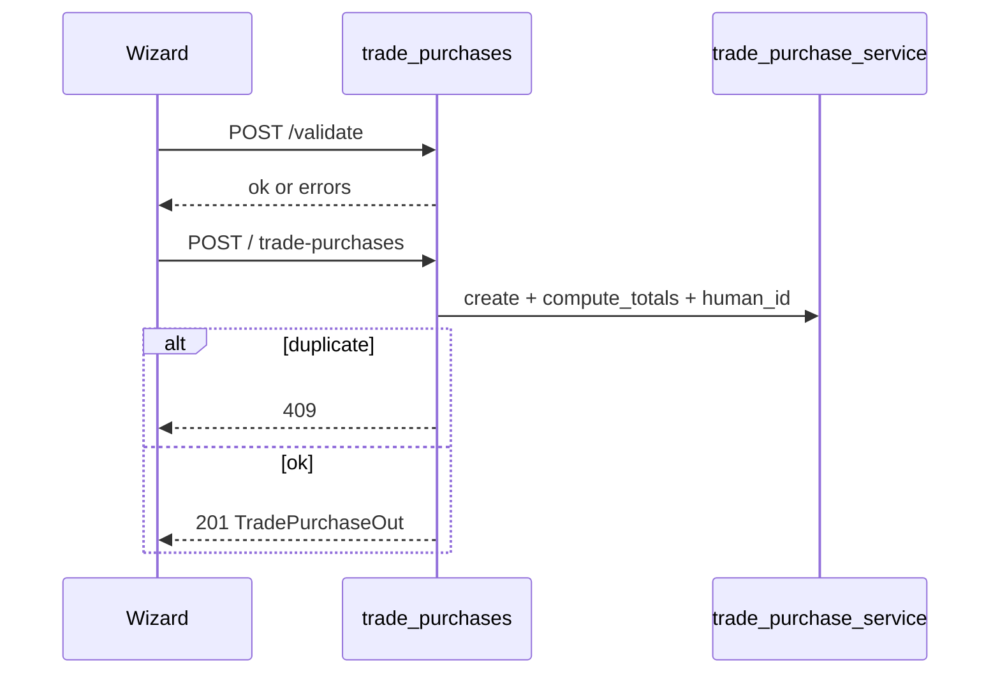
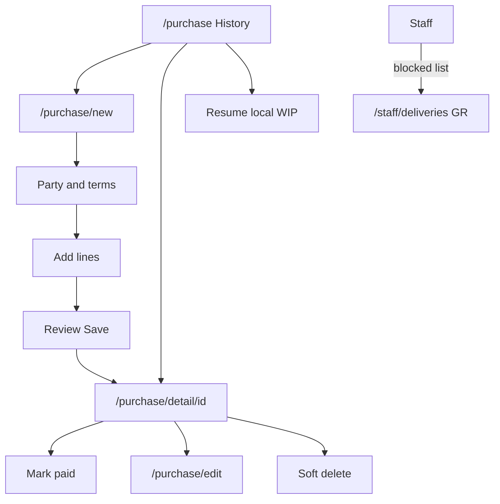

# Module: Purchase Orders (Trade Purchases)

**Queue:** 9 of 15  
**Status:** Review PASS (2026-07-18)  
**Scope:** Analysis only — trade purchase list / wizard / detail / drafts / CRUD / payment / cancel. Delivery receive & stock-commit deep-dive → Goods Receipt (#10).  
**Legacy name:** trade purchases  
**Source of truth:** `source-app/`  

## Boundary

| In Purchase Orders (this doc) | Goods Receipt (#10) | Inventory / Stock (#11–12) | Reports (#14) | Suppliers / Products |
|---|---|---|---|---|
| List, wizard, drafts, preview/validate, create/edit/delete, payment, cancel | `dispatch` / `arrive` / `verify` / `commit-stock` / `auto-commit` / `delivery-pipeline`; staff receive UIs | Stock qty side effects of commit | `/reports/purchase/:id` | Party FKs; catalog line FKs |
| Detail delivery **banner surface** (cite only) | Deep pipeline rules | — | — | Customers absent |

---

## 1. Screen inventory

| Route | Page | Notes |
|---|---|---|
| `/purchase` | `PurchaseHomePage` | Owner shell History tab |
| `/history` | redirect → `/purchase` | |
| `/purchase/new` | `PurchaseEntryWizardV2` | Create; seed / resumeDraft / catalogItemId |
| `/purchase/scan`, `/purchase/scan-draft` | → `/purchase/new` | |
| `/purchase/edit/:purchaseId` | `PurchaseEntryWizardV2` | Edit |
| `/purchase/detail/:purchaseId` | `PurchaseDetailPage` | Detail + payment; delivery banner surface |

**Staff:** allowed `/purchase/new|edit|detail`; **blocked** `/purchase` list → `/staff/deliveries`.  
**Boundary paths only:** `staff_pending_deliveries_page`, `staff_receive_shipment_page`, `staff_purchase_history_page`, `staff_purchase_order_detail_page`.

---

## 2. Layouts

### Purchase History (`purchase_home_page.dart`)

- Period presets (Today → All / Custom) via `analyticsDateRangeProvider`.
- Chips: All, Due, Paid, Draft, Undelivered, Stuck, Done (+ URL `?filter=`).
- More filters: amount sort, pending/paid/overdue, date range, package type, supplier/broker contains.
- Search debounce 300ms (supplier, ID, items); fuzzy rank.
- Swipe: Edit · Paid · Share · Del; quick COMMIT STOCK / PAY when eligible.
- Multi-select: CSV export, bulk delete.
- Local WIP resume row → `purchase_new` with `resumeDraft`.

### Wizard V2 (`purchase_entry_wizard_v2.dart`)

UI steps: **0 Party+Terms** · **1 Items** · **2 Review**.  
(Server draft step 0–3; Flutter combines party+terms.)

### Detail

Header, summary strip, lines, charges/balance, action bar (Mark Paid, Edit, PDF, Share, Print). Delivery banner + timeline + damage section = **surface** (deep → #10). Delete (soft) in overflow — no separate Cancel button on detail (API cancel exists).

---

## 3. Form fields

### Header (wizard / API create)

| Field | Notes |
|---|---|
| supplier_id* | Party step |
| broker_id | Optional |
| purchase_date* | |
| invoice_number | UI “Narration / ref” |
| payment_days | Due date preview |
| discount | Header % |
| commission_percent / mode / money | % or Fixed ₹ (Once/bill, Kg, Bag, Box, Tin) |
| delivered_rate, billty_rate, freight_amount, freight_type | In draft/API; Terms UI may omit editors (controllers exist) |
| status | create default `confirmed`; allow `draft\|saved\|confirmed` |
| force_duplicate | Bypass 409 |

### Line (item entry sheet / `TradePurchaseLineIn`)

catalog_item_id*, item_name*, qty*, unit*, landing_cost / purchase_rate*, optional kg/box/tin fields, selling_rate, tax_percent/tax_mode, HSN (required if tax%>0), discount/freight/notes optional.

---

## 4. Validation

**Client** (`purchase_draft_provider`): supplier; commission % ≤100; ≥1 line; per-line catalog, qty, whole packs, bag kg, landing >0, HSN if taxed.

**Server:** `POST /validate` → `{ok, errors, warnings}`; create/update 422; unit profile strips BOX/TIN weight fields; `purchase_line_unit_validation` (Units boundary).

**Duplicate:** `POST /check-duplicate` + create 409 `DUPLICATE_PURCHASE_DETECTED` (24h window); `force_duplicate`.

---

## 5. Buttons / menus

| Action | Where | API |
|---|---|---|
| New purchase | History | → wizard |
| Save | Wizard review | POST/PUT + validate |
| Mark Paid / PAY swipe | Detail / list | PATCH payment / mark-paid |
| Edit | Swipe / detail | PUT |
| Delete | List / detail | DELETE soft |
| Commit stock / delivery actions | List/detail banner | **#10** |
| Export CSV / PDF / Share | Multi-select / detail | local/export |

---

## 6. Search / filter / sort

List API: `limit`≤50 (clamped), `offset`, `status`, `q`, `supplier_id`, `broker_id`, `catalog_item_id`, `purchase_from/to`, `include_lines`. Excludes `deleted`.  
Client: period + chips + fuzzy search + amount/undelivered-days sorts.

---

## 7. Calculations

SSOT: `line_totals_service.py` + `compute_totals` / `_header_commission_rupees` in `trade_purchase_service.py`.

| Rule | Summary |
|---|---|
| `line_money` | gross × (1−disc%) × (1+tax%) — tax as exclusive add-on |
| `line_profit` | qty×selling − (line_money + line freight charges) |
| Header total | Sum lines + header freight/billty/delivered (if no line charges) + commission |
| Preview | `POST /preview-lines` → line_total, profit, weight, resolved_labels |

**Note:** `tax_mode` inclusive/none **stored** but `line_money` does not branch on it — Unknown for parity.

---

## 8. Role / permission gates

| Action | Gate |
|---|---|
| List / get / draft / preview / validate | `require_membership` |
| Create | **`purchase_create`** |
| Update / payment / mark-paid / cancel | **`purchase_edit`** |
| Delete | roles `owner` \| `manager` \| `super_admin` |
| Staff list `/purchase` | Blocked → deliveries |
| Staff financials on detail | Redacted when `!sessionCanSeeFinancials` |

---

## 9. APIs (in-scope)

Prefix: `/v1/businesses/{business_id}/trade-purchases`

| Method | Path | Auth | Notes |
|---|---|---|---|
| GET/PUT/DELETE | `/draft` | membership | One draft per user+business; PUT step 0–3 + payload |
| POST | `/preview-lines` | membership | |
| POST | `/validate` | membership | Structured ok/errors |
| POST | `/check-duplicate` | membership | |
| GET | `/next-human-id` | membership | Preview only; create assigns |
| GET | `/last-defaults` | membership | Query catalog_item_id + optional party |
| GET | `/` | membership | List; staff redacted |
| POST | `/` | `purchase_create` | 201; Idempotency-Key optional |
| GET | `/{id}` | membership | |
| PUT | `/{id}` | `purchase_edit` | 409 if stock_committed |
| DELETE | `/{id}` | owner/manager/super_admin | Soft `deleted` |
| PATCH | `/{id}/payment` | `purchase_edit` | |
| POST | `/{id}/mark-paid` | `purchase_edit` | Full total if amount omitted |
| POST | `/{id}/cancel` | `purchase_edit` | Soft cancelled |

### Boundary endpoints (path + auth only — deep → #10)

| Method | Path | Auth |
|---|---|---|
| GET | `/delivery-pipeline` | membership |
| PATCH | `/{id}/delivery` | `stock_edit` |
| POST | `/{id}/dispatch` | owner/manager/super_admin |
| POST | `/{id}/arrive` | `stock_edit` |
| POST | `/{id}/commit-stock` | owner/manager/admin/super_admin **and** `stock_edit` |
| POST | `/{id}/auto-commit` | same |
| POST | `/{id}/verify` | `stock_edit` |
| POST/GET | `/{id}/damage-reports` | stock_edit / membership |
| GET/POST | `/{id}/lifecycle(-events)` | membership / owner-manager |

---

## 10. Database

### `trade_purchases`

Identity: `id`, `business_id`, `user_id`, `human_id`, `invoice_number`, `purchase_date`, `supplier_id`, `broker_id`.  
Payment: `payment_days`, `due_date`, `paid_amount`, `paid_at`.  
Commercial: `discount`, `commission_*`, `delivered_rate`, `billty_rate`, `freight_*`.  
Totals: `total_qty`, `total_amount`, landing/selling/profit subtotals.  
Status/delivery columns (pipeline stamps for #10): `status`, `is_delivered`, `delivery_status`, `delivered_at`, dispatch/arrive/verify/commit fields, truck/driver.

### `trade_purchase_lines`

`catalog_item_id`, qty/unit, rates, weight/box/tin, `landing_cost`, tax, `line_total`/`profit`, receipt qty fields (`received_qty`, `damaged_qty`, `return_qty`).

### `trade_purchase_drafts`

`business_id`, `user_id`, `step`, `payload_json`, `updated_at`.

### `purchase_lifecycle_events`

from/to status, actor, notes, `event_metadata`.

### Damage (surface)

`purchase_damage_reports` — nested under purchase; deep workflow → #10 / `damage_reports` router.

---

## 11. Business rules

1. **human_id:** `PUR-{year}-{NNNN}` per business (`next_human_id`); unique `(business_id, human_id)`.  
2. Create default status `confirmed`; Out normalizes (`saved`→`draft`, `confirmed`→`active`, `delivered`→`added_to_stock`).  
3. **Derived payment status** (`compute_status`): paid / overdue / due_soon / partially_paid.  
4. **Cancel:** soft `cancelled` + delivery_status cancelled; may revert stock if committed.  
5. **Delete:** soft `deleted`; role-gated; stock revert if needed.  
6. **Edit blocked** if `delivery_status == stock_committed` (409).  
7. Duplicate fingerprint last **24h** `created_at` (purchase_date param unused in SQL — Unknown).  
8. Party = supplier required; broker optional; **no customer**.  
9. Money fields as Decimal strings (JSON floats rejected).

---

## 12. Loading / error / empty / refresh

- History: skeleton / FriendlyLoadError; list 503 `PURCHASE_LIST_TEMPORARY`.  
- Wizard: offline queue `trade_purchase_create`; 409 duplicate → Save anyway; 409 committed → message.  
- Local draft: Hive `draft_trade_purchase_v1_{businessId}`, debounce 800ms (not in edit mode).  
- Server draft: GET 404 “No draft”.

---

## 13. Responsive / a11y

Desktop history can use split pane select. No dedicated a11y doc beyond standard widgets — Unknown if custom semantics.

---

## 14. Boundary reminder

Do not expand this doc into staff receive / commit-stock math / inventory movements / purchase PDF report pages.

---

## 15. Unknowns / Risks

1. Server draft `payload` schema opaque — Flutter-owned.  
2. `tax_mode` inclusive/none not applied in `line_money`.  
3. Duplicate check ignores `purchase_date` in query.  
4. Idempotency-Key in-process — multi-worker Unknown.  
5. Header freight/delivered/billty: controllers without Terms UI — how set in happy path Unknown.  
6. Flutter detail uses **Delete** not `POST /cancel` — both soft paths exist.  
7. List status vs Out `derived_status` / normalize mapping care for React port.

---

## 16. Sequence (create)

## 17. User flow

---

## Capability flags

| Capability | UI | API | Notes |
|---|---|---|---|
| List / filter / search | Yes | Yes | |
| Create / edit wizard | Yes | Yes | |
| Drafts local + server | Yes | Yes | |
| Preview / validate | Yes | Yes | |
| Payment / mark-paid | Yes | Yes | |
| Cancel API | Partial UI | Yes | UI prefers delete |
| Soft delete | Yes | Yes | |
| Delivery / commit | Banner surface | Yes | Deep → #10 |

---

## Review PASS/FAIL

| # | Section | Status | Evidence |
|---|---|---|---|
| 1 | Screens/routes | PASS | `app_router.dart` |
| 2 | Layouts | PASS | home, wizard, detail |
| 3 | Fields | PASS | schemas + wizard steps |
| 4 | Validation | PASS | draft provider + validate |
| 5 | Buttons | PASS | §5 |
| 6 | Search/filter | PASS | home + list query |
| 7 | Calculations | PASS | line_totals + compute_totals |
| 8 | Roles | PASS | purchase_create/edit + staff |
| 9 | APIs | PASS | in-scope + boundary table |
| 10 | DB | PASS | `20_Database_Analysis.md` |
| 11 | Rules | PASS | status/cancel/delete/human_id |
| 12 | Loading | PASS | §12 |
| 13 | Responsive | PASS | sparse |
| 14 | Boundary | PASS | §Boundary |
| 15 | Unknowns | PASS | §15 |
| 16–17 | Diagrams | PASS | §16–17 |

**Verdict:** Review **PASS**. **Stop.** Next: Goods Receipt analysis only.
