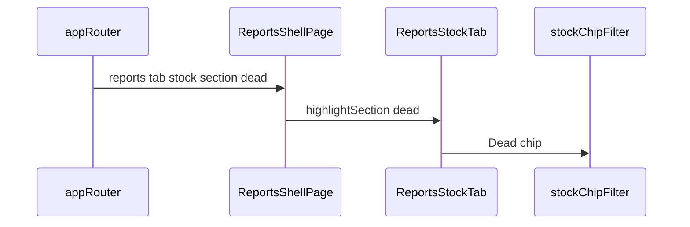
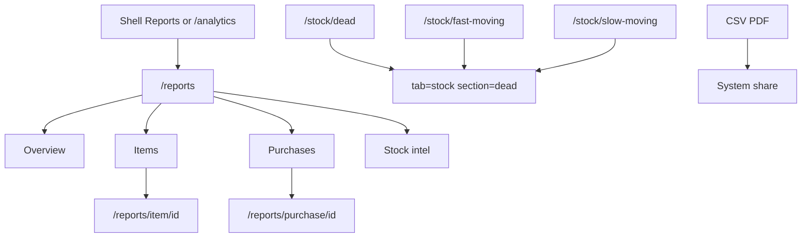

# Module: Reports (BI Shell / Trade Analytics / Stock Intel)

**Queue:** 14 of 15  
**Status:** Review PASS (2026-07-18)  
**Scope:** Analysis only — `/reports` shell (Overview / Items / Purchases / Stock), item & purchase drills, trade report APIs, report-views CRUD, ops dead/fast/slow summary, redirects from `/analytics` and `/stock/dead|fast|slow`.  
**Source of truth:** `source-app/`  
**Also closes:** Phase 1 checklist **1.10 Reports inventory**

## Boundary

| In Reports (this doc) | Dashboard (#2) | Settings (#15) | Purchase Orders (#9) | Stock Movement (#12) | Inventory (#11) | Sales (#13) |
|---|---|---|---|---|---|---|
| Shell + 4 tabs; item/purchase drills; in-shell CSV/PDF | `GET …/home-overview` consumed by **Home** | Permission keys; backup/`exports.py` | Trade purchases as report input; autofill endpoint shared | movement-summary / activity-feed APIs (chrome/orphan here) | List/adjust; dead/fast/slow **redirect here** | No sales UI; `sales-comparison` helper only |
| `GET …/operations/reports/summary` Stock tab | Snapshot KPIs on home | WhatsApp dropped | PO entry not here | Activity tab UX | Low-stock attention on Overview KPI | — |

---

## 1. Screen inventory

| Route | Page / widget | Notes |
|---|---|---|
| `/reports` | `ReportsShellPage` (`FullReportsPage`) | Shell; `?tab=` `?section=` |
| `/analytics` | redirect → `/reports` | `app_router.dart` |
| `/reports?tab=overview\|items\|purchase\|stock` | Same shell | Tab aliases — §11 |
| `/reports?tab=stock&section=dead\|fast\|slow` | `ReportsStockTab` | From stock redirects |
| `/stock/dead` | → `/reports?tab=stock&section=dead` | |
| `/stock/fast-moving` | → `…&section=fast` | |
| `/stock/slow-moving` | → `…&section=slow` | |
| `/reports/item/:catalogItemId` | `ReportsItemReportPage` | Optional `?name=` |
| `/reports/item-detail?k=&n=` | Fallback when id unresolved | |
| `/reports/purchase/:purchaseId` | `ReportsPurchaseReportPage` | `extra: TradePurchase` optional |
| Staff | `/reports*` allowed | `_isStaffAllowedRoute` |

**Sources:** `reports_shell_page.dart`, `reports_bi_tab.dart`, `features/reports/tabs/*`, `app_router.dart`.

---

## 2. Layouts

### ReportsShellPage

`ReportsTopBar` (back, search, filter, export, period on narrow) + `ReportsPrimaryTabs` (Overview | Items | Purchases | Stock).  
Width ≥900: left period nav; desktop: right filter drawer.  
Pull-to-refresh invalidates purchases payload. Stall banner ~1.5s. `PopScope` → home/shell pop.

### Overview

KPI grid then charts. KPI taps `context.replace('/reports?tab=…')`.

### Items

Virtualized rows; skeleton ×8; Load more (+40). Tap → item drill or fallback.

### Purchases

Supplier ranking (top 8), prior-period %, recent bills, top items (row `onTap` empty — no nav).

### Stock

Independent of purchase period: `operationalReportsProvider` → chips + sort → intel cards. Caption: movement class rolling, not tied to period bar.

### Drills

Item: breadcrumb + bundle. Purchase: report page.

---

## 3. Form fields

| Surface | Fields |
|---|---|
| Period | Today / Week / Month / Quarter / Year / Custom |
| Search | Debounce 300ms → filter `searchQuery` |
| Filter sheet | units, sort, stockStatus, category/subcategory/supplier/broker, usage, min/max value; `activeViewId` field exists |
| Stock chips | All / Active / Slow / Dead / Fast |
| Stock sort | Highest/lowest stock, most/least used 7d, recently/oldest movement, A–Z |
| Export CSV | Items or Purchases columns (client) |
| PDF | Confirm → trade statement SSOT over merged purchases |
| Sales-comparison body | `lines[]` name/qty/amount — API only |
| Report view | `name`, `tab`, `filters_json`, `is_default` |

---

## 4. Validation

| Rule | Source |
|---|---|
| `from` ≤ `to`; optional `max_span_days` 1–400 | `reports_trade.py` |
| `tz_offset_minutes` −720…840 | movement/activity |
| Sales-comparison lines 1–500 | Pydantic |
| Report view name 1–120; tab 1–32 | `report_views.py` |
| One `is_default` per (business, user, tab) | unique partial index |
| Exclude trade status draft/cancelled/deleted | report query helpers |
| Item bundle 404 / 500 codes | item endpoint |
| Stock `stale_days` default **30** | `operations.py` |

---

## 5. Buttons / actions

| Action | Notes |
|---|---|
| Switch 4 tabs | Query `?tab=` |
| Period / filter / search | Shell |
| Export CSV / Share PDF | In-shell — not `exports.py` |
| Item → drill | Catalog id resolve |
| Purchase bill → purchase report | `extra` recommended |
| Stock chip / sort | Stock tab only |
| Retry empty/error | All tabs |

---

## 6. Search / filter / sort

| Surface | Behavior |
|---|---|
| Shell search | Client filter items/purchases/stock |
| Filter state | Client on merged purchases → filtered provider |
| Items sort | highestValue / highestQty / latest / az |
| Stock chips | Filter `movement_status`; All requires `currentStock > 0` |
| URL `?tab=` aliases | Legacy categories/suppliers/brokers/usage → Items or Purchases |
| URL `?section=` | Chip apply for dead/fast/slow/active; `low`/`out`/`current` parsed but not applied |

---

## 7. Calculations

| Rule | Behavior | Source |
|---|---|---|
| Period windows | Today; Week today−6; Month −29; Quarter; Year Jan1…today | shell |
| Prior period | Equal-length window ending day before `from` | period-comparison |
| `purchase_change_pct` | `((cur-prev)/prev)*100` if prev > ε | same |
| Movement qty_delta | `sum(new_qty - old_qty)` by adjustment_type | movement-summary |
| Dead stock | cur>0 AND used_7d≤0 AND (no last_purchase OR days≥stale_days) | ops summary |
| movement_status | out / dead / fast / very_slow / slow / no_activity / active | `_movement_status` |
| List buckets | dead[:50]; fast used_7d>0 [:30]; slow cur>0 && used_7d≤0 [:30] | summary |
| Sales match | SequenceMatcher thresholds 0.82 / 0.62 | sales-comparison |
| Overview KPIs | Client trade agg + ops dead/fast lengths | Overview grid |

---

## 8. Role gates

| Capability | Auth |
|---|---|
| Most `/reports/*` | `require_membership` |
| `trade-dashboard-snapshot`, `trade-summary` | **owner\|manager\|super_admin** |
| report-views CRUD | membership; scoped to **own** user |
| ops `/reports/summary` | membership |
| Backend `reports_access` / `analytics_access` | **Not** checked on report routers — Settings keys only |
| UI gate for Reports tab | **None** found — shell shows Reports; staff may open `/reports*` |
| Staff defaults | `reports_access: false`, `analytics_access: false` — **UI does not enforce** |
| `export_access` | exports router only — not in-shell Share/PDF |

---

## 9. APIs (in-scope)

Prefix: `/v1/businesses/{business_id}/reports`  
Prefix: `/v1/businesses/{business_id}/report-views`  
Prefix: `/v1/businesses/{business_id}/operations`

### `reports_trade.py`

| Method | Path | Auth | UI? |
|---|---|---|---|
| POST | `/sales-comparison` | membership | **Orphan** — client method, no feature caller |
| GET | `/trade-supplier-broker-map` | membership | Client only / thin |
| GET | `/trade-last-supplier-autofill` | membership | **Purchase wizard** (boundary #9) |
| GET | `/trade-dashboard-snapshot` | owner\|manager\|super_admin | Snapshot path |
| GET | `/home-overview` | membership | **Dashboard/Home** primary |
| GET | `/trade-summary` | owner\|manager\|super_admin | KPI / fallback |
| GET | `/trade-daily-profit` | membership | Overview charts |
| GET | `/trade-items` | membership | Snapshot / breakdown |
| GET | `/trade-suppliers` | membership | Snapshot |
| GET | `/trade-categories` | membership | Breakdown |
| GET | `/trade-types` | membership | Snapshot |
| GET | `/period-comparison` | membership | Purchases tab |
| GET | `/movement-summary` | membership | **Orphan provider** — no widget watch |
| GET | `/activity-feed` | membership | **No Flutter client** |
| GET | `/item/{catalog_item_id}` | membership | Item drill |

### `report_views.py`

| Method | Path | Auth | UI? |
|---|---|---|---|
| GET/POST `` | list/create | membership (own) | **Orphan UI** — client list/create only |
| PATCH/DELETE `/{view_id}` | update/delete | membership (own) | No Flutter client found |

### `operations.py`

| Method | Path | Auth | UI? |
|---|---|---|---|
| GET | `/reports/summary` | membership | **Yes** — Stock tab / Overview KPIs |

---

## 10. Database

### `report_saved_views`

| Column | Notes |
|---|---|
| `id` | UUID PK |
| `business_id` | UUID FK |
| `user_id` | UUID FK |
| `name` | VARCHAR(120) |
| `tab` | VARCHAR(32) |
| `filters_json` | JSONB default `{}` |
| `is_default` | bool |
| `created_at` / `updated_at` | timestamptz |

Unique default per `(business_id, user_id, tab) WHERE is_default`.  
`is_pinned` in older SQL history — **Unknown** vs current ORM (no `is_pinned` on model).

### Read sources

`trade_purchases` / lines; `catalog_items`; categories; suppliers; `stock_adjustment_log`; `daily_usage_logs`; physical counts on item bundle.

---

## 11. Business rules

### Tab query map

| Query | Tab |
|---|---|
| `overview`, `ring` | Overview |
| `items`, `item`, `categories`, `usage`, … | Items |
| `purchase`, `purchases`, `suppliers`, `brokers`, … | Purchases |
| `stock`, `dead*`, `slow*`, `movement`, `activity` | Stock |

### Stock section → chip

`dead`/`fast`/`slow`/`active` → chips; `low`/`out`/`current` parsed but not applied.

### Dual data paths

| Tab | Data |
|---|---|
| Overview / Items / Purchases | Trade purchases client aggregate + optional breakdown APIs |
| Stock | ops `/reports/summary` only — **not** top-bar period |
| Item drill | `GET …/reports/item/{id}` |
| Home (boundary) | `GET …/home-overview` |

Trade-backed SSOT (not legacy `entries`). Insights/goals stubs return empty (“legacy analytics API removed”).

---

## 12. Loading / error / empty

Shell purchases spinner / empty / error / stall; Items skeletons; Stock FriendlyLoadError; Item drill auto-retry once; session null → Sign in.

---

## 13. Responsive / a11y

≥900 period sidebar; desktop filter drawer; narrow period on top bar. A11y: Unknown beyond Material.

---

## 14. Boundary reminder

- Dashboard owns Home + `home-overview` consumption.  
- Settings owns permission toggles + backup/exports — not in-shell share.  
- PO uses autofill on reports router — Purchase UX.  
- Stock Movement owns Activity tab; orphan movement APIs cited here.  
- Inventory redirects dead/fast/slow into Reports Stock.  
- Sales module absent; sales-comparison is catalog match only.

---

## 15. Unknowns / Risks

1. Permission gap: staff defaults deny `reports_access` but UI/router allow `/reports`.  
2. Orphan: sales-comparison, activity-feed, movement-summary watch, saved-views UI.  
3. Staff hitting `trade-summary` 403 vs shell KPI fallback — Unknown.  
4. `is_pinned` migration vs ORM.  
5. Purchases top-item rows non-navigable.  
6. Legacy supplier/broker/category filter presets no-ops.  
7. `section=low|out|current` unused by chips.  
8. SQL Server JSONB → JSON for `filters_json`.

---

## 16. Sequence (shell load)

```mermaid
sequenceDiagram
  participant UI as ReportsShellPage
  participant Purch as reportsPurchasesPayload
  participant Filt as reportsFilteredData
  participant Ops as operationalReports
  participant API as FastAPI

  UI->>Purch: watch
  Purch->>API: trade purchases
  API-->>Purch: list
  Purch-->>Filt: merged
  Filt-->>UI: agg
  alt Stock tab
    UI->>Ops: watch
    Ops->>API: GET operations/reports/summary
    API-->>Ops: items dead fast slow
    Ops-->>UI: filtered stock
  end
```

### Dead/fast/slow deep link

---

## 17. User flow

---

## Capability flags

| Capability | UI | API | Notes |
|---|---|---|---|
| Reports shell 4 tabs | Yes | purchases + ops | |
| Period / filter / search | Yes | Client + query | |
| Stock dead/fast/slow | Yes | ops summary | |
| Item / purchase drill | Yes | item bundle / purchase | |
| Movement summary | Orphan provider | Yes | |
| Activity feed | No client | Yes | |
| Sales comparison | No UI | Yes | |
| Saved views | Orphan | CRUD | |
| Permission keys | Settings only | Not on routes | Gap |

---

## Review PASS/FAIL

| # | Section | Status | Evidence |
|---|---|---|---|
| 1 | Screens | PASS | router + shell + tabs + drills |
| 2 | Layouts | PASS | §2 |
| 3 | Fields | PASS | §3 |
| 4 | Validation | PASS | §4 |
| 5 | Actions | PASS | §5 |
| 6 | Search | PASS | §6 |
| 7 | Calcs | PASS | periods + dead/fast/slow |
| 8 | Roles | PASS | membership vs require_role; UI gap |
| 9 | APIs | PASS | §9 + orphans |
| 10 | DB | PASS | report_saved_views |
| 11 | Rules | PASS | tab/section + ops |
| 12 | Loading | PASS | §12 |
| 13 | Responsive | PASS | thin |
| 14 | Boundary | PASS | §Boundary |
| 15 | Unknowns | PASS | §15 |
| 16–17 | Diagrams | PASS | §16–17 |

**Verdict:** Review **PASS**. Closes **1.10**. **Stop.** Next: Settings analysis only.

---

**Primary sources:**  
`reports_shell_page.dart`, `reports_bi_tab.dart`, tabs/*, stock/*, `app_router.dart`, `reports_trade.py`, `report_views.py`, `operations.py` (`/reports/summary`), providers under reports/analytics/ops, `docs/18_API_Inventory.md`, `docs/20_Database_Analysis.md`.
