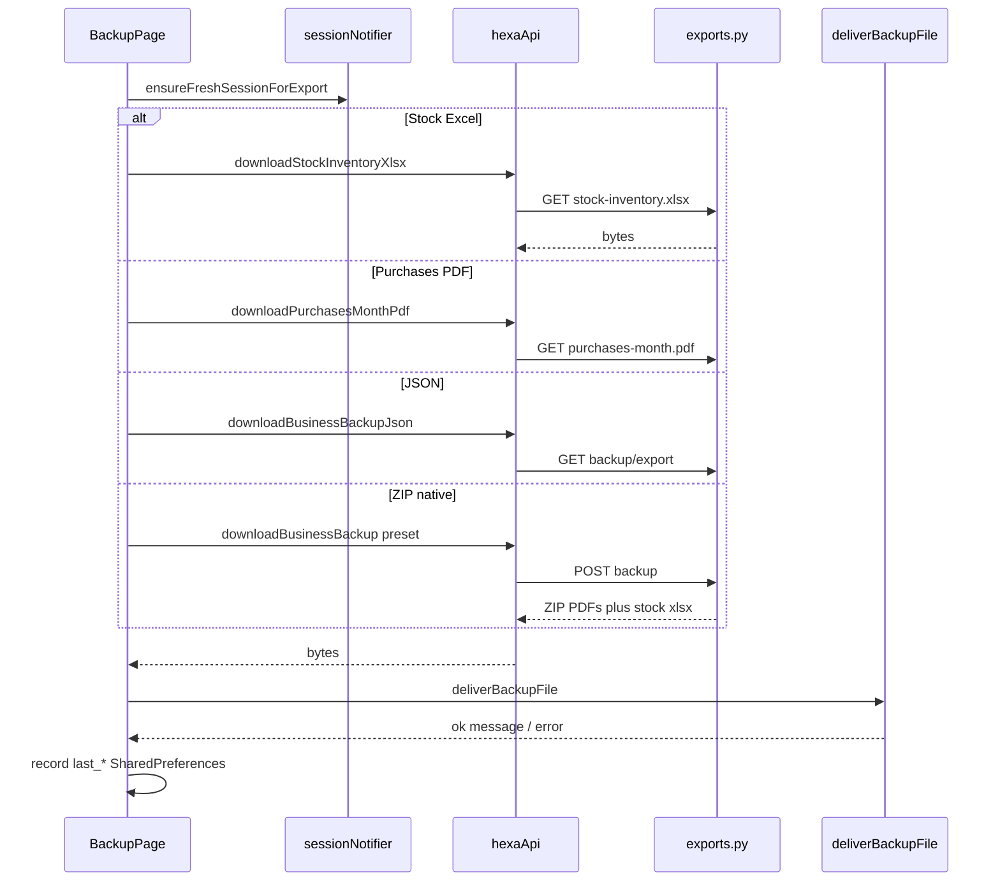
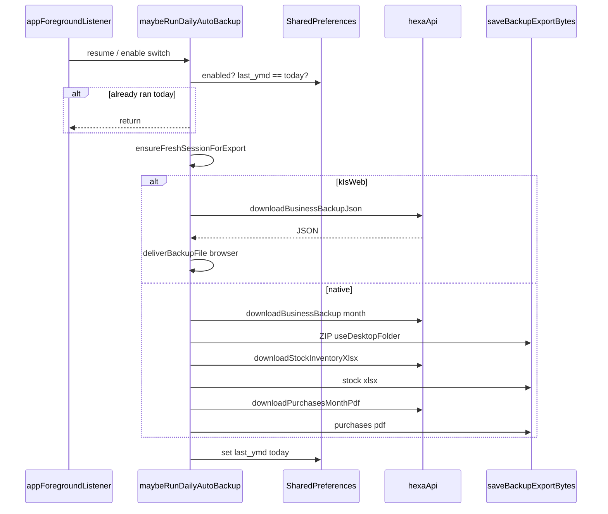
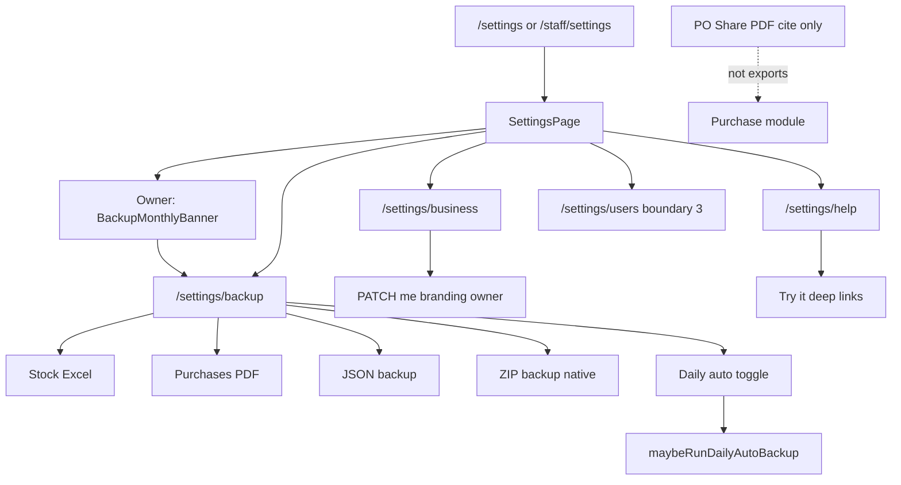

# Module: Settings (Hub / Business Profile / Export & Backup / Help)

**Queue:** 15 of 15  
**Status:** Review PASS (2026-07-18)  
**Scope:** Analysis only — Settings hub (`/settings`, `/staff/settings`), Business profile branding, Export & Backup (manual + daily auto), Help guide, monthly backup banner, local notification prefs, session/sign-out. Users & roles deep UX lives in module #3 (nav only here).  
**Source of truth:** `source-app/`  
**Emphasize:** Backup / export surfaces, ZIP contents, `export_access`, auto-backup.

## Boundary

| In Settings (this doc) | Users & Roles (#3) | Purchase Orders (#9) | Reports (#14) | Dashboard (#2) | Inventory / Stock |
|---|---|---|---|---|---|
| Hub tiles, profile branding, backup/export APIs+UI, help, notifs prefs, sign-out | Full user CRUD / permission matrix UI | Per-purchase **Share PDF** (cite only — not `exports.py`) | In-shell CSV/PDF; permission keys toggled under Users | Home KPIs; refresh aggregates from Settings | Ops deep-links (reorder, opening stock, barcodes) — not owned here |
| `exports.py` + `export_files.py` | `export_access` toggle UI | `purchase_saved_sheet` Share PDF | WhatsApp dropped (shared migration) | — | Staff cash / missing codes nav |

**Out of scope deep extract:** `UserManagementPage` / `UserProfilePage` (module #3). Cite only that Settings navigates to `/settings/users` when `sessionCanAdminUsers`.

---

## 1. Screen inventory

| Route | Page / widget | Notes |
|---|---|---|
| `/settings` | `SettingsPage` | Owner/manager hub |
| `/staff/settings` | `SettingsPage` (same widget) | Staff shell entry |
| `/settings/business` | `BusinessProfilePage` | Optional `?readonly=1` / `true` |
| `/settings/backup` | `BackupPage` | Export & Backup hub |
| `/settings/help` | `HelpGuidePage` | EN + AR guide cards |
| `/settings/users` | `UserManagementPage` | **Boundary #3**; router gate `sessionCanManageUsers` |
| `/settings/users/:userId` | `UserProfilePage` | **Boundary #3** |
| Staff | `/settings*` allowed | `_isStaffAllowedRoute` |
| Super-admin gesture | Version long-press ×3 in 4s → `/admin` | Super-admin only |

**Sources:** `settings_page.dart`, `business_profile_page.dart`, `backup_page.dart`, `help_guide_page.dart`, `backup_monthly_banner.dart`, `app_router.dart`.

---

## 2. Layouts

### SettingsPage

- AppBar: title **Settings**, back → `popOrGo('/home')`.
- Width ≥720: left `_SettingsSidebar` (220px) + `DesktopPageShell` max 720; narrow: list only in shell.
- List sections (role-gated): Account → Quick Actions (!staff) → Notifications → Business → Operations → Export & Backup (!staff) → Data → Admin (super-admin) → Troubleshooting → version → Sign out.
- Owner-only top: `BackupMonthlyBanner` (dismissible per calendar month).

### Desktop sidebar

| Tile | Route | Gate |
|---|---|---|
| Business profile | `/settings/business` | Always |
| Users | `/settings/users` | `canManageUsers` (= `sessionCanAdminUsers`) |
| Backup & export | `/settings/backup` | `isOwner` only |
| Help guide | `/settings/help` | Always |

### BusinessProfilePage

Single card form: name, PDF header title, GSTIN, phone, contact email, address (multiline). Caption: shown on purchase order PDFs.

### BackupPage

Scroll list: storage hint → Stock Excel + Purchases PDF → JSON backup → Daily auto-backup switch → ZIP section (**native only**, hidden on web) with range chips.

### HelpGuidePage

`HexaResponsiveCenter` max 720; expansion tiles with EN body + italic AR + **Try it** CTA (shell tab or `push`).

---

## 3. Form fields

### Business profile

| Field | Controller / key | Notes |
|---|---|---|
| Registered business name | `_nameCtrl` | Required on save |
| Order PDF header title | `_titleCtrl` | Optional; e.g. HARISREE AGENCY |
| GSTIN | `_gstCtrl` | Optional; maxLength 15; uppercased on save |
| Phone | `_phoneCtrl` | Optional |
| Contact email | `_emailCtrl` | Optional; always sent (`includeContactEmail: true`) |
| Address | `_addressCtrl` | Optional; 3–6 lines |

Loaded from `session.primaryBusiness` post-frame. No logo picker in UI (API exists — orphan).

### BackupPage

| Control | Pref / state | Values |
|---|---|---|
| ZIP range chips | `_preset` | `month` (default), `quarter`, `all` |
| Daily auto-backup | `backup_auto_daily_enabled` | bool |
| Last timestamps | SharedPreferences ms | zip / json / stock / purchases PDF |

### Notifications (device-local)

| Toggle | Pref key kind |
|---|---|
| Local notifications master | `localNotificationsOptInProvider` |
| Low stock / Delivery / Stock variance / Staff requests / Opening stock / Evening physical count | `notificationKindTogglesProvider` kinds: `low_stock`, `delivery`, `stock_variance`, `staff_alert`, `opening_stock`, `physical_reminder` |

### Banner dismiss

| Pref | Value |
|---|---|
| `backup_banner_dismissed_ym` | `YYYY-MM` of dismiss month |

---

## 4. Validation

| Rule | Surface | Source |
|---|---|---|
| Business name non-empty | Client + API 400 | `business_profile_page.dart`; `me.py` patch |
| GSTIN empty OK; else length 15 and `^[0-9A-Z]{15}$` | Client | `_validateGst` |
| Phone empty OK; else ≥10 digits after stripping non-digits | Client | `_validatePhone` |
| Save only if `primaryBusiness.role == 'owner'` | Client early return | `_save` |
| `readonly=1\|true` → all fields read-only; no Save | Query | `_readOnly` |
| Non-owner message (not readonly) | UI text | HexaColors.loss |
| Logo JPEG/PNG/WebP ≤2MB | API only | `me.py` upload — **no Settings UI** |
| ZIP `range_preset` ∈ month\|quarter\|all | API body | `BackupRequest` |
| Export requires session; refresh via `ensureFreshSessionForExport` | Client | `BackupPage` |
| Empty stock / empty ZIP / empty JSON → snack errors | Client | bytes empty or API 404 |

**Server branding:** strips empties to null; GST upper; contact email lower. No GST regex on server beyond max_length 20.

---

## 5. Buttons / actions

### Settings hub

| Action | Behavior |
|---|---|
| New purchase / Purchase history | `go` — hidden for staff |
| Notification switches | Local prefs + `LocalNotificationsService.setOptIn` |
| Business profile | push `/settings/business` or `?readonly=1` if manager |
| Users & roles | push `/settings/users` if `sessionCanAdminUsers` |
| Reorder / Opening stock (owner) / Staff cash (owner) / Bulk print / Scan | ops / barcode nav |
| Export & Backup | push `/settings/backup` (!staff section) |
| Help / Contacts / Taxonomy / Catalog (!staff) / Reorder levels / Missing codes | Data nav |
| Backup (Data) | push backup if **!owner** (managers + staff see this tile) |
| Owner tasks | owner only |
| Super admin | super-admin section |
| Refresh all stats | `invalidateBusinessAggregates` + snack |
| Sign out | logout → `/login` |
| Version long-press ×3 | `/admin` if super-admin |

### BackupPage

| Action | API / deliver |
|---|---|
| Download Stock Excel | `GET …/stock-inventory.xlsx` → deliver |
| Download Purchases PDF (this month) | `GET …/purchases-month.pdf` → deliver |
| Download JSON backup | `GET …/backup/export` → deliver |
| Download ZIP backup | `POST …/backup` `{range_preset}` → deliver (native UI) |
| Daily auto-backup switch | prefs + optional immediate `maybeRunDailyAutoBackup` |

Busy: any export disables all buttons (`_anyBusy`).

### Business profile

| Action | Behavior |
|---|---|
| Save | `patchBusinessBranding` → `refreshBusinesses` → snack |

### Help

| Action | Behavior |
|---|---|
| Try it → … | `goShellTabFromContext` or `context.push(route)` |

### Boundary cite — Purchase Share PDF (not Settings)

`purchase_saved_sheet.dart` **Share PDF** → `sharePurchasePdf(p, biz)` (client PDF for one bill). Not `exports.py`. Email tile text: attach PDF from Share PDF. Do not merge into Settings backup.

---

## 6. Search / filter / sort

| Surface | Behavior |
|---|---|
| Settings hub | No search |
| Backup ZIP | Range chips only (`month` / `quarter`=`90 days` / `all`) — not free-text |
| Help | Expansion tiles; no search |
| Business profile | N/A |

---

## 7. Calculations

| Rule | Behavior | Source |
|---|---|---|
| ZIP month range | Calendar month start → today | `_range_dates` |
| ZIP quarter | today−89 days → today | same |
| ZIP all | no lower bound → today | same |
| JSON window | 90 days (today−89…today); `range_days: 90` | `get_backup_export_json` |
| Purchases month PDF | Calendar month start → today | `get_purchases_month_pdf` |
| Trade filter | Exclude status `draft` / `cancelled` / `deleted` | `trade_purchase_status_in_reports` |
| ZIP purchase cap | `limit(5000)` | `post_backup_zip` |
| JSON purchase / audit caps | 2000 purchases; 500 stock audits | JSON export |
| ZIP money summary | Σ total, Σ paid, Σ (total−paid) → `Summary.txt` | `exports.py` |
| Stock Excel status | `stock_status(cur, reorder)` per catalog row | `export_files.fetch_stock_inventory_rows` |
| Auto-backup once/day | `backup_auto_daily_last_ymd` == today → skip | `backup_auto_service.dart` |
| Banner visibility | dismissed_ym ≠ current `YYYY-MM` | `BackupMonthlyBanner` |

---

## 8. Role gates

| Capability | Gate |
|---|---|
| Open `/settings*` / `/staff/settings` | Auth session; staff allowed by router |
| Export & Backup **section** on hub | `!sessionIsStaff` |
| Data → Backup tile | `!isOwner` (managers + staff) |
| Sidebar Backup | `isOwner` only |
| Monthly banner | `isOwner` |
| Opening stock / Staff cash / Owner tasks | `isOwner` (owner \|\| superAdmin role flag on hub) |
| Business profile edit | API + client: **owner** membership; managers get `?readonly=1` |
| Users tile on hub | `sessionCanAdminUsers` (owner/admin/super) — **not** `sessionCanManageUsers` |
| `/settings/users` URL | Redirect away unless `sessionCanManageUsers` (includes **manager**) — UI/router mismatch |
| All `exports.*` endpoints | `require_permission("export_access")` |
| Default `export_access` | owner/admin/manager **true**; staff **false** | `permissions.py` / `session_permissions.dart` |
| Branding PATCH/logo | `require_owner_membership` | `me.py` |
| Super-admin section / gesture | `session.isSuperAdmin` |

**Staff + backup:** Staff default `export_access: false` → API 403 if they open Backup via Data tile. UI does not check `export_access` before showing Backup tile.

---

## 9. APIs (in-scope)

### Exports — prefix `/v1/businesses/{business_id}/exports`

| Method | Path | Auth | Body / notes | UI |
|---|---|---|---|---|
| POST | `/backup` | `export_access` | `{ "range_preset": "month\|quarter\|all" }` → ZIP | BackupPage ZIP; desktop auto |
| GET | `/stock-inventory.xlsx` | `export_access` | XLSX bytes | Manual + desktop auto |
| GET | `/purchases-month.pdf` | `export_access` | PDF; empty month still builds PDF (200) | Manual + desktop auto |
| GET | `/backup/export` | `export_access` | JSON bundle | Manual + **web** auto |

### Branding — prefix `/v1/me`

| Method | Path | Auth | UI |
|---|---|---|---|
| PATCH | `/businesses/{business_id}/branding` | owner membership | BusinessProfilePage |
| POST | `/businesses/{business_id}/branding/logo` | owner; multipart | **No Settings UI** (hexa_api client exists) |
| GET | `/businesses` | auth | Session refresh after save |

### Flutter client (`hexa_api.dart`)

| Method | Maps to |
|---|---|
| `downloadBusinessBackup` | POST `/exports/backup` |
| `downloadBusinessBackupJson` | GET `/exports/backup/export` |
| `downloadStockInventoryXlsx` | GET `/exports/stock-inventory.xlsx` |
| `downloadPurchasesMonthPdf` | GET `/exports/purchases-month.pdf` |
| `patchBusinessBranding` | PATCH `/me/…/branding` |
| `uploadBusinessLogo` / `Bytes` | POST logo — unused by BusinessProfilePage |

Receive timeout exports: 120s.

---

## 10. Database

### `businesses` (ORM `Business`)

| Column | Type / notes |
|---|---|
| `id` | UUID PK |
| `name` | String(255) |
| `branding_title` | String(128) nullable |
| `branding_logo_url` | String(512) nullable |
| `gst_number` | String(20) nullable |
| `address` | Text nullable |
| `phone` | String(32) nullable |
| `contact_email` | String(255) nullable |
| `default_currency` | String(3) default INR |
| `created_at` | timestamptz |

### Migration `066_drop_scan_and_whatsapp.sql`

- Drops `purchase_scan_traces`, `catalog_aliases`.
- Drops `businesses.accounts_whatsapp_number`, `suppliers.whatsapp_number`, `brokers.whatsapp_number`.  
**Implication:** no WhatsApp contact fields in Settings/business branding; feature removed.

### Export read sources (no dedicated export tables)

`catalog_items` (+ categories/types), `suppliers`, `trade_purchases` / `trade_purchase_lines`, `stock_audits` (JSON only).

### Membership permissions

`permissions_json` overrides merge into `ROLE_DEFAULTS` including `export_access` (Users module owns edit UI).

---

## 11. Business rules

### ZIP file contents (`export_files` + `exports.post_backup_zip`)

| Path in ZIP | Content |
|---|---|
| `purchases_summary.pdf` | Range rollup table (Bill/Date/Supplier/Status/Total/Paid/Balance) |
| `orders/{human_id}.pdf` | One PO PDF per purchase (item/qty/unit/line total) |
| `ledgers/{supplier}.pdf` | Per-supplier ledger (Bill/Date/Invoice/Status/Total/Paid/Balance/Due) |
| `stock/harisree_stock_{date}.xlsx` | Current inventory snapshot if catalog rows exist |
| `Summary.txt` | Business, preset, row count, billed/paid/outstanding |
| `README.txt` | Contents legend |

404 if zero trade purchases in range. Filename: `purchase_assistant_backup_{business_id}_{d_to}.zip`.

### Stock XLSX columns

Item Code, Item Name, Category, Subcategory, Supplier, Unit, Current Qty, Opening Qty, Reorder Level, Status, Rack, Barcode, Last Updated.

### JSON backup keys

`exported_at`, `business_id`, `range_days`, `catalog_items[]`, `suppliers[]`, `purchases[]` (+ lines), `stock_movements[]` (audits).

### Delivery (`backup_deliver` / `backup_export_native`)

| Platform | Behavior |
|---|---|
| Web | Browser download; no share sheet |
| Mobile | App docs `warehouse_exports/{y}/{m}/{category}/` + share sheet when possible |
| Desktop manual | Downloads/`warehouse_exports/...` + share |
| Desktop auto (`useDesktopFolder`) | Windows `Desktop/Harisree_Backups/{y}/{m}/auto/` |

### Daily auto-backup (`maybeRunDailyAutoBackup`)

| Platform | What runs |
|---|---|
| Web | JSON only → browser Downloads |
| Native | ZIP (`month`) + stock XLSX + purchases month PDF → Desktop folder (Windows) / export root |

Triggered: app foreground resume (`app_foreground_listener.dart`); enabling switch on BackupPage. Silent on failure. Marks `backup_auto_daily_last_ymd` only on success (web: after JSON deliver ok; native: after ZIP path completes).

### Client vs server empty purchases PDF

Server always returns PDF (possibly “No trade purchases…”). Client treats empty bytes / 404 as “No purchases this month…”.

### Stale docs risk

`source-app/docs/backup/BACKUP_SETUP.md` still says ZIP has **CSV** lines — **false** vs current `exports.py` (PDFs). Prefer code.

---

## 12. Loading / error / empty

| Surface | Behavior |
|---|---|
| Backup buttons | Per-action spinner; label Preparing…; all disabled while busy |
| Session null | “Sign in to download exports.” |
| Session refresh fail | “Your session expired. Please sign out and sign in again.” |
| Stock empty | “No stock items to export.” / API 404 catalog |
| ZIP empty range | “Nothing to export for this range.” / API 404 |
| Purchases PDF 404 | Friendly empty-month message |
| Dio / generic | `friendlyApiError` or fixed failure strings |
| Business save | CircularProgress on Save; snack success/error |
| Auto-backup | Silent catch — no snack |
| Banner | SizedBox.shrink until prefs loaded |

---

## 13. Responsive / a11y

| Rule | Evidence |
|---|---|
| Desktop split ≥720 | Settings sidebar + content |
| Help max width 720 | `HexaResponsiveCenter` |
| Backup ZIP UI | Hidden when `kIsWeb` |
| Auto-backup copy | Web vs desktop subtitle differs |
| A11y | Material defaults; banner dismiss tooltip; Unknown beyond that |

---

## 14. Boundary reminder

- **Users & Roles (#3):** permission toggles including `export_access`; Settings only links.
- **Purchase Orders (#9):** single-bill Share PDF / Print / Email — not Settings exports.
- **Reports (#14):** in-shell trade CSV/PDF; does not call `exports.py`.
- **WhatsApp / scan:** removed by `066_drop_scan_and_whatsapp.sql` — no Settings WhatsApp fields.
- **Ops / catalog / barcode:** hub deep-links only.
- **Server DB dumps** (GitHub Actions `db-backup.yml`): ops infra — not in-app Settings UI.

---

## 15. Unknowns / Risks

1. Hub uses `sessionCanAdminUsers` for Users tile, but router allows managers via `sessionCanManageUsers` — manager can deep-link `/settings/users` without hub tile.
2. Staff see Data → Backup but default `export_access: false` → 403; UI does not gate on permission.
3. Logo upload API + hexa_api methods unused by BusinessProfilePage.
4. `BACKUP_SETUP.md` ZIP=CSV outdated vs PDF ZIP.
5. Native auto-backup marks day complete even if stock/PDF partial failures after ZIP save — Unknown whether intentional.
6. Non-Windows desktop auto `useDesktopFolder` falls back to default export root — path UX Unknown for macOS/Linux.
7. Manager hub `isOwner` false → Backup under Data **and** Export section (!staff) — duplicate nav.
8. Purchases-month PDF empty: test allows 200 or 404; current code path is always 200 with content.
9. Whether `admin` role appears in Flutter hub identically to owner for Opening stock tiles — hub uses `role == owner || isSuperAdmin`, so **admin may miss owner-only ops tiles** while having export_access. Needs verification against real admin membership UX.

---

## 16. Sequence — manual export

### Sequence — daily auto-backup

---

## 17. User flow

---

## Capability flags

| Capability | UI | API | Notes |
|---|---|---|---|
| Settings hub | Yes | — | Role-gated tiles |
| Business profile edit | Owner | PATCH branding | Manager readonly query |
| Logo upload | No | POST logo | Orphan UI |
| Stock Excel | Yes | GET xlsx | `export_access` |
| Purchases month PDF | Yes | GET pdf | |
| JSON backup | Yes | GET backup/export | Web auto |
| ZIP backup | Yes (native) | POST backup | PDF+xlsx contents |
| Daily auto-backup | Yes | same exports | Prefs + foreground |
| Monthly banner | Owner | — | Local dismiss |
| Local notification prefs | Yes | — | Device only |
| `export_access` enforce | No on BackupPage | Yes on all export routes | Staff risk |
| Users management | Nav only | #3 | |
| Share PDF one bill | PO sheet | Client PDF | Boundary cite |
| WhatsApp settings | Removed | Columns dropped | 066 |

---

## Tests (`test_exports_backup.py`) — key assertions

| Test | Assertion |
|---|---|
| `test_stock_inventory_xlsx_export` | 200; OOXML content-type; length >100; `PK` magic |
| `test_purchases_month_pdf_requires_data` | status in (200, 404); if 200 → `%PDF` |
| `test_trade_status_filter_includes_stock_committed` | `added_to_stock` / `completed` **not** excluded; `draft` is |
| `test_backup_zip_contains_pdfs_when_empty_business` | empty biz POST backup → **404** |
| `test_backup_json_export` | 200 JSON; keys `business_id`, `catalog_items`, `suppliers`, `purchases`, `stock_movements` |
| `test_backup_zip_pdf_builders` | `build_purchases_range_pdf` / `build_purchase_order_pdf` / `build_supplier_ledger_pdf` → `%PDF` |

---

## Review PASS/FAIL

| # | Section | Status | Evidence |
|---|---|---|---|
| 1 | Screens | PASS | router + 4 settings pages + staff alias |
| 2 | Layouts | PASS | §2 hub / sidebar / backup / help |
| 3 | Fields | PASS | §3 profile + backup prefs + notifs |
| 4 | Validation | PASS | §4 GST/phone/name/owner |
| 5 | Actions | PASS | §5 + PO Share PDF cite |
| 6 | Search | PASS | chips only |
| 7 | Calcs | PASS | ranges, caps, money summary |
| 8 | Roles | PASS | export_access + UI gaps documented |
| 9 | APIs | PASS | exports.py all 4 + me branding |
| 10 | DB | PASS | businesses + 066 + read sources |
| 11 | Rules | PASS | ZIP contents + auto-backup |
| 12 | Loading | PASS | §12 |
| 13 | Responsive | PASS | ≥720 / web ZIP hide |
| 14 | Boundary | PASS | §Boundary / §14 |
| 15 | Unknowns | PASS | §15 |
| 16–17 | Diagrams | PASS | manual + auto mermaid |

**Verdict:** Review **PASS**. Analysis only — no implementation. **Stop.** Phase 1 module queue complete pending ER diagram (1.9) / sign-off (1.12).

---

**Primary sources:**  
`settings_page.dart`, `business_profile_page.dart`, `backup_page.dart`, `help_guide_page.dart`, `backup_monthly_banner.dart`, `backup_auto_service.dart`, `backup_deliver.dart`, `backup_export.dart` / `_native.dart`, `app_foreground_listener.dart`, `app_router.dart`, `hexa_api.dart` (branding + export methods), `exports.py`, `export_files.py`, `me.py` (branding), `models/business.py`, `sql/066_drop_scan_and_whatsapp.sql`, `permissions.py`, `session_permissions.dart`, `user_permission_groups.dart` (`export_access`), `purchase_saved_sheet.dart` (Share PDF cite), `test_exports_backup.py`.
