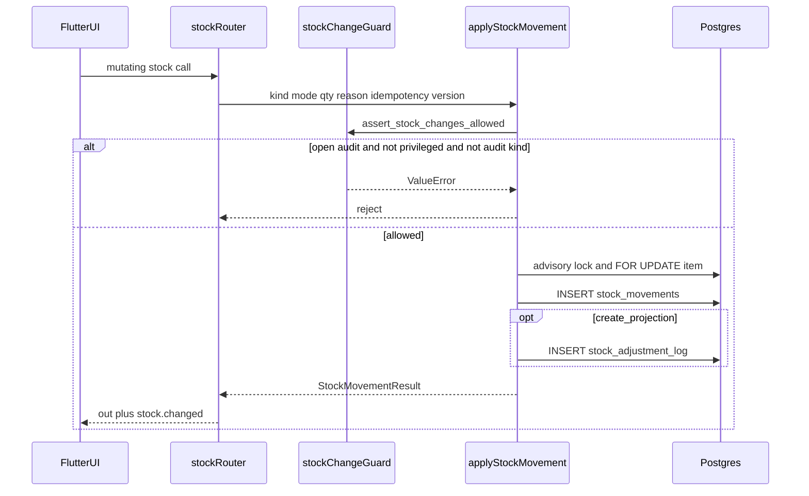
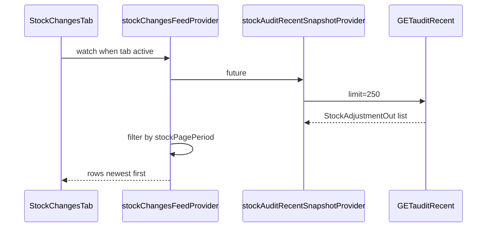
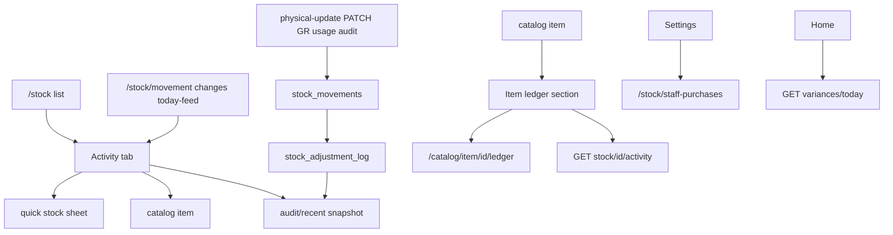

# Module: Stock Movement (Activity / Ledger / Audit Feed)

**Queue:** 12 of 15  
**Status:** Review PASS (2026-07-18)  
**Scope:** Analysis only — Activity/Changes tab, item ledger, `stock_movements` write path, `/stock/audit/*` feed (via `stock_adjustment_log`), staff-purchases, variances today, reports movement-summary/activity-feed as read surfaces.  
**Source of truth:** `source-app/`  

## Boundary

| In Stock Movement (this doc) | Inventory (#11) | Goods Receipt (#10) | Reports (#14) | Sales (#13) |
|---|---|---|---|---|
| Activity tab; item ledger; ledger write engine; audit feed | Stock list, physical-count observation, low-stock, reorder, opening UI, `/stock-audits*` sessions | `commit-stock` UI; only cite `delivery_*` kinds | dead/fast/slow dashboards; report chrome | sale writers beyond kind citation |
| `/stock/audit/*`, variances, staff-purchases, `/{id}/activity` | PATCH/physical-update entry UX that **calls** apply | — | UX for movement-summary | — |
| `movement-summary` / `activity-feed` APIs | — | — | Full BI module | — |

---

## 1. Screen inventory

| Route | Page / widget | Notes |
|---|---|---|
| `/stock?tab=activity\|changes\|movement\|today` | `StockPage` → tab index 1 | `stock_page.dart` `_tabIndex` |
| `/stock/movement` | redirect → `/stock?tab=movement` | `app_router.dart` |
| `/stock/changes` | redirect → `/stock?tab=changes` | |
| `/stock/today-feed` | redirect → `/stock?tab=today` | Same Activity tab |
| `/staff/stock?tab=…` | `StockPage(staff)` | Staff shell |
| `/staff/stock/changes` | redirect → `/staff/stock?tab=changes` | |
| `/stock/staff-purchases` | `StaffPurchaseLogsPage` | Settings entry |
| Catalog item detail | `ItemLedgerSection` | `GET …/stock/{id}/activity` |
| `/catalog/item/:id/ledger` | Full statement link | Unknown depth — not fully extracted |
| Home / staff home | Variances today cards | `GET …/variances/today` — not Activity tab |

**Sources:** `stock_page.dart`, `stock_changes_tab.dart`, `app_router.dart`, `item_ledger_section.dart`, `staff_purchase_logs_page.dart`.

---

## 2. Layouts

### StockPage — Activity tab

Tabs: **Stock** | **Activity** (`StockChangesTab`).  
Period picker (Today / Week / Month / Year / All Time) via `stockPagePeriodProvider`.  
Activity loads only when tab active (`stockChangesTabActiveProvider`); switching to Activity invalidates feed.

### StockChangesTab

Skeleton 8×72; error `HexaErrorCard` “Could not load stock activity”; empty “No stock activity” / period hint + Refresh.  
Rows: avatar (up/down), item name, reason · time · actor, trailing signed qty or **Bill**.  
Tap: owner → `/catalog/item/{id}`; staff → quick stock sheet (or catalog if empty).

### Item ledger (`ItemLedgerSection`)

Card “Item ledger & movement”; range 7d/30d/90d/All; type All/Purchase/Physical/Correction/Damage/Sale/Transfer.  
Up to 25 rows; “Full statement” → `/catalog/item/{id}/ledger`.  
Expand first row for supplier/broker/notes; Open purchase if `source_type == trade_purchase`.

### Staff cash purchases

Flat list: qty, unit, amount, supplier, actor, time. Create via API / other flows (not on this page).

---

## 3. Form fields

| Surface | Fields |
|---|---|
| Activity tab | Period only (read-only feed) |
| Item ledger filters | Range; kind filter (client-side on `kind` / `movement_kind`) |
| Staff purchase POST | `item_id`, `qty>0`, optional amount/supplier/broker/notes, `idempotency_key` |
| Physical-update (writer) | `counted_qty≥0`, `adjustment_type` verification\|damaged\|correction\|sale, `reason`, notes, `last_seen_stock_version?`, `idempotency_key?` |
| PATCH stock (writer) | `new_qty≥0`, `adjustment_type` (broader pattern), reason, version, idempotency |
| Opening stock (writer) | absolute qty; reason if changing existing |
| Undo | no body — reverts last own adjustment within 15 min |

---

## 4. Validation

| Rule | Source |
|---|---|
| Negative stock blocked (`after < 0`) → 422 | `stock_movement_service.py` |
| Stale `stock_version` → 409 `STALE_STOCK_VERSION` unless force/tolerance | service + physical-update/PATCH |
| Verification tolerance ≤2 version drift; other types 0 | `stock_detail.py` |
| Open audit (`draft`\|`pending_review`) blocks non-audit kinds for non-privileged | `stock_change_guard.py` |
| Audit allow kinds: `physical_count`, `correction`; sources `stock_audit`, `audit_session` | same |
| Privileged bypass: owner\|admin\|manager\|super_admin | same |
| Idempotency UQ `(business_id, idempotency_key)` → duplicate return | model + service |
| Opening locked: PATCH 403 unless owner\|super_admin\|admin | `stock_detail.py` |
| Undo window 15 min; opening undo forbidden for non-owner roles | undo-last |
| `POST …/physical-count` does **not** write `stock_movements` | Inventory boundary |

---

## 5. Buttons / actions

| Action | Owner | Staff |
|---|---|---|
| View Activity tab | Yes | Yes |
| Tap row → catalog / quick sheet | Catalog | Quick sheet if stock exists |
| Staff purchases list | Settings link | Same route |
| Create staff-purchase / quick-purchase | `stock_edit` | `stock_edit` |
| Item ledger filters / full statement | Yes | Yes (membership) |
| Variances today (home) | Yes | Staff home |

---

## 6. Search / filter / sort

| Surface | Behavior |
|---|---|
| Activity tab | Client filter by `stockPagePeriodProvider` on audit recent rows; newest first |
| Audit recent API | `limit` 1–250 (UI uses 250); optional `on=YYYY-MM-DD` UTC day |
| Item activity API | `limit` 1–200, `offset`, optional `kind` CSV |
| Item ledger UI | Client range + substring kind filters |
| Staff purchases GET | optional `item_id`, limit 1–500 |
| Reports movement-summary | `from`/`to` + `tz_offset_minutes`; group by `adjustment_type` |

---

## 7. Calculations

| Rule | Formula / behavior | Source |
|---|---|---|
| Absolute mode | `after = qty`; `delta = after - before` | `apply_stock_movement` |
| Delta mode | `delta = qty`; `after = before + delta` | same |
| Version bump | `stock_version += 1` | same |
| Qty delta (Activity UI) | `new_qty - old_qty` (or legacy `qty_delta`) | `stock_audit_rows.dart` |
| “Bill” row | `adjustment_type == purchase` && `abs(delta) < 0.001` | `stock_changes_tab.dart` |
| kind → adjustment_type | see §11 | `_adjustment_type_for` |
| Variance feed | Distinct `AppNotification` kind `stock_variance` for UTC today | `/variances/today` |
| Reports qty_delta | `sum(new_qty - old_qty)` by type | `reports_trade.py` |

---

## 8. Role gates

| Capability | Auth |
|---|---|
| Activity / audit feed / recent / item audit / variances / staff-purchases GET / item activity / reports feeds | `require_membership` |
| POST staff-purchases, quick-purchase, physical-update, PATCH, undo, verify-count | `require_permission("stock_edit")` |
| POST opening-stock | owner \| super_admin |
| Open-audit write guard bypass | owner \| admin \| manager \| super_admin |
| Opening locked PATCH / undo opening | owner \| super_admin \| admin |

---

## 9. APIs (in-scope)

Prefix stock: `/v1/businesses/{business_id}/stock`  
Prefix reports: `/v1/businesses/{business_id}/reports`

### Audit / feed (`stock_audit.py`)

| Method | Path | Auth | Response |
|---|---|---|---|
| GET | `/audit/feed` | membership | `list[StockAdjustmentOut]` (alias of recent) |
| GET | `/audit/recent` | membership | same; Query `limit` default 5 (le 250), `on?` |
| GET | `/audit/{item_id}` | membership | last 50 adjustments for item |
| GET | `/variances/today` | membership | `list[StockVarianceOut]` from notifications |
| GET | `/staff-purchases` | membership | `list[StaffPurchaseLogOut]` |
| POST | `/staff-purchases` | **stock_edit** | creates movement `quick_purchase` + log |

### Detail activity / writers (`stock_detail.py`)

| Method | Path | Auth | Notes |
|---|---|---|---|
| GET | `/{item_id}/activity` | membership | Merges movements + staff_purchase_logs + staff_activity_log |
| POST | `/{item_id}/opening-stock` | owner\|super_admin | `opening_stock` absolute |
| POST | `/{item_id}/physical-update` | stock_edit | absolute; maps adj_type → kind |
| PATCH | `/{item_id}` | stock_edit | absolute |
| POST | `/{item_id}/undo-last` | stock_edit | `undo` absolute to prior old_qty |
| POST | `/{item_id}/verify-count` | stock_edit | → `correction` via audit apply |

### Ops (`stock_ops.py`)

| Method | Path | Auth | Notes |
|---|---|---|---|
| POST | `/{item_id}/quick-purchase` | stock_edit | wraps staff purchase create |

### Reports (`reports_trade.py`) — read surface only

| Method | Path | Auth | Notes |
|---|---|---|---|
| GET | `/movement-summary` | membership | `by_type`, `timeline` from **adjustment_log** |
| GET | `/activity-feed` | membership | stock_timeline + purchase list |

### Writer side-effects (boundary — cite only)

| Writer | Kind | Source |
|---|---|---|
| GR commit | `delivery_receive` | `stock_inventory.apply_confirmed_purchase_stock` |
| GR reverse | `delivery_revoke` | `revert_confirmed_purchase_stock` |
| GR edit committed | `delivery_adjustment` | `sync_confirmed_purchase_stock_diff` |
| Stock audit apply line | `correction` | `stock_audit_service.apply_audit_line_to_stock` |
| Daily usage close | `usage` | `operations.py` |

---

## 10. Database

### `stock_movements` (model `StockMovement`)

| Column | Type / notes |
|---|---|
| `id` | UUID PK |
| `business_id` | UUID FK businesses CASCADE, indexed |
| `item_id` | UUID FK catalog_items CASCADE, indexed |
| `movement_kind` | String(50), indexed |
| `delta_qty` | Numeric(12,3) NOT NULL |
| `qty_before` | Numeric(12,3) NOT NULL |
| `qty_after` | Numeric(12,3) NOT NULL |
| `stock_unit` | String(32) NULL |
| `reason` | String(255) NULL |
| `notes` | Text NULL |
| `source_type` | String(50) NULL, indexed |
| `source_id` | UUID NULL, indexed |
| `idempotency_key` | String(120) NOT NULL; **UQ (business_id, idempotency_key)** |
| `actor_id` | UUID FK users SET NULL, indexed |
| `actor_name` | String(255) NULL |
| `unit_mismatch_flag` | Boolean NOT NULL default false |
| `metadata_json` | JSON NULL |
| `created_at` | timestamptz, indexed |

Model: `source-app/backend/app/models/stock_movement.py`. Docs: `docs/20_Database_Analysis.md`.

### `stock_adjustment_log` (projection when `create_projection=True`)

| Column | Type / notes |
|---|---|
| `id` | UUID PK |
| `business_id` | UUID FK |
| `item_id` | UUID FK |
| `old_qty` | Numeric(12,3) |
| `new_qty` | Numeric(12,3) |
| `adjustment_type` | String(50) |
| `reason` | Text NULL |
| `updated_by` | UUID FK users NULL |
| `updated_by_name` | String(255) NULL |
| `updated_at` | timestamptz |

Related: `staff_purchase_logs.stock_movement_id` FK; `catalog_items.current_stock` / `stock_version` mutated by apply.

---

## 11. Business rules

### Critical dual-store fact

Activity tab reads **`stock_adjustment_log` via `GET /stock/audit/recent`**, not `stock_movements` directly.  
Item activity (`GET …/{id}/activity`) reads **`stock_movements`** (+ staff purchase / activity logs).

### `movement_kind` (proven writers)

| `movement_kind` | How written | Typical `source_type` | Mode |
|---|---|---|---|
| `quick_purchase` | POST staff-purchases / quick-purchase | `staff_purchase_log` | delta |
| `physical_count` | physical-update / PATCH when adj=`verification` | `physical_update` / `stock_patch` | absolute |
| `damage` | physical-update / PATCH when adj=`damaged` | same | absolute |
| `correction` | physical-update / PATCH / audit apply / verify-count | various | absolute |
| `sale` | physical-update / PATCH when adj=`sale` | same | absolute |
| `opening_stock` | POST opening-stock | `opening_stock_setup` | absolute |
| `undo` | POST undo-last | `undo` | absolute |
| `delivery_receive` | GR commit | `trade_purchase` | delta |
| `delivery_revoke` | GR reverse | `trade_purchase` | delta |
| `delivery_adjustment` | GR sync diff | `trade_purchase` | delta |
| `usage` | daily usage log | `daily_usage` | absolute |
| *(passthrough)* | PATCH if adj_type not in map | `stock_patch` | absolute — kind = raw adjustment_type |

UI filter mentions `transfer` — **no dedicated writer found**. Unknown whether historical rows exist.

### kind → `adjustment_type` (`_adjustment_type_for`)

| movement_kind | adjustment_type |
|---|---|
| quick_purchase | purchase |
| physical_count | verification |
| damage | damaged |
| correction | correction |
| sale | sale |
| opening_stock | opening_stock |
| delivery_receive | purchase |
| delivery_revoke | purchase_reversal |
| delivery_adjustment | purchase_adjustment |
| usage | usage |
| undo | correction |
| *(else)* | **manual** |

### Apply pipeline (`apply_stock_movement`)

1. Idempotency short-circuit → `duplicate=True`  
2. `assert_stock_changes_allowed`  
3. Postgres advisory lock `stock_item:{business}:{item}`  
4. FOR UPDATE catalog row; version check  
5. Compute before/after; reject negative  
6. Update `current_stock`, `stock_version++`, last_stock_*  
7. Insert `stock_movements`  
8. Optional `stock_adjustment_log` projection (`create_projection` default True)  
9. Optional staff_activity `STOCK_UPDATE`  
10. Bump trade read caches  

Realtime: callers publish `stock.changed` with `item_id`, `movement_id`, `kind`.

### Activity tab data path

```
stockChangesTabActive → stockChangesFeedProvider
  → stockAuditRecentSnapshotProvider
    → GET /stock/audit/recent?limit=250
  → client period filter on created_at / audited_at
```

Purchase-bill merge (`mapPurchasesToStockAuditRows`) is used on **home dashboard**, not in `stockChangesFeedProvider` — Activity “Bill” path may rarely fire unless zero-delta purchase adjustments exist.

---

## 12. Loading / error / empty

| Surface | Behavior |
|---|---|
| Activity | Skeleton; HexaErrorCard retry; empty + Refresh |
| Ledger | Spinner; FriendlyLoadError; auto-retry once after 3s; empty + “View all time” / Update physical |
| Staff purchases | Center spinner / empty text |
| API 409 | STALE_STOCK_VERSION payload with current_stock + stock_version |
| API 422 | Negative stock message |

---

## 13. Responsive / a11y

Activity list is full-width; StockPage desktop split applies to **list** tab. A11y: Unknown beyond standard ListTile / icons.

---

## 14. Boundary reminder

- Inventory list / physical-count observation / low-stock / reorder / opening / `/stock-audits*` → #11.  
- GR commit UI → #10; only `delivery_*` kinds here.  
- Reports chrome / dead-fast-slow → #14; movement-summary API cited here.  
- Home warehouse activity shares audit snapshot — Dashboard related, not re-documented.

---

## 15. Unknowns / Risks

1. **Activity vs ledger SSOT mismatch** — Activity uses `stock_adjustment_log`; item ledger uses `stock_movements`. Divergence if `create_projection=False` (default True).  
2. **Period filter keys** — client uses `created_at`/`audited_at`; API/sort often `updated_at` — possible filter miss.  
3. **`transfer` movement_kind** — UI filter only; no writer found.  
4. **PATCH passthrough kinds** (`manual`, `expired`, `purchase`, …) project as `manual` when unmapped.  
5. **Bill rows on Activity** — merge helper unused by feed provider; Unknown intentional vs dead UI.  
6. **Full ledger page** `/catalog/item/:id/ledger` — linked, not fully extracted.  
7. **Variances/today** — notification-backed; emit rules in `stock_variance_notifications` not fully listed.  
8. **SQL Server numeric precision** — ORM Numeric(12,3); confirm DDL for exact target types.  
9. **Reports `activity-feed`** mixes purchase bills + stock day counts — not per-movement ledger.

---

## 16. Sequence (apply movement)



### Activity tab read



---

## 17. User flow



---

## Capability flags

| Capability | UI | API | Notes |
|---|---|---|---|
| Activity / Changes tab | Yes | audit/recent | Period client filter |
| Item ledger | Yes | `/{id}/activity` | Movements + purchases + staff log |
| Staff purchase list | Yes | GET staff-purchases | |
| Staff purchase create | Indirect | POST + quick-purchase | stock_edit |
| Variances today | Home | GET variances/today | Notifications |
| Movement reports | Reports (#14) | movement-summary / activity-feed | adjustment_log based |
| Immutable ledger write | Via Inventory/GR/Ops | `apply_stock_movement` | Single write path |

---

## Review PASS/FAIL

| # | Section | Status | Evidence |
|---|---|---|---|
| 1 | Screens | PASS | router + StockPage + ChangesTab |
| 2 | Layouts | PASS | §2 |
| 3 | Fields | PASS | schemas + UI |
| 4 | Validation | PASS | service + guard |
| 5 | Actions | PASS | §5 |
| 6 | Search | PASS | §6 |
| 7 | Calcs | PASS | §7 |
| 8 | Roles | PASS | deps on routes |
| 9 | APIs | PASS | stock_audit / detail / ops / reports |
| 10 | DB | PASS | `stock_movement.py` + docs/20 |
| 11 | Rules | PASS | kinds + `_adjustment_type_for` |
| 12 | Loading | PASS | §12 |
| 13 | Responsive | PASS | thin |
| 14 | Boundary | PASS | §Boundary |
| 15 | Unknowns | PASS | §15 |
| 16–17 | Diagrams | PASS | §16–17 |

**Verdict:** Review **PASS**. **Stop.** Next: Sales analysis only.

---

**Primary sources:**  
`stock_changes_tab.dart`, `stock_page.dart`, `app_router.dart`, `stock_providers.dart`, `api_read_snapshots.dart`, `item_ledger_section.dart`, `stock_movement.py`, `stock_movement_service.py`, `stock_audit.py`, `stock_detail.py`, `reports_trade.py`, `stock_change_guard.py`, `docs/20_Database_Analysis.md`, `docs/modules/inventory.md` §Boundary.
