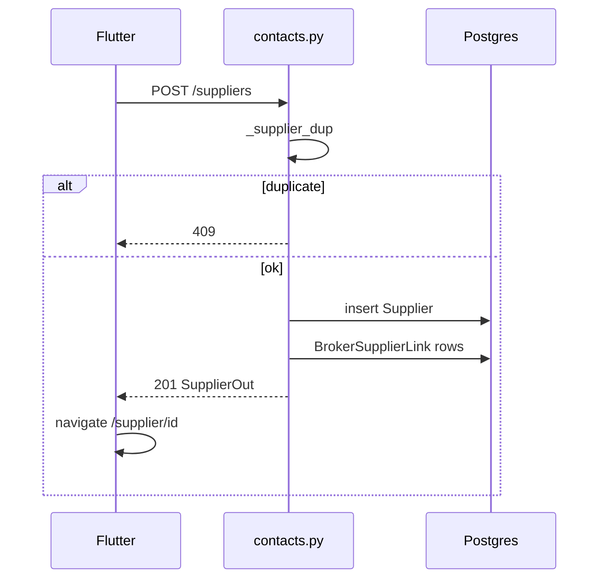
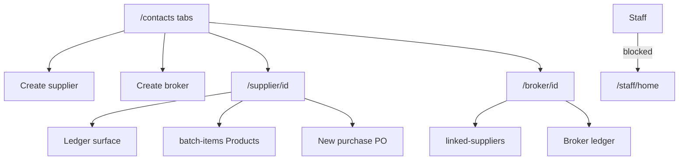

# Module: Suppliers (Contacts — Suppliers + Brokers)

**Queue:** 7 of 15  
**Status:** Review PASS (2026-07-18)  
**Scope:** Analysis only — supplier and broker **masters** under Contacts. No customer entity in source.  
**Source of truth:** `source-app/`  

## Boundary

| In Suppliers (this doc) | Products (#4) | Customers (#8) | Purchase Orders (#9) | Reports (#14) |
|---|---|---|---|---|
| Contacts hub; supplier/broker CRUD | `/supplier/:id/batch-items`; item default junctions | **Absent** in source — do not invent | Trade purchase create/edit lifecycle | Trade-supplier dashboards |
| Metrics / linked-suppliers / ledger **surfaces** | Item supplier intelligence | — | Deep purchase wizard party rules | Beyond hub KPI enrichment |
| `suppliers`, `brokers`, `broker_supplier_m2m` | `catalog_item_default_*`, `supplier_item_defaults` | — | — | — |

**Exclude deep-dive:** `/contacts/category` trade-string browse (not `item_categories` taxonomy — see Categories).

---

## 1. Screen inventory

| Route | Page | Notes |
|---|---|---|
| `/contacts` | `ContactsPage` | Tabs: Suppliers, Brokers, Categories, Types, Items |
| `/contacts/supplier/new` | `SupplierCreateSimple` | Fast create |
| `/suppliers/quick-create` | `SupplierCreateSimple` | Same |
| `/brokers/quick-create` | `BrokerWizardPage` | `selectionReturnOnSave: true` |
| `/supplier/:supplierId` | `SupplierDetailPage` | Profile + purchases |
| `/supplier/:id/ledger` | `SupplierLedgerPage` | Ledger surface |
| `/broker/:brokerId` | `BrokerDetailPage` | Profile + metrics |
| `/broker/:id/ledger` | `BrokerHistoryPage` | History surface |
| `/contacts/category` | `CategoryItemsPage` | Boundary — trade category string |
| `/supplier/:id/batch-items` | `BatchItemCreatePage` | **Products** exit |

**Modal (not GoRoute):** `SupplierCreateWizardPage`, `BrokerWizardPage` (create/edit from hub).

**Staff:** `_staffRedirectForBlockedRoute` sends `/contacts`, `/supplier*`, `/broker*` → `/staff/home`. Not in `_isStaffAllowedRoute`.

---

## 2. Layouts

### Contacts hub (`contacts_page.dart`)

- Five tabs; `?tab=` query. Local search debounce 300ms (does **not** call `GET /contacts/search`).
- Workspace count chips (suppliers/brokers/categories/types/items). Enriched 90d supplier `_metrics` attached but **not rendered on cards**.
- AppBar: catalog + Add (per tab) + settings. Row ⋮: View / Edit / Delete (delete owner-only on client).
- Navigate to supplier/broker detail or catalog/category.

### Supplier create simple

Name*, Place* (location), Phone optional, GST/Address expandable; “Default Rate” field **not sent to API**.

### Supplier create/edit wizard (5 steps)

Basic → Business → Brokers → Items & categories → Review. Draft in SharedPreferences. After create → `/supplier/:id`.

### Broker wizard (2 steps)

Details (+ Advanced: suppliers, prefs) → Commission + deal defaults. Syncs supplier `broker_ids` after save. No `image_url` UI.

### Supplier detail

Header (name, location, phone, last buy, GSTIN, quick stats); linked broker (`broker_id`); date chips; purchase list; FAB New purchase; ⋮ Batch add items; Edit; PDF → ledger; Export CSV. **No delete on detail.**

### Broker detail

Date range; commission; “Suppliers on your bills” (`linked-suppliers`); metrics card; PUR list; monthly chart; FAB New purchase; PDF; ledger. **No edit/delete on detail** (list only).

### Ledger / history (surface)

Lists flatten `listTradePurchases` by supplier/broker id; row actions touch purchases (**PO**). PDF share helpers.

---

## 3. Form fields

### Supplier (wizard / API)

| Field | Notes |
|---|---|
| name* | 1–255; normalized strip |
| phone | optional; `^\+?\d{10,15}$` after strip |
| location | simple UI requires Place; API optional |
| gst_number | 15-char GSTIN regex if set |
| address, notes | optional |
| default_payment_days | 0–3650 |
| default_discount / delivered / billty rates | ≥0 |
| freight_type | `included` \| `separate` |
| broker_id / broker_ids | merge → primary + M2M |
| ai_memory_enabled | bool; wizard state, **no UI toggle** |
| preferences | `{category_ids, type_ids, item_ids}` → `preferences_json` |

### Broker

| Field | Notes |
|---|---|
| name* | |
| phone | max 15 |
| location, notes | |
| commission_type | `percent` \| `flat` |
| commission_value | ≥0 |
| default_payment_days, discount, rates, freight_type | same idea as supplier |
| image_url | API only — no wizard field |
| supplier_ids | replace M2M; syncs supplier rows |
| preferences | same prefs shape |

---

## 4. Validation

**Client:** name ≥2 on simple create; GSTIN regex on wizard; phone digit length; fuzzy dup hint ≥0.72; exact case-insensitive block; broker phone 10–15.

**Server:** name unique per business (lower normalize) → **409**; phone/GST/freight validators; delete blocked by active trade purchases (and broker delete also if suppliers still have `broker_id`).

---

## 5. Buttons / menus / sheets

| Action | Where | API / nav |
|---|---|---|
| Add supplier/broker | Hub AppBar | create routes / wizards |
| Edit / Delete | Hub ⋮ | PATCH; DELETE owner |
| View detail | Hub | `/supplier` or `/broker` |
| New purchase | Detail FAB | **PO** |
| Batch add items | Supplier ⋮ | Products `/batch-items` |
| Statement PDF | Detail / ledger | PDF helpers + ledger route |
| Export CSV | Supplier detail | local/export |

---

## 6. Search / filter / sort

| Surface | Behaviour |
|---|---|
| Hub | Local filter name/phone/location; 300ms debounce |
| `GET /contacts/search` | Server ILIKE; scopes suppliers/brokers/categories/catalog_types/items; **hub does not call it** |
| List suppliers | `compact` + `limit` (1–5000); API default compact for pickers |
| Lists | Order by lower(name) typical |

---

## 7. Calculations / metrics

**`GET …/suppliers/{id}/metrics?from&to`**

- Report-scope TPs (excludes draft/cancelled/deleted).  
- `deals`, `total_qty`, `avg_landing`, `total_profit`, `purchase_amount`, `profit_margin_pct`.

**`GET …/brokers/{id}/metrics?from&to`**

- `deals`, `total_commission` (sum `commission_money`), `total_profit`.

**Hub enrichment:** `contactsSuppliersEnrichedProvider` joins `tradeReportSuppliers` 90d → `_metrics` (unused on cards). Broker enrichment metrics future empty.

**Detail local stats:** supplier detail quick stats from purchase list (not necessarily metrics endpoint).

---

## 8. Role / permission gates

| Capability | Gate |
|---|---|
| Open contacts / supplier / broker routes | Staff **blocked** by router |
| Create / update / list / metrics | `require_membership` |
| Delete supplier / broker | `require_owner_membership` + client owner check on hub |

---

## 9. APIs (`contacts.py`)

Prefix: `/v1/businesses/{business_id}`

| Method | Path | Auth | Notes |
|---|---|---|---|
| GET | `/suppliers` | membership | `compact`, `limit` |
| POST | `/suppliers` | membership | 201; seeds M2M |
| GET | `/suppliers/{id}` | membership | + broker_ids, last_purchase_date |
| PATCH | `/suppliers/{id}` | membership | |
| DELETE | `/suppliers/{id}` | **owner** | 204; hard delete |
| GET | `/suppliers/{id}/metrics` | membership | from, to |
| GET | `/brokers` | membership | |
| POST | `/brokers` | membership | 201 |
| GET | `/brokers/{id}` | membership | |
| PATCH | `/brokers/{id}` | membership | |
| DELETE | `/brokers/{id}` | **owner** | 204 |
| GET | `/brokers/{id}/linked-suppliers` | membership | from report-scope TPs; max 200 |
| GET | `/brokers/{id}/metrics` | membership | from, to |
| GET | `/contacts/search` | membership | q, limit, scope |
| GET | `/contacts/category-items` | membership | category, from, to |

---

## 10. Database

### `suppliers` (`Supplier`)

`id`, `business_id`, `name`, `phone`, `gst_number`, `default_payment_days`, `default_discount`, `default_delivered_rate`, `default_billty_rate`, `location`, `address`, `notes`, `freight_type`, `ai_memory_enabled`, `preferences_json`, `broker_id` → `brokers`, `created_at`. **No soft-delete column.**

### `brokers` (`Broker`)

`id`, `business_id`, `name`, `phone`, `location`, `notes`, `preferences_json`, `commission_type`, `commission_value`, defaults + freight, `image_url`, `created_at`.

### `broker_supplier_m2m` (`BrokerSupplierLink`)

`id`, `broker_id`, `supplier_id`, `created_at`; **UQ** `(broker_id, supplier_id)`.

### Products junctions (cite only)

`catalog_item_default_suppliers`, `catalog_item_default_brokers`, `supplier_item_defaults`.

---

## 11. Business rules

1. Unique supplier/broker **name per business** (app-level lower normalize) → 409; no DB unique on name.  
2. Hard DELETE only; blocked by non-deleted/cancelled trade purchases; broker also blocked if any supplier still assigned `broker_id`.  
3. `broker_ids` + `broker_id` merged; first is primary; M2M replace-all when broker fields present on update.  
4. Clearing `broker_id: null` without `broker_ids` clears links.  
5. `linked-suppliers` = suppliers on **bills** with broker (not only M2M table).  
6. No customer master in contacts.

---

## 12. Loading / error / empty / refresh

- Providers: `suppliers_list_provider` / `brokers_list_provider` keepAlive 3m; hub enrichment provider; soft auth gate in `contacts_list_fetch`.  
- Hub empty / error: standard list patterns (FriendlyLoadError / empty states — cite contacts_page).  
- After writes: invalidate list/hub providers (wizard/detail flows).

---

## 13. Responsive / a11y

No dedicated contacts responsive doc beyond standard Flutter layouts. A11y: Unknown — needs verification if custom semantics exist.

---

## 14. Boundary reminder

| Keep | Defer |
|---|---|
| Master CRUD + hub + metrics APIs | Products batch-items & item defaults |
| Ledger/PDF **surface** | PO purchase CRUD |
| Document customers **absent** | Inventing Customers UI |
| Hub KPIs | Full Reports trade-supplier dashboards |

---

## 15. Unknowns / Risks

1. **`preferences_json` / `ai_memory_enabled`** — stored; no contacts-search consumer; AI runtime use Unknown.  
2. Hub does not call `/contacts/search` — API may be unused by primary hub.  
3. Supplier card `_metrics` unused in UI.  
4. List `last_purchase_date` often null (populated on get/create/update).  
5. Simple create Place required vs API optional; Default Rate field unused.  
6. Broker detail lacks edit (list-only) — UX gap.  
7. Name uniqueness race without DB constraint.  
8. Customers (#8) has **no** source module — analysis next must confirm absence vs other features.

---

## 16. Sequence (create supplier)

## 17. User flow

---

## Capability flags

| Capability | UI | API | Notes |
|---|---|---|---|
| List/create/edit suppliers | Yes | Yes | |
| Delete supplier | Hub owner | Owner | Hard delete |
| List/create/edit brokers | Yes | Yes | No detail edit |
| Delete broker | Hub owner | Owner | |
| M2M links | Yes | Yes | |
| Metrics | Broker detail; supplier local | Yes | |
| Preferences | Wizard | Store | |
| Customers | No | No | |
| Soft delete | No | No | |

---

## Review PASS/FAIL

| # | Section | Status | Evidence |
|---|---|---|---|
| 1 | Screens/routes | PASS | `app_router.dart` + contacts pages |
| 2 | Layouts | PASS | hub, wizards, detail, ledger |
| 3 | Fields | PASS | schemas + wizards |
| 4 | Validation | PASS | client + `_supplier_dup` / phone / GST |
| 5 | Buttons | PASS | §5 |
| 6 | Search | PASS | local vs `/contacts/search` |
| 7 | Metrics | PASS | metrics endpoints |
| 8 | Roles | PASS | staff block + owner delete |
| 9 | APIs | PASS | `contacts.py` |
| 10 | DB | PASS | models + analysis doc |
| 11 | Rules | PASS | hard delete, M2M, unique name |
| 12 | Loading | PASS | providers |
| 13 | Responsive | PASS | sparse |
| 14 | Boundary | PASS | §Boundary |
| 15 | Unknowns | PASS | §15 |
| 16–17 | Diagrams | PASS | §16–17 |

**Verdict:** Review **PASS**. **Stop.** Next: Customers analysis only (expect confirm absence).
