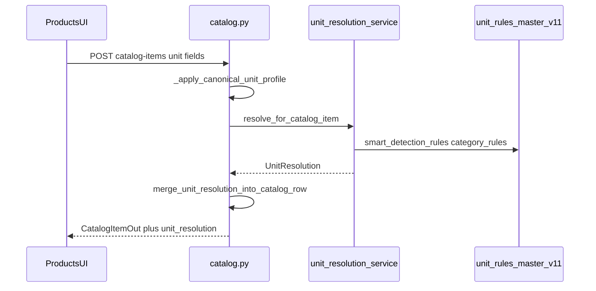
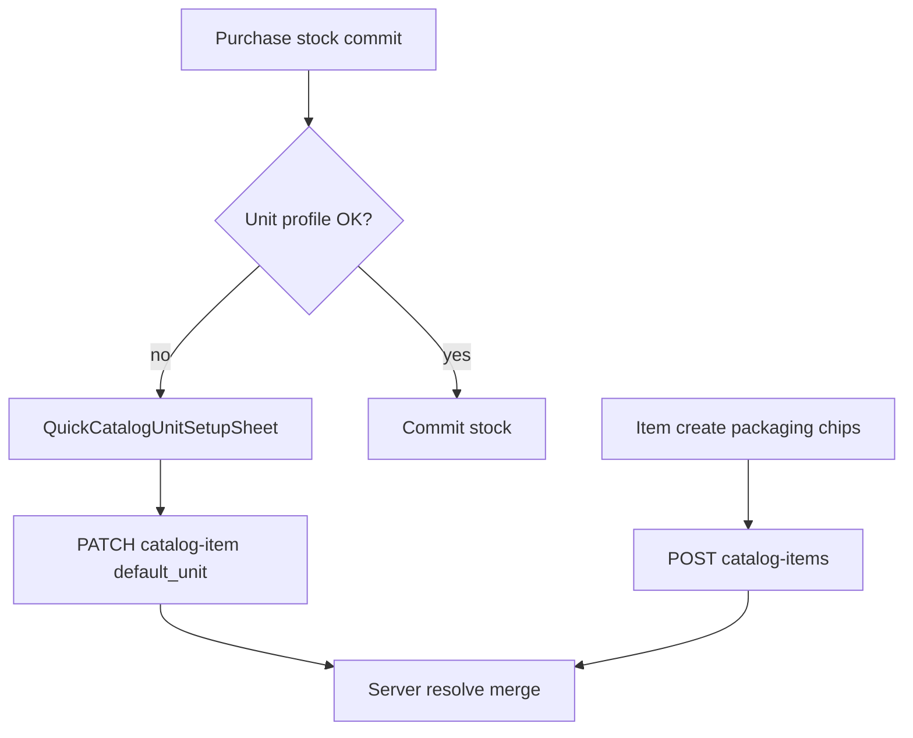

# Module: Units (Masters + Unit-Engine)

**Queue:** 6 of 15  
**Status:** Review PASS (2026-07-18)  
**Scope:** Analysis only — unit masters tables, packaging intelligence schema, JSON rules SSOT, resolution engines. **No** dedicated Units GoRoute hub.  
**Source of truth:** `source-app/`  

## Boundary (Products / Categories / Suppliers)

| In Units (this doc) | Products (#4 — done) | Categories (#5 — done) | Suppliers (#7 — next) |
|---|---|---|---|
| `master_units`, packaging/rules tables, confidence logs | Item create/edit/detail UX | Taxonomy CRUD | Supplier masters |
| `unit_rules_master.json` + `unit_resolution_service` | `catalog_items` unit **columns** as form fields | — | — |
| Flutter `core/unit_engine/*`, `core/units/*` | Host routes for packaging picker / setup sheet | — | — |
| Read-only `unit_resolution` on catalog responses | Full catalog-items CRUD | — | — |

**Boundary lock:** Products owns item-form unit fields; Units owns masters, rules JSON, resolution engine, packaging-profile tables. Host UI = “Products UI → Units resolve.”

---

## 1. Screen / route inventory

**Dedicated Units master CRUD routes:** **none** (confirmed in `app_router.dart` / routers).

| Host route (Products owns UX) | Widget | Units consumer |
|---|---|---|
| `/catalog/quick-add` | `CatalogItemCreatePage` | `PackagingTypeSelector` |
| `/catalog/item/create` | → quick-add | same |
| `/catalog/category/…/add-item` | `CatalogAddItemPage` | create form family |
| `/catalog/quick-add-from-scan` | `BarcodeQuickCreatePage` | unit field |
| `/supplier/:id/batch-items` | `BatchItemCreatePage` | packaging selector |
| `/catalog/item/:id/edit` | `ItemEditPage` + defaults form | unit / kg / tin fields |
| *(sheet, no route)* | `QuickCatalogUnitSetupSheet` | PATCH `default_unit` when stock commit blocked |

---

## 2. Layouts (unit widgets only)

### `PackagingTypeSelector`

Chips from `StockTrackingMode.pickerModes`: **KG**, **BAG**, **BOX**, **TIN**, **PC**.  
(`retail_packet` exists as constant but **not** in picker.)

### `QuickCatalogUnitSetupSheet`

Bottom sheet: pick `kg|bag|box|tin|piece`; bag requires kg/bag; PATCH via `updateCatalogItem`; seeds from `unit_resolution.kg_per_bag` / name parse; invalidate providers.

### Unit engine summary / hints

- `unit_engine_summary_card.dart` — display on item/stock intel  
- `bag_default_unit_hint.dart` — bag needs kg context  

Do not re-document full item pages (Products).

---

## 3. Fields

### Stored on `catalog_items` (Products form; Units engine writes smart columns)

| Field | Role |
|---|---|
| `default_unit` | Warehouse picker: `bag\|kg\|box\|tin\|piece` |
| `default_kg_per_bag` | Required when unit=bag |
| `default_items_per_box` | Box; coerce default 1 |
| `default_weight_per_tin` | Tin |
| `selling_unit`, `stock_unit`, `display_unit` | Smart profile |
| `package_type`, `package_size`, `package_measurement`, `conversion_factor` | Packaging |
| `unit_confidence`, `validation_status`, `smart_classification` | Resolution metadata |

### Packaging profile table (`item_packaging_profiles`)

Alternate rows per item: package_type/size/measurement, selling/stock/display units, conversion_factor, confidence, `ai_generated`, `updated_by_learning`.  
**Runtime writers:** none found in app routers/services (schema only).

### Stock modes (client)

`loose_kg` → KG · `wholesale_bag` → BAG · `box` → BOX · `tin` → TIN · `piece` → PC.

---

## 4. Validation

**Client**

- `smart_validation_engine.dart` — name→unit hint; light qty/rate checks  
- `purchase_line_unit_guard.dart` — line unit vs catalog stock mode  
- Create schemas: bag requires `default_kg_per_bag` (Flutter + Pydantic)

**Server** (`catalog.py` + services)

- `_UNIT_PATTERN` on create/update  
- Bag: `default_kg_per_bag` required and &gt; 0  
- `_sync_item_unit_extras` — clears kg/box/tin extras incompatible with `default_unit`  
- `_sync_stock_fields_from_default_unit` — aligns package_type/stock_unit for commit-stock  
- `purchase_line_unit_validation.validate_purchase_line_unit` — uses `stock_tracking_profile.line_unit_allowed`

---

## 5. Buttons / actions

| Action | Trigger | Effect |
|---|---|---|
| Pick packaging type | Create/batch forms | Sets `default_unit` (+ extras) |
| Unit setup sheet | Stock commit blocked | PATCH item unit profile |
| Name classify | `SmartUnitService.classifyAsync` | Suggests bag/box/kg/tin/piece from JSON |
| Server resolve | create/update/from-scan/batch | `resolve` + `merge` into row; Out includes `unit_resolution` |

---

## 6. Search / filter

No master-units list UI. Rules loaded from JSON (`unit_rules_loader` client; `_rules()` lru_cache server). No pagination.

---

## 7. Calculations / resolution

### Backend SSOT — `unit_resolution_service.py`

- Loads sibling `unit_rules_master.json` (backend **v11.0**).  
- **Does not query** `MasterUnit` / `SmartUnitRule` / packaging tables.

**`resolve_from_text` order**

1. Name contains LOOSE → KG / LOOSE  
2. First match in `smart_detection_rules`  
3. `category_rules` key match  
4. Fallback bag+sack for RICE/SUGAR + KG size  
5. Else PCS  

**`resolve_for_catalog_item` precedence**

1. Catalog row with `selling_unit` (`rule_id=catalog_item_row`) — except unverified PCS/PIECE overridden by text conf ≥ 80  
2. Enhance with `default_kg_per_bag` / name parse → BAG/SACK/KG  
3. Else text resolution  

**`UnitResolution.as_dict()` payload** (read-only on API)

`selling_unit`, `stock_unit`, `display_unit`, `package_type`, `package_size`, `package_measurement`, `conversion_factor`, `confidence`, `rule_id`, `canonical_unit_type`, `inferred_confidence`, `unit_profile_source`, optional `kg_per_bag`.

### `_apply_canonical_unit_profile`

On **POST `/catalog-items` only** (not from-scan/batch): maps warehouse unit → package_type/stock/display/selling; bag sets `validation_status=unit_profile_verified`.

### Client engines

- `central_calculation_engine.dart` — UI money/weight preview (server authoritative)  
- `smart_unit_classifier.dart` — Flutter mirror of JSON classify  
- `dynamic_unit_label_engine.dart` / `resolved_item_unit_context.dart` — labels/hydration  

### Related services

- `package_detection_service` — façade over resolve  
- `unit_normalization` — line qty → stock unit  
- Trade preview uses `resolved_labels` (same `as_dict` shape), not field name `unit_resolution`

---

## 8. Role / permission gates

No Units-specific permission. Unit editing follows **host Products** page gates (membership on catalog PATCH; staff/owner as per Products routes).

---

## 9. APIs

**No** `/master-units`, `/smart-unit-rules`, or packaging-profile CRUD routers (confirmed).

| Method | Path | Units behaviour |
|---|---|---|
| POST | `/catalog-items` | `_apply_canonical` + resolve + merge; Out has `unit_resolution` |
| POST | `/catalog-items/from-scan` | resolve + merge (no `_apply_canonical`) |
| POST | `/catalog-items/batch` | resolve + merge per line |
| PATCH | `/catalog-items/{id}` | if name/category/unit touched → resolve + merge; extras sync |
| GET | `/catalog-items`, `/catalog-items/{id}` | `_catalog_item_out` embeds `unit_resolution` |
| GET | `/catalog-items/{id}/lines` | per-line `unit_resolution` via `resolve_from_text` |

Auth: same membership as catalog (Products).

---

## 10. Database

From `models/unit_intelligence.py` + `docs/20_Database_Analysis.md`:

| Table | Purpose | Runtime use |
|---|---|---|
| `master_units` | Canonical codes; UQ `unit_code` | Seeded (Alembic 019 / SQL); **not queried by resolvers** |
| `item_packaging_profiles` | Alt packaging per item | Schema only — no app writers found |
| `smart_unit_rules` | Keyword→unit (nullable `business_id`) | Schema only |
| `smart_package_rules` | Keyword→package_type + priority | Schema only |
| `unit_confidence_logs` | Append-only score trail | Schema only |
| *(co-located)* `ocr_item_aliases`, `item_learning_history`, `ai_item_profiles` | OCR/learning/AI JSON | Out of deep Units UX; same model file |

**Live smart profile** lives on **`catalog_items`** columns (written by merge/canonical), not packaging-profile table.

---

## 11. Business rules

1. Warehouse five-unit SSOT for picker: bag / kg / box / tin / piece.  
2. JSON rules are runtime SSOT for text resolution; DB rule tables unused.  
3. Catalog row smart columns override JSON when `selling_unit` set (PCS override exception).  
4. Dual JSON copies: backend **v11** (11 smart rules + `spice_tokens`) vs Flutter asset **v10** (5 rules, no spice_tokens) — **drift risk**.  
5. JSON keys `master_units`, `package_aliases`, `spice_tokens` present in file; resolution service only consumes `smart_detection_rules` + `category_rules`.  
6. Create single-item applies canonical profile; from-scan/batch skip `_apply_canonical`.  
7. Incompatible unit extras cleared on sync.

---

## 12. Loading / error / empty

- Unit setup sheet: saving via PATCH; failure surfaces as Dio/retry snack (host).  
- Resolve failures: Unknown — needs verification (service generally returns fallback PCS).  
- No empty-state for master list (no UI).

---

## 13. Responsive / a11y

Chip selectors only; no dedicated Units responsive layout. A11y: Unknown beyond standard widgets.

---

## 14. Boundary reminder

| Units | Products | Categories | Suppliers |
|---|---|---|---|
| Engine + JSON + tables | Item forms / routes | Taxonomy | Contacts/suppliers |

Do not invent master-units admin UI that source lacks.

---

## 15. Unknowns / Risks

1. **DB intelligence tables unused** at runtime — migrate schema for parity, but do not invent CRUD without product decision.  
2. **Flutter JSON v10 vs backend v11** — client classify may disagree with server `unit_resolution`.  
3. Whether `package_aliases` / `spice_tokens` / JSON `master_units` are consumed outside resolution (not by `unit_resolution_service`).  
4. Learning/OCR/confidence-log writers — none found; may be future/offline.  
5. `_apply_canonical` bag sets `stock_unit=BAG` while `_sync_stock_fields_from_default_unit` sets bag → `stock_unit=KG` — path-dependent inconsistency risk (cite both).

---

## 16. Sequence (create item → resolve)

## 17. User flow (missing unit → setup sheet)

---

## Capability flags

| Capability | UI | API | Notes |
|---|---|---|---|
| Master units CRUD | No | No | Seed table only |
| Smart rules CRUD | No | No | JSON file SSOT |
| Packaging profile CRUD | No | No | Table unused |
| Resolve on catalog I/O | Yes (embedded) | Yes | `unit_resolution` |
| Packaging picker | Yes (Products host) | Via item create | 5 modes |
| Unit setup sheet | Yes | PATCH item | Products host |
| Client JSON classify | Yes | — | Asset v10 |

---

## Review PASS/FAIL

| # | Section | Status | Evidence |
|---|---|---|---|
| 1 | Routes | PASS | none dedicated; host table §1 |
| 2 | Widget layouts | PASS | selector + setup sheet |
| 3 | Fields | PASS | catalog + profile tables |
| 4 | Validation | PASS | Pydantic + guards + sync extras |
| 5 | Actions | PASS | §5 |
| 6 | Search | PASS | JSON load only |
| 7 | Calculations | PASS | resolve order + payload |
| 8 | Roles | PASS | host Products |
| 9 | APIs | PASS | no master CRUD; catalog embed |
| 10 | DB | PASS | unit_intelligence + analysis doc |
| 11 | Rules | PASS | JSON vs DB precedence |
| 12 | Loading/errors | PASS | sheet + Unknown noted |
| 13 | Responsive | PASS | sparse |
| 14 | Boundary | PASS | §Boundary + §14 |
| 15 | Unknowns | PASS | §15 |
| 16–17 | Diagrams | PASS | §16–17 |

**Verdict:** Review **PASS**. **Stop.** Next: Suppliers analysis only.
