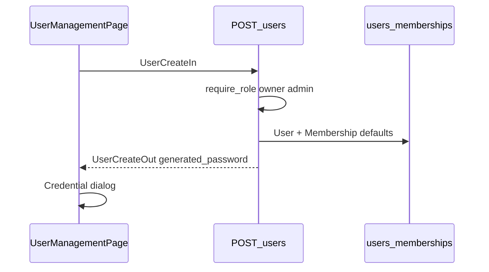
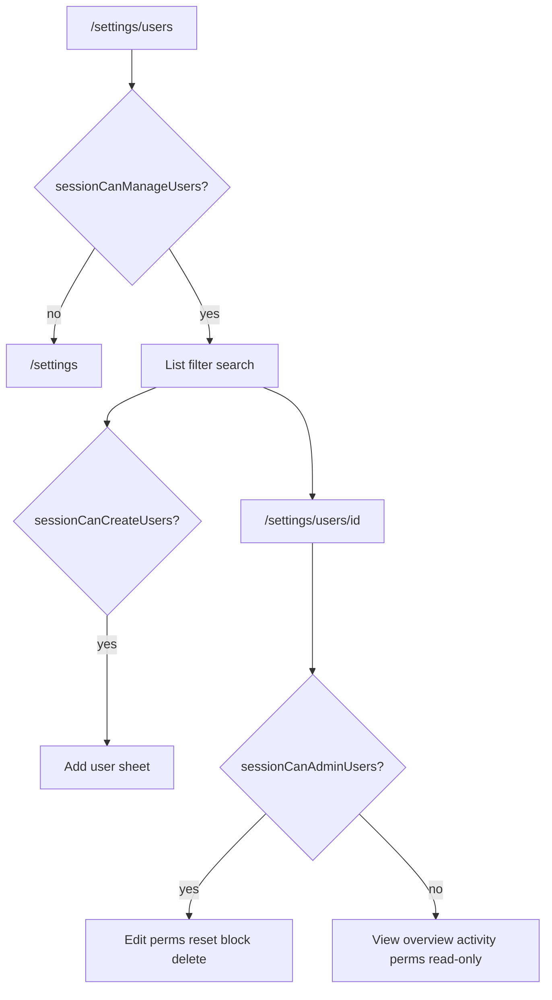

# Module: Users & Roles

**Queue:** 3 of 15  
**Status:** Backend Slice 1–5 — list + create + profile + PATCH + DELETE PASS (2026-07-18) · UI blocked  
**Scope:** Analysis + core mutate APIs through soft-delete; reset/permissions/UI not started  
**Source of truth:** `source-app/`  
**Compare:** `docs/modules/users_roles_backend_{list,create,profile,patch,delete}_compare.md` 

## Definition

| Surface | Route | UI |
|---|---|---|
| User list | `/settings/users` | `UserManagementPage` |
| User profile | `/settings/users/:userId` | `UserProfilePage` |
| Desktop preview | split on list page | `UserManagementDetailPanel` |

**Out of scope here:** Settings business/backup/help pages (queue Settings later). Staff `/staff/settings` is profile/logout oriented — not full user admin.

**Cross-links:** Login (self-register vs owner-created accounts); Dashboard (manager has owner home; `user_manage` default false).

---

## Capability flags

| Capability | UI | API | Who |
|---|---|---|---|
| View user list | Yes | `GET …/users` | owner, admin, **manager**, super_admin |
| Create user | Yes (if create gate) | `POST …/users` | owner, admin, super_admin (**not manager**) |
| Edit / block / delete / reset pwd / edit perms | Yes (if admin gate) | PATCH/DELETE/reset/permissions | owner, admin, super_admin |
| Permission toggles | Permissions tab | GET/PATCH `…/permissions` | admin actions to save |
| Bulk actions | Select mode | `POST …/bulk` | admin gate |
| Active sessions list | — | `GET …/active-sessions` | owner, manager, super_admin |

### Manager question — **resolved from source**

- **Manager is a first-class role** in `ROLE_DEFAULTS` and create/list APIs.
- Manager **can open Users list** (`sessionCanManageUsers` + `require_role(..., "manager")` on GET).
- Manager **cannot** create users, patch/delete, reset password, or edit permissions (`sessionCanCreateUsers` / `sessionCanAdminUsers` exclude manager; matching backend `require_role` without manager on mutating endpoints).
- Manager **has owner dashboard** (`sessionHasOwnerDashboard`) but `user_manage` permission default is **false**.

---

## 1. Screen purpose

Administer business memberships: list staff/managers/admins, create logins, adjust roles/status, reset passwords, override permissions, view activity/ledger/purchases related to a user.

## 2. Layout

- **List:** AppBar “Users”; search + status chips; optional role filter drawer; `UserCompactCard` list; desktop split list | detail panel (flex ~4:5).
- **Profile:** Header (name, role/status pills, warehouse, email, phone, last active) + tabs Overview | Activity | Permissions.
- Route guard: paths under `/settings/users` without `sessionCanManageUsers` redirect to `/settings`.

**Sources:** `user_management_page.dart`, `user_profile_page.dart`, `app_router.dart`.

## 3. Every field (create / edit)

### Create sheet (`UserCreateIn` + UI)

| Field | Rules |
|---|---|
| full_name | required, 1–255 |
| email | optional; else `{phoneDigits}@staff.harisree.local` |
| phone | required, ≥6 digits |
| role | `admin` \| `manager` \| `staff` (UI); **not** `owner` on create |
| password | optional; else generated readable password |
| notes | optional ≤2000 |
| is_active | default true |

### Patch (`UserPatchIn`)

Optional: full_name, email, phone, role (`admin|manager|staff|owner`), is_active, is_blocked, notes. Owner role on target locked in UI for owners.

## 4. Placeholders / validation

- Client: form validation in add-user sheet (see page).
- Server: Pydantic patterns above; phone digit check; email uniqueness; username allocation; `hash_password` strength on set password.
- Create conflict 409 email/username.

## 5. Buttons / actions

| Action | Gate | API |
|---|---|---|
| Add user | `sessionCanCreateUsers` | POST users |
| Open profile | manage | navigate |
| Reset password | `sessionCanAdminUsers` | POST reset-password |
| Block / unblock | admin, non-owner target | PATCH / bulk |
| Activate / deactivate | admin | PATCH / bulk |
| Delete (soft) | admin, non-owner, not self | DELETE / bulk |
| Copy email / credentials | admin | GET credentials |
| Save permissions | admin | PATCH permissions |
| Bulk bar | admin | POST bulk |

## 6. Filters / search / sort

- Search: name / email / phone (client filter on list).
- Status chips: All / Active / Inactive / Blocked (`user_list_filters.dart`).
- Role filter drawer: Staff / Manager / Admin·Owner.
- List API: `include_inactive` (provider uses `true`).

## 7. KPI / cards / last active

- Compact card: status, online hint, last active (`user_last_active.dart`).
- Overview KPI grid: Purchases, Stock updates, Items created, Scans from profile `stats`.
- List rows include `today_stats`, `activity_count_7d`, `last_active_at`.

## 8. Permission groups UI

From `user_permission_groups.dart` (mirrors `PERMISSION_KEYS`):

| Group | Key | Label |
|---|---|---|
| Inventory | `stock_edit` | Edit stock |
| Inventory | `delete_access` | Delete items |
| Purchases | `purchase_create` | Create purchase |
| Purchases | `purchase_edit` | Edit purchase |
| Reports | `reports_access` | View reports |
| Reports | `export_access` | Export reports |
| Reports | `analytics_access` | Analytics dashboard |
| Printing | `barcode_print` | Barcode print |
| Users | `user_manage` | Manage users |

View-only for manager; editable save for admin/owner.

## 9. Activity timeline / tabs

Profile Activity tab chips: All | Stock | Purchases | Items | Ledger — backed by user detail endpoints (created-items, stock-adjustments, purchases, ledger) + activity providers.

## 10. Sessions

`GET …/users/active-sessions` — users with `last_active_at` within **5 minutes**; roles owner/manager/super_admin. Used by home satellites / ops (not necessarily a dedicated Users screen section — document API).

## 11. Navigation / access

```9:24:source-app/flutter_app/lib/core/router/post_auth_route.dart
/// Owner / manager / platform super-admin may view the user list.
bool sessionCanManageUsers(Session session) { ... owner|admin|manager|superAdmin }
bool sessionCanCreateUsers(...) { ... owner|admin|superAdmin }
bool sessionCanAdminUsers(...) { ... owner|admin|superAdmin }
```

Home owner tools “Users” → `/settings/users`.

## 12. Role set

| Role | Create via Users API | Notes |
|---|---|---|
| `staff` | Yes | Default floor |
| `manager` | Yes | View users; no mutate users |
| `admin` | Yes | Cannot create/assign `owner` |
| `owner` | No on create; patch pattern allows | Protected target |
| `super_admin` | User flag `is_super_admin` | Bypass role checks in deps |

## 13. `permissions_json` / defaults

`effective_permissions(role, overrides)` — start `ROLE_DEFAULTS[role]` else staff; bool overrides only; legacy `delete_items` → `delete_access`.

On **role change** / bulk `set_role`: replace with **fresh ROLE_DEFAULTS** (drops overrides) — confirmed by `test_users_management.py`.

On **PATCH permissions**: merge bool keys into existing JSON.

Create membership stores `effective_permissions(role, None)` (full default map).

## 14. Authorization summary

Users router uses **`require_role(...)`**, not `require_permission("user_manage")`.  
`require_permission` exists in deps for other modules.  
UI gates are role-helper based, not the `user_manage` flag (flag still exists for API permission checks elsewhere).

`_guard_actor_target` / `actor_can_manage_target`: admin cannot manage owner; no self deactivate/delete/block.

## 15. Password / credentials

- Optional password on create; else `generate_readable_password(full_name)` then `hash_password`.
- Reset returns `new_password` plaintext once.
- `GET …/credentials` returns username/email/phone **without** password.
- Create response may include `generated_password` when password omitted.

## 16. Soft-delete / deactivate / block

- DELETE: soft-delete (`deleted_at`), revoke tokens, cannot delete self.
- Deactivate / block via PATCH or bulk; activate clears `deleted_at` + `is_blocked` (per patch rules in router).
- Soft-deleted excluded from normal lists.

## 17. API inventory (prefix `/v1/businesses/{business_id}/users`)

| Method | Path | Roles |
|---|---|---|
| POST | `/` | owner, admin, super_admin |
| GET | `/` | owner, admin, manager, super_admin |
| GET | `/active-sessions` | owner, manager, super_admin |
| POST | `/bulk` | owner, admin, super_admin |
| GET | `/{user_id}` | owner, admin, manager, super_admin |
| PATCH | `/{user_id}` | owner, admin, super_admin |
| DELETE | `/{user_id}` | owner, admin, super_admin |
| POST | `/{user_id}/reset-password` | owner, admin, super_admin |
| GET | `/{user_id}/credentials` | owner, admin, super_admin |
| GET | `/{user_id}/created-items` | owner, admin, manager, super_admin |
| GET | `/{user_id}/stock-adjustments` | owner, manager, super_admin |
| GET | `/{user_id}/purchases` | owner, admin, manager, super_admin |
| GET | `/{user_id}/ledger` | owner, admin, manager, super_admin |
| GET/PATCH | `/{user_id}/permissions` | owner, admin, super_admin |

Activity: `POST/GET /v1/businesses/{business_id}/activity-log` — `require_membership`.

Request/response shapes: `schemas/users.py` (`UserCreateIn`, `UserListOut`, `UserProfileOut`, `UserCreateOut`, `PermissionsOut`, `UserBulkIn`, …).

## 18. Database

### `users`

`id`, `email`, `username`, `password_hash`, `phone`, `name`, `is_super_admin`, `is_active`, `is_blocked`, `token_version`, `last_login_at`, `last_active_at`, `created_by`, `created_at`, `deleted_at`, `notes`, …

### `memberships`

`id`, `user_id`, `business_id`, `role`, `permissions_json`, `created_at`; unique `(user_id, business_id)`.

### Related

`user_sessions`, `staff_activity_log` (lifecycle USER_CREATE etc.), catalog/stock tables for profile stats endpoints.

## 19. Business rules (high signal)

1. Manager views users; does not mutate.
2. Admin cannot create or assign owner.
3. Cannot delete self; cannot admin-action against owner if not owner/super_admin.
4. Role change resets permission overrides to defaults.
5. Synthetic staff emails `@staff.harisree.local` from phone digits.
6. Public self-register separate (Login module); production often disabled — owners create users here.
7. `user_manage` permission key ≠ Flutter route gate (role helpers win for Settings Users).

## 20. Loading / error / empty

- List from `businessUsersProvider` AsyncValue; empty list when no matches after filter.
- Credential dialog after create with generated password.
- HTTP 403/409 surfaces via Dio — exact snack strings in page (cite UI on implement).

## 21. Responsive / a11y

- Desktop split panel; mobile list → navigate to profile.
- **Unknown:** exhaustive Semantics audit.

## 22. Edge cases / Unknowns / Risks

**Edge cases:** empty email → synthetic; bulk set_role; stock-adjustments endpoint omits admin in require_role list (owner, manager, super_admin only) — intentional asymmetry vs purchases.

**Unknowns:**

1. Whether `user_manage` permission is enforced on any non-users routes in a way that should gate Settings Users in future (today UI uses role helpers).
2. Full ledger/purchase response field catalogs (defer detail to those modules if oversized).

**Risks:**

- Porting “manager = full admin” would over-privilege.
- Forgetting role-change resets overrides loses security model.
- Hashing generated passwords must satisfy `passwords.validate_password_strength`.

---

## Sequence (create user)



## User flow



---

## Review PASS/FAIL

| # | Section | Status | Evidence |
|---|---|---|---|
| 1–2 | Purpose / layout | PASS | management + profile pages |
| 3–5 | Fields / validation / buttons | PASS | schemas + UI |
| 6–10 | Filters KPI perms activity sessions | PASS | users widgets + API |
| 11–14 | Gates roles permissions authz | PASS | post_auth_route + permissions.py + users.py |
| 15–16 | Password / lifecycle | PASS | readable_password + soft delete |
| 17–19 | APIs DB rules | PASS | users.py schemas models |
| 20–22 | UX unknowns risks | PASS | documented |
| — | Manager question | PASS | resolved in capability flags |
| — | Matrices | PASS | see docs/matrix/* |

**Verdict:** Review **PASS**. **Stop.** Next analysis: Products.
